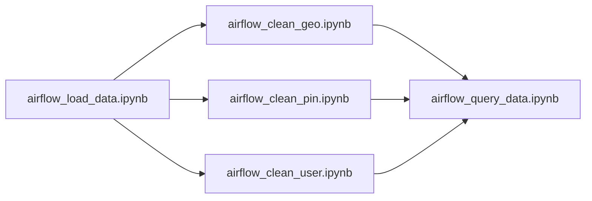

# AWS Data Pipeline Project

This data pipeline project emulates a data management system similar to what a large social media platform, such as Pinterest, might use. It provides a practical look into how data can be efficiently collected, processed, and stored in a cloud environment like AWS.

## Architecture Design


## Project Navigation

The wiki supplies six project walkthrough documents detailing the process of emulating the Pinterest system of processing data using the AWS Cloud. These walkthroughs will explain the following:

## TODO: Create a wiki

- [Part 1](Walkthrough_part_1_EC2_Kafka_Client) will describe how to configure a `EC2 Kafka client`.
- [Part 2](Walkthrough_part_2_MSK_S3) will describe how to connect an `MSK cluster` to an `S3 bucket`.
- [Part 3](Walkthrough_part_3_API) will describe configuring an `API` in `API Gateway`.
- [Part 4](Walkthrough_part_4_ETL_Databricks) will describe how to read, clean and query data on `Databricks`.
- [Part 5](Walkthrough_part_5_Airflow) will describe how to orchestrate `Databricks` Workloads on `MWAA`.
- [Part 6](Walkthrough_part_6_Streaming) will describe how to create data streams using `Kinesis Data Streams`.

## Aim of the project

This project aims to provide hands-on experience setting up and managing a data pipeline. It offers insights into how large-scale applications like Pinterest handle vast amounts of data, ensuring it's processed efficiently and stored securely. The aim is to create a robust data pipeline that enables us to:

- **Data Emulation**: Develop a script that retrieves data from an Amazon RDS to effectively emulate the process of posting data as it would occur on a platform like Pinterest.
- **Data Processing with Kafka**: Implement Apache Kafka to process the influx of data efficiently, ensuring smooth data flow and scalability.
- **Data Storage in S3**: Utilise Amazon S3 buckets to securely store processed data and easily access it for future analysis.
- **API Integration for Data Streaming**: Develop an API to facilitate data streaming into the Kafka cluster and for data distribution to an S3 data lake.
- **Data Analysis in Databricks**: To extract batch data from AWS S3 and transform it in Databricks using pySpark, and to conduct comprehensive batch analysis on the stored Pinterest data
- **Workflow Orchestration with MWAA**: Employ Managed Workflows for Apache Airflow (MWAA) to orchestrate complex data workflows using Directed Acyclic Graphs (DAGs), which enhances the automation and monitoring of the data pipeline.
- **Real-time Data Handling with Kinesis**: Integrate AWS Kinesis Data Streams to extend the pipeline's capabilities for real-time data management using a Spark cluster on Databricks.

## Tools Used

[](https://aws.amazon.com/) **Amazon Web Services (AWS):** A comprehensive, scalable cloud computing platform provided by Amazon, offering a wide range of services including computing power, storage, databases, machine learning, and more.

[](https://www.anaconda.com/) **Anaconda:** A distribution of the Python and R programming languages for scientific computing, data science, and machine learning, bundled with a collection of pre-installed packages and tools for easy management of environments and dependencies.

[](https://airflow.apache.org/) **Apache Airflow:** A platform used to programmatically author, schedule, and monitor workflows, allowing for complex data pipelines to be built, managed, and automated.

[](https://kafka.apache.org/) **Apache Kafka:** A distributed streaming platform used for building real-time data pipelines and streaming applications, known for its high throughput, fault tolerance, and scalability.

[](https://spark.apache.org/) **Apache Spark:** A unified analytics engine for big data processing, providing APIs for batch processing, real-time streaming, machine learning, and graph processing, with built-in support for multiple languages and libraries.

[](https://www.gnu.org/software/bash/) **Bash:** A Unix shell and command language used for executing commands, scripting, and automating tasks in Unix-like operating systems.

[](https://databricks.com/) **Databricks:** A unified analytics platform powered by Apache Spark, designed to accelerate innovation by bringing data science, engineering, and business together on a single platform.

[](https://git-scm.com/) **Git:** A distributed version control system widely used for tracking changes in source code during software development, facilitating collaboration among multiple developers.

[](https://git-scm.com/) **GitHub:** A web-based platform for hosting and collaborating on Git repositories, widely used by developers for version control, collaboration, and project management.

[](https://www.json.org/) **JSON (JavaScript Object Notation):** A lightweight data interchange format used for transmitting data between a server and a web application, commonly used for APIs and configuration files.

[](https://www.mysql.com/) **MySQL:** An open-source relational database management system known for its reliability, speed, and ease of use, commonly used for web applications, content management systems, and more.

[](https://www.sqlalchemy.org/) **SQLAlchemy:** A SQL toolkit and Object-Relational Mapping (ORM) library for Python, providing a high-level interface for database interactions and data manipulation, commonly used in web applications and data-driven projects.

[](https://www.python.org/) **Python:** A versatile programming language known for its simplicity and readability, widely used for web development, data analysis, artificial intelligence, and more.

[](https://code.visualstudio.com/) **Visual Studio Code:** A popular, lightweight, and powerful source code editor developed by Microsoft, known for its customizable interface, rich language support, and extensive extension marketplace.

[](https://yaml.org/) **YAML (YAML Ain't Markup Language):** A human-readable data serialization language used for configuration files and data exchange, known for its simplicity and readability.

## Technologies Used

[Part 1](Walkthrough_part_1_EC2_Kafka_Client) will give an overview of how this project used [Amazon RDS](Walkthrough_part_1_EC2_Kafka_Client#amazon-rds), [Amazon EC2](Walkthrough_part_1_EC2_Kafka_Client#amazon-ec2), [Apache Kafka](Walkthrough_part_1_EC2_Kafka_Client#apache-kafka), and [AWS IAM](Walkthrough_part_1_EC2_Kafka_Client#aws-iam)

[Part 2](Walkthrough_part_2_MSK_S3) will give an overview of how this project used [Amazon MSK](Walkthrough_part_2_MSK_S3#amazon-msk) and [Amazon S3](Walkthrough_part_2_MSK_S3#amazon-s3)

[Part 3](Walkthrough_part_3_API) will give an overview of how this project used [Amazon API Gateway](Walkthrough_part_3_API#amazon-api-gateway) and [Confluent REST Proxy for Kafka](Walkthrough_part_3_API#confluent-rest-proxy-for-kafka)

[Part 4](Walkthrough_part_4_ETL_Databricks) will give an overview of how this project used [Apache Spark](Walkthrough_part_4_ETL_Databricks#apache-spark) and [Databricks](Walkthrough_part_4_ETL_Databricks#databricks)

[Part 5](Walkthrough_part_5_Airflow) will give an overview of how this project used [Apache Airflow](Walkthrough_part_4_ETL_Databricks#apache-airflow) and [Amazon MWAA](Walkthrough_part_4_ETL_Databricks#amazon-mwaa)

[Part 6](Walkthrough_part_6_Streaming) will give an overview of how this project used [Apache Spark Structured Streaming](Walkthrough_part_6_Streaming#apache-spark-structured-streaming), [Apache Delta Lake](Walkthrough_part_6_Streaming#apache-delta-lake) and [AWS Kinesis](Walkthrough_part_6_Streaming#aws-kinesis)

## Installation instructions

Follow these instructions to set up and install the project on your local machine.

> [!Prerequisites]
> Make sure you have the following installed:
>
> - A Code editor such as Visual Studio Code
> - Conda (optional but recommended)

### Clone Repository

Clone the repository to your local machine using the following:

```bash
git clone https://github.com/ChefData/pinterest-data-pipeline545
```

### Environment Setup

The repository supplies a Conda environment configuration to streamline dependency management, enhance reproducibility, isolate dependencies, facilitate environment sharing, and simplify setup for collaborators or users.

1. Import the conda environment from the supplied YAML file

    ```bash
    conda env create -f AiCore-Project-PDP-env.yaml
    ```

2. Activate the conda virtual environment:
    - On Windows:

        ```bash
        activate AiCore-Project-PDP
        ```

    - On macOS and Linux:

        ```bash
        conda activate AiCore-Project-PDP
        ```

### Credential Setup

This project utilises environment variables for a cleaner separation of configuration from application logic, making the code easier to read and maintain. The environment variables contain sensitive information like passwords, API keys, and access tokens. Storing this sensitive information as environment variables, which is ignored in version control using .gitignore, helps to keep this sensitive information out of the public repository, reducing the risk of accidentally exposing sensitive data to unauthorised users.

You must set up three files to help simplify configuration management and enhance security:

1. Create a YAML file within the repository containing the RDS database credentials. The YAML file should be structured as follows:

    ```yaml
    HOST: your_host
    USER: your_username
    PASSWORD: your_password
    DATABASE: your_database
    PORT: 3306
    ```

2. Create a .env text file in your repository's root directory in the form:

    ```env
    # Datebase Credentials
    creds_path = /your_path_to_rds_database_credentials.yaml

    # AWS IAM Username
    iam_username = <USER_ID>

    # Invoke URL - This links the scripts to your API endpoint.
    invoke_URL = <INVOKE_URL>

    # Deployment Stage
    deployment_stage = <DEPLOYMENT_STAGE>

    # Consumer Group
    consumer_group = <CONSUMER_GROUP>

    # Bootstrap Servers
    bootstrap_servers = <BOOTSTRAP_SERVER_STRING>
    ```

3. Create a local key pair file ending in the .pem extension. This file will allow you to connect to the EC2 instance. The wiki details the process of creating this file in [Walkthrough Part 1 Setting up permissions](Walkthrough_part_1_EC2_Kafka.md#setting-up-permissions)

> [!NOTE]
>
> In Amazon EC2, a key pair is a secure method of accessing your EC2 instances. It consists of a public key and a corresponding private key. The public key encrypts data that only the private key can decrypt. Key pairs are essential for establishing secure remote access to your EC2 instances.
>
> The public key is stored on the instance associated with it, allowing it to authenticate the private key when you attempt to connect. To securely access the EC2 instance after creation, use the private key to authenticate yourself.

## TODO: Resource provisioning

## Project Structure

### Key Scripts

- `streaming_batch.py`: Contains a script that extracts Pinterest data from MySQL database and uploads it to an S3 bucket through an API Gateway that goes through an MSK cluster on an EC2 instance.
- `streaming_kinesis.py`: Contains a script that streams real-time data to AWS Kinesis
- `api_communicator.py`: Contains the `APICommunicator` class for communicating with an API and sending data to Kafka topics or Kinesis streams.
- `data_processor.py`: The `DataProcessor` class is responsible for processing data from various sources and sending it to an API.
- `rds_db_connector.py`: Contains the `RDSDBConnector` class for connecting to a database, reading credentials from a YAML file, creating a database URL, initialising an SQLAlchemy engine, and performing database operations.
- `query_batch_data_direct.ipynb`: A script to directly load data from the S3 bucket, clean that data, and query the cleaned data for information.
- `query_batch_data_mount.ipynb`: A script to mount, clean and query data for information.
- `write_stream_data.ipynb`: A script to read real-time kinesis data, clean it, and save it in the delta table on Databricks.
- `databricks_clean_data.py`: Contains the `DataCleaning` class for cleaning data in PySpark DataFrames.
- `databricks_load_data.py`: Contains the `S3DataLoader` class for loading data from AWS S3 into PySpark DataFrames.

### Data Orchestration

- `0ab336d6fcf7_dag.py`: A dag file which runs the following notebooks on databricks daily.



- `airflow_load_data.ipynb`: A script to mount the S3 bucket onto databricks.
- `airflow_clean_geo.ipynb`: This script reads JSON files from the mounted S3 bucket, stores the contents as DataFrames and performs cleaning operations.
- `airflow_clean_pin.ipynb`: A script that reads JSON files from the mounted S3 bucket, stores the contents as DataFrames and performs cleaning operations.
- `airflow_clean_user.ipynb`: This script reads JSON files from the mounted S3 bucket, stores the contents as DataFrames and performs cleaning operations.
- `airflow_query_data.ipynb`: A script to query the cleaned data for information.

### Data files

The project uses an RDS database containing three tables resembling data received by the Pinterest API when a user makes a POST request by uploading data to Pinterest:

- `pinterest_data`: Contains data about posts which users upload to Pinterest
- `geolocation_data`: Contains data about the geolocation of each Pinterest post found in pinterest_data
- `user_data`: Contains data about the user that has uploaded each post found in pinterest_data

The data within these tables will emulate Pinterest's data pipeline.

### File structure of the project

```text
AWS Data Pipeline

Local Machine
.
├── USER_ID-key-pair.pem
├── AiCore-Project-PDP-env.yaml
├── README.md
├── README_Images
├── Walkthrough_part_1_EC2_Kafka_Client.md
├── Walkthrough_part_2_MSK_S3.md
├── Walkthrough_part_3_API.md
├── Walkthrough_part_4_ETL_Databricks.md
├── Walkthrough_part_5_Airflow.md
├── Walkthrough_part_6_Streaming.md
├── classes
│   ├── __init__.py
│   ├── api_communicator.py
│   ├── aws_db_connector.py
│   └── rds_db_connector.py
├── creds.yaml
├── databricks
│   ├── airflow
│   │   ├── 0ab336d6fcf7_dag.py
│   │   ├── airflow_clean_geo.ipynb
│   │   ├── airflow_clean_pin.ipynb
│   │   ├── airflow_clean_user.ipynb
│   │   ├── airflow_load_data.ipynb
│   │   └── airflow_query_data.ipynb
│   ├── classes
│   │   ├── databricks_clean_data.py
│   │   └── databricks_load_data.py
│   ├── query_batch_data_direct.ipynb
│   ├── query_batch_data_mount.ipynb
│   └── write_stream_data.ipynb
├── streaming_batch.py
├── streaming_kinesis.py
├── .gitignore
└── .env

EC2 Instance
├── kafka_2.12-2.8.1
│   ├── bin
│   │   └── client.properties
│   └── libs
│       └── aws-msk-iam-auth-1.1.5-all.jar
├── kafka-connect-s3
│   └── confluentinc-kafka-connect-s3-10.0.3.zip
└── confluent-7.2.0
    └── etc
        └── kafka-rest
            └── kafka-rest.properties
```

## Troubleshooting

If you encounter any issues during the installation or setup process, please open an issue in the repository.
