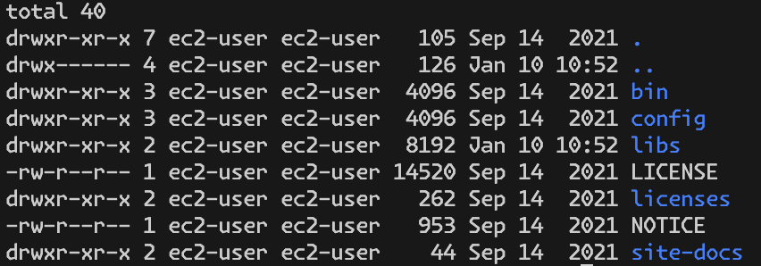

# Pinterest Data Pipeline

## Table of Contents

- [Description of the project](#description-of-the-project)
  - [What the project does](#what-the-project-does)
  - [Aim of the project](#aim-of-the-project)
  - [Lessons learned](#lessons-learned)
- [Installation instructions](#installation-instructions)
- [Usage instructions](#usage-instructions)
  - [Environment Setup](#environment-setup)
  - [Credential Setup](#credential-setup)
  - [Project Navigation](#project-navigation)
- [Classes and Methods](#classes-and-methods)
- [File structure of the project](#file-structure-of-the-project)
- [Technologies Used](#technologies-used)
- [Troubleshooting](#troubleshooting)
- [License information](#license-information)

## Description of the project

A data pipeline is a systematic and automated process for the efficient and reliable movement, transformation, and management of data from one point to another within a computing environment. It plays a crucial role in modern data-driven organizations by enabling the seamless flow of information across various stages of data processing.

Pinterest uses the AWS Data Pipeline to process and move data between different AWS compute and storage services, as well as on-premises data sources, at specified intervals.

At Pinterest, there are two primary categories of data sets: online service logs and database dumps. The pipeline for collecting service logs is usually composed of three stages: log collection, log transportation, and log persistence.

Pinterest crunches billions of data points every day to decide how to provide more value to their users. This project has been designed to create a similar system using AWS Cloud infrastructure.

The project uses a RDS database containing three tables resembling data received by the Pinterest API when a POST request is made by a user uploading data to Pinterest:

- pinterest_data contains data about posts being updated to Pinterest
- geolocation_data contains data about the geolocation of each Pinterest post found in pinterest_data
- user_data contains data about the user that has uploaded each post found in pinterest_data

### What the project does

### Aim of the project

THe aim of this project is as follows:

- To develop an end-to-end data processing pipeline hosted on AWS, based on Pinterest’s experimental processing pipeline.
- To develop an API using AWS API Gateway and integrating with AWS MSK and MSK Connect for data distribution to an S3 data lake.
- To extract batch data from AWS S3 and transformed it in Databricks using pySpark
- To use AWS MWAA to orchestrate Databricks Workloads
- To implement real-time data streaming via AWS Kinesis and conduct near real-time analysis using a Spark cluster on Databricks.

### Lessons learned

> [!NOTE]
>
> The following were already configured in the AWS account:
>
> - EC2 instance
> - S3 bucket
> - IAM role that can write to the S3 bucket
> - VPC Endpoint to S3
> - Security rules for the EC2 instance to allow communication with the MSK cluster
> - REST type API with regional endpoint
>
> The following were already configured in the Databricks account:
>
> - The Databricks account was granted full access to S3, so a new Access Key and Secret Access Key was not created for Databricks.
> - The credentials were already uploaded to Databricks.

## Installation instructions

To use the functionality provided by this project, follow these steps:

> [!NOTE]
> Make sure you have the following installed:
>
> - A Code editor such as Visual Studio Code
> - Conda (optional but recommended)

### 1. Clone the Repository

Clone the repository to your local machine using the following:

#### Windows

1. Install [Git](https://git-scm.com/download/win).
2. Open the command prompt or Git Bash.
3. Clone the repository to your local machine:

    ```bash
    git clone https://github.com/ChefData/pinterest-data-pipeline545
    ```

#### macOS

1. Open the Terminal.
2. If you don't have git installed, you can install it using [Homebrew](https://brew.sh/):

    ```bash
    /bin/bash -c "$(curl -fsSL https://raw.githubusercontent.com/Homebrew/install/HEAD/install.sh)"
    brew install git
    ```

3. Clone the repository to your local machine:

    ```bash
    git clone https://github.com/ChefData/pinterest-data-pipeline545
    ```

#### Linux: Ubuntu or Debian-based systems

1. Open the terminal.
2. Install git:

    ```bash
    sudo apt-get update
    sudo apt-get install git
    ```

3. Clone the repository to your local machine:

    ```bash
    git clone https://github.com/ChefData/pinterest-data-pipeline545
    ```

#### Linux: Fedora

1. Open the terminal.
2. Install git:

    ```bash
    sudo dnf install git
    ```

3. Clone the repository to your local machine:

    ```bash
    git clone https://github.com/ChefData/pinterest-data-pipeline545
    ```

## Usage instructions

> [!NOTE]
> It is assumed that you are a support engineer at AiCore and have the relevant credentials to download the data that has been stored in the different sources

Follow these instructions to set up and install the project on your local machine.

### Environment Setup

1. Create a Conda Virtual Environment to isolate the project dependencies (Optional but Recommended)

    ```bash
    conda create -n AiCore-Project-PDP -c conda-forge python=3.11 ipykernel sqlalchemy requests boto3 pymysql python-decouple PyYAML
    ```

2. Or import the conda environment from the supplied YAML file

    ```bash
    conda env create -f AiCore-Project-PDP-env.yaml
    ```

3. Activate the conda virtual environment:
    - On Windows:

        ```bash
        activate AiCore-Project-PDP
        ```

    - On macOS and Linux:

        ```bash
        conda activate AiCore-Project-PDP
        ```

### Credential Setup

1. Thoughout this project credentials were used specific to the infrastructure. Take a note of the following credentials for the purposes of the project:
    - USER_ID
        - Provided by AiCore
    - KEY_PAIR_NAME
        - Navigate to the EC2 console.
        - Identify and select the instance with the unique USER_ID.
        - Under the Details section find the Key pair name.


    - IAM_ARN
        - x
    - BOOTSTRAP_SERVER_STRING
        - x
    - PLAINTEXT_APACHE_ZOOKEEPER_CONNECTION_STRING
        - x
    - CONSUMER_GROUP
        - x


    - BUCKET_NAME
        - Navigate to the S3 console.
        - Find the bucket associated with the USER_ID.
        - The bucket name should have the following format: user-<USER_ID>-bucket.
    - KAFKA_CLIENT_EC2_INSTANCE_PUBLIC_DNS
        - Navigate to the EC2 console.
        - Select 'Instances'
        - Select the client EC2 machine
        - Copy the 'Public IPv4 DNS'
    - INVOKE_URL
        - Produced during the [Build a Kafka REST proxy integration method for the API](#build-a-kafka-rest-proxy-integration-method-for-the-api)
    - DEPLOYMENT_STAGE
        - Produced during the [Build a Kafka REST proxy integration method for the API](#build-a-kafka-rest-proxy-integration-method-for-the-api)

2. Create a YAML file containing the RDS database credentials. The YAML file should be stuctured as follows:

    ```yaml
    HOST: your_host
    USER: your_username
    PASSWORD: your_password
    DATABASE: your_database
    PORT: 3306
    ```

3. Create a .env text file in your repository’s root directory in the form:

    ```env
    # Datebase Credentials
    creds_path = /Users/your_path_to_rds_database.yaml

    # AWS IAM Username
    iam_username = <USER_ID>

    # Invoke URL
    invoke_URL = <INVOKE_URL>

    # Deployment Stage
    deployment_stage = <DEPLOYMENT_STAGE>

    # Consumer Group
    consumer_group = <CONSUMER_GROUP>

    # Bootstrap Servers
    bootstrap_servers = <BOOTSTRAP_SERVER_STRING>
    ```

4. Create a key pair file locally, which is a file ending in the .pem extension. This file will allow you to connect to the EC2 instance.
    - To do this, navigate to Parameter Store in your AWS account.
    - Find the specific key pair associated with your EC2 instance.
    - Select this key pair and under the Value field select Show. This will reveal the content of your key pair.
    - Copy its entire value (including the BEGIN and END header) and paste it in the .pem file in VSCode.
    - Save the created file in VSCode using the following format: KEY_PAIR_NAME.pem

> [!NOTE]
>
> In Amazon EC2, a key pair is a secure method of accessing your EC2 instances. It consists of a public key and a corresponding private key. The public key is used to encrypt data that can only be decrypted using the private key. Key pairs are essential for establishing secure remote access to your EC2 instances.
>
> The public key associated with the instance is stored on the instance itself, allowing it to authenticate the private key when you attempt to connect. To securely access the EC2 instance after creation, use the private key to authenticate yourself.

## Batch Processing: Configure the EC2 Kafka client

The following is a step by step guide of how to create the batch pipeline.

### Setting up permissions

Ensure you have the private key file (.pem) associated with the key pair used for the instance, as described in the [Credential Setup](#credential-setup)

In terminal on your local machine:

- Use the following command to set the appropriate permissions for the private key file to ensure it is only accessible by the owner:

    ```bash
    chmod 400 /path/to/KEY_PAIR_NAME.pem
    ```

> [!NOTE]
>
> The command 'chmod' is used to change the ownership and permission. In linux their are 3 types of ownership (User, Group, Other) and 3 types of permission (Read, Write, Excute).
>
> In the command 'chmod 400' the 3 digits are associated with:
>
> - 1st position show ownership of USER === Here 4
> - 2st position show ownership of GROUP === Here 0
> - 3st position show ownership of OTHER === Here 0
>
> The numbers represent:
>
> - 0=>No permission
> - 1=>Excute
> - 2=>Write
> - 3=>Execute + Write
> - 4=>Read
> - 5=>Read + Execute
> - 6=>Read +Write
> - 7=>Read + Write +Execute
>
> The command 'chmod 400' therefore represents:
>
> - READ permission for USER
> - NO permission for GROUP
> - NO permission for OTHER

### Connect to the EC2 instance

In terminal on your local machine:

- Use the SSH command to connect to the instance. You can find the exact command to connect to the EC2 instance under 'Example' in the EC2 Instance SSH client tab:

    ```bash
    ssh -i "/path/to/KEY_PAIR_NAME.pem" ec2-user@public_dns_name
    ```

When accessing the EC2 client using SSH for the first time a message may be encountered about the authenticity of the host. This message is prompted because the SSH client does not recognise the remote host and wants to verify its authenticity to ensure secure communication.

Type yes to confirm and continue connecting. By doing so, the key fingerprint will be stored in the SSH client's known_hosts file, and future connections to the same host will not prompt the same message.

If during this process your local machine is logged off the instance just run the ssh command again to reconnect.

### Set up Kafka on the EC2 instance

In order to connect to the IAM authenticated MSK cluster, the appropriate packages need to be installed on the EC2 client machine.

On the client EC2 machine:

- Install Java 1.8.0 with the following command:

    ```bash
    sudo yum install java-1.8.0
    ```

- Install Kafka 2.12-2.8.1 with the following command:

    ```bash
    wget https://archive.apache.org/dist/kafka/2.8.1/kafka_2.12-2.8.1.tgz  
    ```

- Extract the downloaded Kafka archive by running the following command:

    ```bash
    tar -xzf kafka_kafka_2.12-2.8.1.tar
    ```

- Running the following command will output the following image:

    ```bash
    cd /home/ec2-user/kafka_2.12-2.8.1
    ls -al
    ```

    

### Setting up IAM authentication

MSK clusters support IAM authentication. IAM access control allows MSK to enable both authentication and authorisation for clusters. This means, that if a client tries to write something to the cluster, MSK uses IAM to check whether the client is an authenticated identity and also whether it is authorised to produce to the cluster. To connect to a cluster that uses IAM authentication, follow these additional steps.

On the client EC2 machine:

- Inside the libs folder download the IAM MSK authentication package from Github, using the following command:

    ```bash
    cd /home/ec2-user/kafka_2.12-2.8.1/libs
    wget https://github.com/aws/aws-msk-iam-auth/releases/download/v1.1.5/aws-msk-iam-auth-1.1.5-all.jar
    ```

### Setting up CLASSPATH environment variable

In order to ensure that the Amazon MSK IAM libraries are easily accessible to the Kafka client, regardless of the location from which commands are executed, the environment variable CLASSPATH needs to be setup.

On the client EC2 machine:

- To set up the CLASSPATH environment variable, use the following command:

    ```bash
    export CLASSPATH=/home/ec2-user/kafka_2.12-2.8.1/libs/aws-msk-iam-auth-1.1.5-all.jar
    ```

When opening a new session or restarting an EC2 instance, any environment variables that were set in previous sessions will not persist. Therefore, to maintain the CLASSPATH environment variable across sessions, add the export command to the .bashrc file located in the home directory of the ec2-user.

On the client EC2 machine:

- Open .bashrc using the command:

    ```bash
    cd /home/ec2-user/
    nano ~/.bashrc
    ```

- Add the same export command to the .bashrc file:

    ```bash
    export CLASSPATH=/home/ec2-user/kafka_2.12-2.8.1/libs/aws-msk-iam-auth-1.1.5-all.jar
    ```

- Once the export command has been inserted into the .bashrc, make sure to save the changes before exiting.
- After making changes to the .bashrc file, run the source command to apply the changes to the current session:

    ```bash
    source ~/.bashrc
    ```

- To verify if the CLASSPATH environment variable was set properly, use the echo command to display its value:

    ```bash
    echo $CLASSPATH
    ```

- If the CLASSPATH was set correctly, this command will output the path assigned to it, which in this case is /home/ec2-user/kafka_2.12-2.8.1/libs/aws-msk-iam-auth-1.1.5-all.jar

### Configure Kafka client to use AWS IAM

On the client EC2 machine:

- To configure a Kafka client to use AWS IAM for authentication, create a client.properties file, using the following command:

    ```bash
    cd /home/ec2-user/kafka_2.12-2.8.1/bin
    nano client.properties
    ```

- The client.properties file should contain the following (replacing IAM_ARN as described in the [Credential Setup](#credential-setup)):

    ```bash
    # Sets up TLS for encryption and SASL for authN.
    security.protocol = SASL_SSL

    # Identifies the SASL mechanism to use.
    sasl.mechanism = AWS_MSK_IAM

    # Binds SASL client implementation. Uses the specified profile name to look for credentials.
    sasl.jaas.config = software.amazon.msk.auth.iam.IAMLoginModule required awsRoleArn="IAM_ARN";

    # Encapsulates constructing a SigV4 signature based on extracted credentials.
    # The SASL client bound by "sasl.jaas.config" invokes this class.
    sasl.client.callback.handler.class = software.amazon.msk.auth.iam.IAMClientCallbackHandler
    ```

- Once the previous text has been inserted into the client.properties file, make sure to save the changes before exiting.

### Create Kafka topics

An Apache Kafka topic is a named channel for messages. Producers publish messages to topics, and consumers subscribe to them. Topics help organise and categorise data flow, allowing for scalable and flexible data distribution. Each message is associated with a topic, and topics are divided into partitions for parallel processing.

This project uses a RDS database containing three tables resembling data received by the Pinterest API when a POST request is made by a user uploading data to Pinterest. A topic will be created for each table in the RDS database.

To create the three topics, run the following commands (replacing BOOTSTRAP_SERVER_STRING and USER_ID as described in the [Credential Setup](#credential-setup)):

- For the Pinterest data

    ```bash
    cd /home/ec2-user/kafka_2.12-2.8.1/bin
    ./kafka-topics.sh --bootstrap-server <BOOTSTRAP_SERVER_STRING> --command-config client.properties --create --topic <USER_ID>.pin
    ```

- For the geolocation data

    ```bash
    cd /home/ec2-user/kafka_2.12-2.8.1/bin
    ./kafka-topics.sh --bootstrap-server <BOOTSTRAP_SERVER_STRING> --command-config client.properties --create --topic <USER_ID>.geo
    ```

- For the user data

    ```bash
    cd /home/ec2-user/kafka_2.12-2.8.1/bin
    ./kafka-topics.sh --bootstrap-server <BOOTSTRAP_SERVER_STRING> --command-config client.properties --create --topic <USER_ID>.user
    ```

## Batch Processing: Connect a MSK cluster to a S3 bucket

### Create a custom plugin with MSK Connect

The Confluent.io Amazon S3 Connector is a sink connector that exports data from Kafka topics to S3 objects in either JSON, Avro or Bytes format.

In the EC2 client machine:

- Download the Confluent.io Amazon S3 Connector and copy it to the S3 bucket by running the following command (replacing BUCKET_NAME as described in the [Credential Setup](#credential-setup)):

    ```bash
    # assume admin user privileges
    sudo -u ec2-user -i
    # create directory where we will save our connector
    mkdir kafka-connect-s3 && cd kafka-connect-s3
    # download connector from Confluent
    wget https://d1i4a15mxbxib1.cloudfront.net/api/plugins/confluentinc/kafka-connect-s3/versions/10.0.3/confluentinc-kafka-connect-s3-10.0.3.zip
    # copy connector to our S3 bucket
    aws s3 cp ./confluentinc-kafka-connect-s3-10.0.3.zip s3://<BUCKET_NAME>/kafka-connect-s3/
    ```

In the S3 console:

- Open the bucket associated with the USER_ID.
- Open the newly created folder kafka-connect-s3/
- Select the zip file and copy the S3 URI

In the MSK console:

- Select 'Customised plugins' under the 'MSK Connect' section on the left side of the console
- Choose Create custom plugin
- Paste the S3 URI for the zip file
- Create a custom plugin with the following name: <USER_ID>-plugin

### Create a connector with MSK Connect

In the MSK console:

- Select Connectors under the MSK Connect section on the left side of the console
- Choose Create connector
- In the list of plugins, select the newly created plugin, and then click Next.
- For this project the AWS account only had permissions to create a connector with the following name: <USER_ID>-connector
- Then choose the pinterest-msk-cluster from the cluster list.
- To ensure that data going through the three previously created Kafka topics will get saved to the S3 bucket, paste the following configuration in the Connector configuration settings (replacing BUCKET_NAME and USER_ID as described in the [Credential Setup](#credential-setup)):

    ```bash
    connector.class=io.confluent.connect.s3.S3SinkConnector
    # same region as our bucket and cluster
    s3.region=us-east-1
    flush.size=1
    schema.compatibility=NONE
    tasks.max=3
    # include nomeclature of topic name, given here as an example will read all data from topic names starting with msk.topic....
    topics.regex=<USER_ID>.*
    format.class=io.confluent.connect.s3.format.json.JsonFormat
    partitioner.class=io.confluent.connect.storage.partitioner.DefaultPartitioner
    value.converter.schemas.enable=false
    value.converter=org.apache.kafka.connect.json.JsonConverter
    storage.class=io.confluent.connect.s3.storage.S3Storage
    key.converter=org.apache.kafka.connect.storage.StringConverter
    s3.bucket.name=<BUCKET_NAME>
    ```

- Change the 'Connector capacity type' to 'Provisioned'; ensure both the MCU count per worker and Number of workers are set to 1
- Change 'Worker Configuration' to 'Use a customised configuration', then pick 'confluent-worker'
- Under 'Access permissions' select the IAM role previously created: the role has the following format <USER_ID>-ec2-access-role
- Leave the rest of the configurations as default.
- Skip the rest of the pages.

Once your connector is up and running you will be able to visualise it in the Connectors tab in the MSK console.

Now that the plugin-connector pair has been built, data passing through the IAM authenticated cluster will be automatically stored in the designated S3 bucket, in a newly created folder called topics.

## Batch Processing: Configuring an API in API Gateway

### Build a Kafka REST proxy integration method for the API

By building a Kafka REST Proxy integration (which provides a RESTful interface to a Kafka cluster) it will make it easy to produce and consume messages, view the state of a cluster, or perform administrative actions without using native Kafka protocols or clients.


> HTTP proxy integration is a simple, yet powerful way of building APIs that allow web applications to access multiple resources on the integrated HTTP endpoint. In HTTP proxy integration, API Gateway simply passes client-submitted method requests to the backend. In turn the backend HTTP endpoint parses the incoming data request to determine the appropriate return responses.
>
> Creating a proxy resource with the {proxy+} parameter and the ANY method, provides the integration with access to all available resources.
>
> [!GitHub]
> Creating a {proxy+} resource with HTTP proxy integration allows a streamlined setup where the API Gateway submits all request data directly to the backend with no intervention from API Gateway.
> All requests and responses are handled by the backend - in this case the Confluent REST Proxy on the EC2 instance.
>
> [!GitHub]
> By installing a Confluent REST Proxy for Kafka on the EC2 instance, we can post data from the Pinterest emulator to a REST API on the Amazon API Gateway which in turn sends it via the proxy to update the Kafka topics on the MSK cluster without having to create and maintain producer programs locally on the EC2 instance.


In the 'API Gateway' console

- Select REST type API with regional endpoint
- Select 'Create resource' to create a new child resource for our API


- Select the 'Proxy resource' toggle
- For 'Resource Name' enter {proxy+}
- Enable 'CORS (Cross Origin Resource Sharing)'
- Select 'Create Resource'


- To set up an integration click on the 'ANY' resource


- Then click on the 'Edit integration' button


- For 'Integration type' select 'HTTP'
- Select the 'HTTP proxy integration' toggle
- For 'HTTP method' select 'ANY'
- For the Endpoint URL, enter the Kafka Client Amazon EC2 Instance Public IPv4 DNS with the following format (replacing KAFKA_CLIENT_EC2_INSTANCE_PUBLIC_DNS as described in the [Credential Setup](#credential-setup)):

    ```bash
    http://<KAFKA_CLIENT_EC2_INSTANCE_PUBLIC_DNS>:8082/{proxy}
    ```

- 8082 is the default port the Confluent REST Proxy listens to
- Click 'Save'


- To deploy the API use the 'Deploy API' button in the top-right corner of the API page.


- For Stage, choose \*New Stage\*
- For Stage name, enter the desired stage name, for example 'Test'.
  - Copy the stage name as the DEPLOYMENT_STAGE as described in the [Credential Setup](#credential-setup)
- Click 'Deploy'
  - Copy the Invoke URL as the INVOKE_URL as described in the [Credential Setup](#credential-setup). It will have the following structure: <https://APIInvokeURL/Test>

### Set up the Kafka REST proxy on the EC2 client

Now the Kafka REST Proxy integration for the API has been set up, it is time to set up the Kafka REST Proxy on the EC2 client machine. To be able to consume data using MSK from the API just created, additional packages need to be downloaded on the client EC2 machine.

On the client EC2 machine:

- Install Confluent package for Kafka REST proxy, using the following command:

    ```bash
    sudo wget https://packages.confluent.io/archive/7.2/confluent-7.2.0.tar.gz
    tar -xvzf confluent-7.2.0.tar.gz
    ```

- To configure the REST proxy to communicate with the desired MSK cluster, and to perform IAM authentication the kafka-rest.properties file needs to be modified:

    ```bash
    cd /home/ec2-user/confluent-7.2.0/etc/kafka-rest
    nano kafka-rest.properties
    ```


- To allow the REST proxy to connect to the MSK cluster:
  - Modify the bootstrap.servers variable with the BOOTSTRAP_SERVER_STRING as described in the [Credential Setup](#credential-setup)
  - Modify the zookeeper.connect variable with the PLAINTEXT_APACHE_ZOOKEEPER_CONNECTION_STRING as described in the [Credential Setup](#credential-setup)
- To surpass the IAM authentication of the MSK cluster, add the following to the kafka-rest.properties file (replacing IAM_ARN as described in the [Credential Setup](#credential-setup)):

    ```bash
    # Sets up TLS for encryption and SASL for authN.
    client.security.protocol = SASL_SSL

    # Identifies the SASL mechanism to use.
    client.sasl.mechanism = AWS_MSK_IAM

    # Binds SASL client implementation.
    client.sasl.jaas.config = software.amazon.msk.auth.iam.IAMLoginModule required awsRoleArn="<IAM_ARN>";

    # Encapsulates constructing a SigV4 signature based on extracted credentials.
    # The SASL client bound by "sasl.jaas.config" invokes this class.
    client.sasl.client.callback.handler.class = software.amazon.msk.auth.iam.IAMClientCallbackHandler
    ```

- Once the previous text has been inserted into the client.properties file, make sure to save the changes before exiting.

    > Notice the difference from the Kafka client.properties file. To allow communication between the REST proxy and the cluster brokers, all configurations should be prefixed with client.

### Starting the Kafka REST proxy on the EC2 client

On the client EC2 machine:

- Start the REST proxy with the following command:

    ```bash
    cd /home/ec2-user/confluent-7.2.0/bin
    ./kafka-rest-start /home/ec2-user/confluent-7.2.0/etc/kafka-rest/kafka-rest.properties
    ```

- In the EC2 console, the following message should be present:

    

The proxy is now ready to receive requests from the API and the Kafka related modules are now ready to accept data from the Pinterest users.

### Send data to the API

Data can now be sent to the API, which in turn will send the data to the MSK Cluster using the plugin-connector pair previously created. The user_posting_emulation.py has been supplied to send data to the Kafka topics using the API Invoke URL. It will send data from the three tables to their corresponding Kafka topic.

In terminal on your local machine:

- Navigate to the project directory:

    ```bash
    cd pinterest-data-pipeline545
    ```

- Run the following Python Script:

    ```bash
    python user_posting_emulation.py
    ```

### Checking Data has been sent with a Kafka consumer

To check data has been sent to the cluster, run a Kafka consumer (one per topic).

On the client EC2 machine:

- Open a new terminal window and run the following command (replacing BOOTSTRAP_SERVER_STRING and USER_ID as described in the [Credential Setup](#credential-setup)):

  - For the Pinterest data

    ```bash
    cd /home/ec2-user/kafka_2.12-2.8.1/bin
    ./kafka-console-consumer.sh --bootstrap-server <BOOTSTRAP_SERVER_STRING> --consumer.config client.properties --group <CONSUMER_GROUP> --topic <USER_ID>.pin --from-beginning
    ```

  - For the geolocation data

    ```bash
    cd /home/ec2-user/kafka_2.12-2.8.1/bin
    ./kafka-console-consumer.sh --bootstrap-server <BOOTSTRAP_SERVER_STRING> --consumer.config client.properties --group <CONSUMER_GROUP> --topic <USER_ID>.geo --from-beginning
    ```

  - For the user data

    ```bash
    cd /home/ec2-user/kafka_2.12-2.8.1/bin
    ./kafka-console-consumer.sh --bootstrap-server <BOOTSTRAP_SERVER_STRING> --consumer.config client.properties --group <CONSUMER_GROUP> --topic <USER_ID>.user --from-beginning
    ```

If everything has been set up correctly, the Kafka consumers will show messages being consumed.

The following is a explation of the additional configuration:

- --consumer.config; with the path to a consumer properties file containing security settings, is required as the SSL is being used for authentication
- --from-beginning; option is used to start consuming from the beginning of the topic. To see only new messages, omit this option.

### Checking Data has been ingested and stored in the S3 bucket

If the data has successfully been ingested through Kafka, it will be present in the S3 bucket as follows:


Notice the folder organization (e.g topics/<USER_ID>.pin/partition=0/) that your connector creates in the bucket

## Batch Processing: Databricks

To clean and query the batch data, you will need to read this data from your S3 bucket into Databricks.
To do this, you will need to mount the desired S3 bucket to the Databricks account.
The file you are looking for is called authentication_credentials.csv.

When reading in the JSONs from S3, make sure to include the complete path to the JSON objects, as seen in your S3 bucket (e.g topics/<USER_ID>.pin/partition=0/).

You should create three different DataFrames:

df_pin for the Pinterest post data
df_geo for the geolocation data
df_user for the user data.

To read data from an Amazon S3 bucket into Databricks, the following steps need to be taken:

### Create AWS Access Key and Secret Access Key for Databricks

> [!Note]
>
> During this project the Databricks account was already granted full access to S3, so a new Access Key and Secret Access Key was not required for Databricks.
> The following are the steps required to create a new Access Key and Secret Access Key if they were required.

In the 'IAM' console:

- Select 'Users' under the 'Access management' section on the left side of the console
- Click on the 'Create user' button.
- On the 'Specify user details' page, enter the desired 'User name' and click 'Next'.
- On the 'Set permissions' page, select the 'Attach policies directly' choice.
- In the search bar type AmazonS3FullAccess and check the box. (This will allow full access to S3, meaning Databricks will be able to connect to any existing buckets on the AWS account.)
- Skip the next sections until you reach the Review page. Here select the 'Create user' button.
- Now that you have created the IAM User, you will need to assign it a programmatic access key:
  - In the 'Security Credentials' tab select 'Create Access Key'
  - On the subsequent page select 'Command Line Interface (CLI)'
  - Navigate to the bottom of the page click 'I understand'
  - On the next page, give the key-pair a description and select 'Create Access Key'
  - Click the 'Download.csv file' button to download the credentials.

### Upload credential csv file to Databricks

> [!Note]
>
> During this project the credentials file was already uploaded to Databricks.
> The following are the steps required to upload a credentials file if required.

In the 'Databricks' UI:

- Click the 'Catalog' icon and then click '+ Add' --> 'Add data' button.
- Click on 'Create or modify table' and then drop the credentials file downloaded from AWS.
- Once the file has been successfully uploaded, click 'Create table' to finalise the process.
- The credentials will be uploaded in the following location: dbfs:/user/hive/warehouse/

### Mount an AWS S3 bucket to Databricks

In the 'Databricks' UI:

- Select the '+ New' icon and then select 'Notebook'.
- Mount the S3 bucket to Databricks.

We will need to import the following libraries first:

```bash
# pyspark functions
from pyspark.sql.functions import *
# URL processing
import urllib
```

Now let's read the table containing the AWS keys to Databricks using the code below:

```bash
# Define the path to the Delta table
delta_table_path = "dbfs:/user/hive/warehouse/authentication_credentials"
# Read the Delta table to a Spark DataFrame
aws_keys_df = spark.read.format("delta").load(delta_table_path)
```

We can extract the access key and secret access key from the spark dataframe created above.
The secret access key will be encoded using urllib.parse.quote for security purposes. 
safe="" means that every character will be encoded.

```bash
# Get the AWS access key and secret key from the spark dataframe
ACCESS_KEY = aws_keys_df.select('Access key ID').collect()[0]['Access key ID']
SECRET_KEY = aws_keys_df.select('Secret access key').collect()[0]['Secret access key']
# Encode the secrete key
ENCODED_SECRET_KEY = urllib.parse.quote(string=SECRET_KEY, safe="")
```

We can now mount the S3 bucket by passing in the S3 URL and the desired mount name to dbutils.fs.mount().
Make sure to replace the AWS_S3_BUCKET with the name of the bucket you have your data stored into, and MOUNT_NAME with the desired name inside your Databricks workspace.

```bash
# AWS S3 bucket name
AWS_S3_BUCKET = "bucket_name"
# Mount name for the bucket
MOUNT_NAME = "/mnt/mount_name"
# Source url
SOURCE_URL = "s3n://{0}:{1}@{2}".format(ACCESS_KEY, ENCODED_SECRET_KEY, AWS_S3_BUCKET)
# Mount the drive
dbutils.fs.mount(SOURCE_URL, MOUNT_NAME)
```

The code above will return True if the bucket was mounted successfully. You will only need to mount the bucket once, and then you should be able to access it from Databricks at any time.

### Reading JSON files from mounted S3 bucket


## File structure of the project

The project is built around three classes and the Python file needed to send data to the API:

```bash
    .
    ├── AiCore-Project-PDP-env.yaml
    ├── user_posting_emulation.py
    ├── README.md
    ├── classes
    │   ├── __init__.py
    │   ├── api_communicator.py
    │   ├── aws_db_connector.py
    │   └── database_connector.py
    ├── <USER_ID>-key-pair.pem
    ├── creds.yaml
    ├── .gitignore
    └── .env
```

## Technologies Used

- Apache Kafka is an open-source technology for distributed data storage, optimised for ingesting and processing streaming data in real-time.
- Amazon Managed Streaming for Apache Kafka (Amazon MSK) is a fully managed service used to build and run applications that use Apache Kafka to process data.
- Amazon MSK Connect is a feature of AWS MSK, that allows users to stream data to and from their MSK-hosted Apache Kafka clusters. With MSK Connect, you can deploy fully managed connectors that move data into or pull data from popular data stores like Amazon S3 and Amazon OpenSearch Service, or that connect Kafka clusters with external systems, such as databases and file systems.
- Amazon Simple Storage Service (S3) is a scalable and highly available object storage service provided by AWS. Its primary purpose is to store and retrieve large amounts of data reliably, securely, and cost-effectively.
- Amazon Elastic Compute Cloud (EC2) is a key component of Amazon Web Services (AWS) and plays a vital role in cloud computing. EC2 provides a scalable and flexible infrastructure for hosting virtual servers, also known as instances, in the cloud.
- Virtual Private Cloud (VPC) is a virtual network infrastructure that allows you to provision a logically isolated section of the AWS cloud where you can launch AWS resources.
- IAM Roles are a fundamental component of Identity and Access Management (IAM) in cloud computing environments, designed to manage and control access to various AWS resources and services. An IAM Role is an entity with a set of permissions that determine what actions can be performed on specific resources.
- Amazon API Gateway is an AWS service that allows the creation, maintenance and securing of scalable REST, HTTP and Websocket APIs. APIs can be created to access AWS services and other web services or data stored in the AWS Cloud.


- Spark Structured Streaming
- Databricks
- Airflow
- AWS MWAA
- AWS Kinesis.


## Tools Used

- Visual Studio Code: Code editor used for development.
- Python: Programming language used for the game logic.
  - PyYAML: YAML parser and emitter for Python
  - sqlalchemy: Open-source SQL toolkit and object-relational mapper
  - requests: Python HTTP library allows users to send HTTP requests to a specified URL.
  - boto3: Boto3 is an AWS SDK for Python that enables developers to integrate their Python applications, libraries, or scripts with AWS services such as Amazon S3, Amazon EC2, and Amazon DynamoDB
  - Decouple: helps you to organize your settings so that you can change parameters without having to redeploy your app.


urllib3.util
logging
json
time
signal
random


- Git: Version control system for tracking changes in the project.
- GitHub: Hosting platform for version control and collaboration.
- Amazon Web Services: cloud computing services
- AiCore: Educational programme for tasks and milestones used for development progression

## Troubleshooting

If you encounter any issues during the installation or setup process, please open an issue in the repository.

## License information

MIT License

Copyright (c) 2023 Nick Armstrong

Permission is hereby granted, free of charge, to any person obtaining a copy of this software and associated documentation files (the "Software"), to deal in the Software without restriction, including without limitation the rights to use, copy, modify, merge, publish, distribute, sublicense, and/or sell copies of the Software, and to permit persons to whom the Software is furnished to do so, subject to the following conditions:

The above copyright notice and this permission notice shall be included in all copies or substantial portions of the Software.

THE SOFTWARE IS PROVIDED "AS IS", WITHOUT WARRANTY OF ANY KIND, EXPRESS OR IMPLIED, INCLUDING BUT NOT LIMITED TO THE WARRANTIES OF MERCHANTABILITY, FITNESS FOR A PARTICULAR PURPOSE AND NONINFRINGEMENT. IN NO EVENT SHALL THE AUTHORS OR COPYRIGHT HOLDERS BE LIABLE FOR ANY CLAIM, DAMAGES OR OTHER LIABILITY, WHETHER IN AN ACTION OF CONTRACT, TORT OR OTHERWISE, ARISING FROM, OUT OF OR IN CONNECTION WITH THE SOFTWARE OR THE USE OR OTHER DEALINGS IN THE SOFTWARE.
