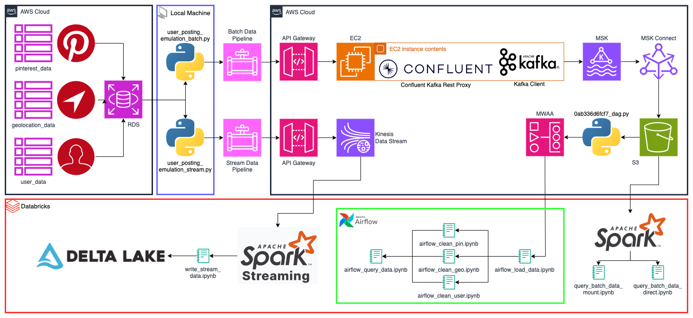
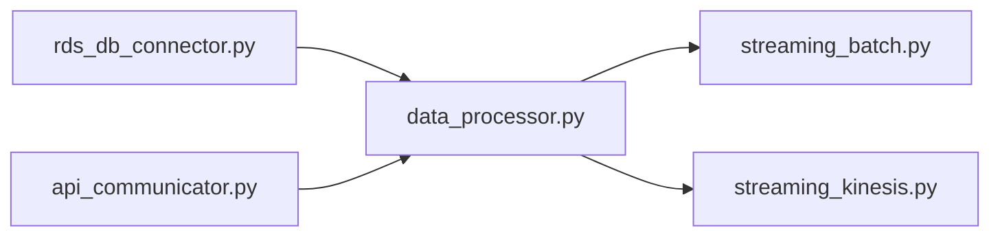
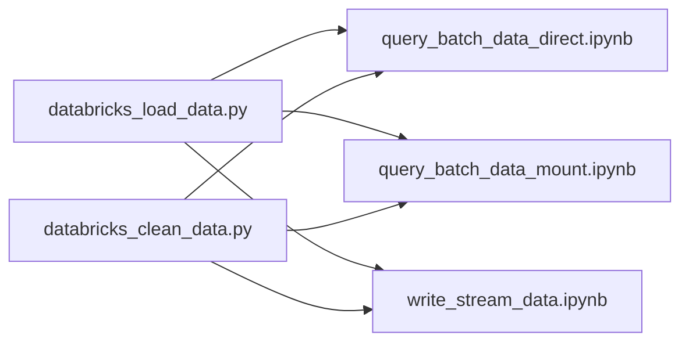
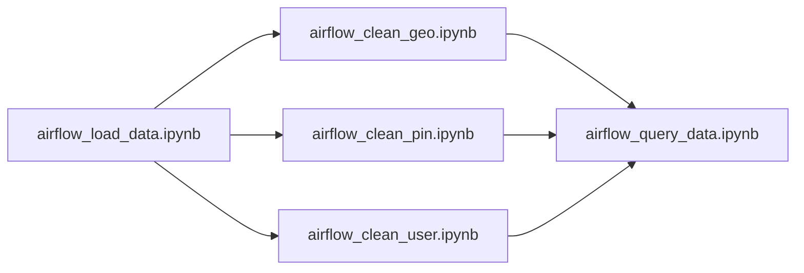

# AWS Data Pipeline Project

This data pipeline project emulates a data management system similar to what a large social media platform, such as Pinterest, might use. It provides a practical look into how data can be efficiently collected, processed, and stored in a cloud environment like AWS.

## Architecture Design



## Project Navigation

The [wiki](https://github.com/ChefData/pinterest-data-pipeline545/wiki) supplies six project walkthrough documents detailing the process of emulating the Pinterest system of processing data using the AWS Cloud.

- [Part 1](https://github.com/ChefData/pinterest-data-pipeline545/wiki/1:-EC2-instance-as-a-Apache-Kafka-machine) will describe how to configure a `EC2 Kafka client`.
- [Part 2](https://github.com/ChefData/pinterest-data-pipeline545/wiki/2:-MSK-cluster-to-S3-bucket) will describe how to connect an `MSK cluster` to an `S3 bucket`.
- [Part 3](https://github.com/ChefData/pinterest-data-pipeline545/wiki/3:-Configuring-API-Gateway) will describe configuring an `API` in `API Gateway`.
- [Part 4](https://github.com/ChefData/pinterest-data-pipeline545/wiki/4:-ETL-in-Databricks) will describe how to read, clean and query data on `Databricks`.
- [Part 5](https://github.com/ChefData/pinterest-data-pipeline545/wiki/5:-Managed-Workflows-for-Apache-Airflow) will describe how to orchestrate `Databricks` Workloads on `MWAA`.
- [Part 6](https://github.com/ChefData/pinterest-data-pipeline545/wiki/6:-Kinesis-Streaming) will describe how to create data streams using `Kinesis Data Streams`.

## Aim of the project

This project aims to provide hands-on experience setting up and managing a data pipeline. It offers insights into how large-scale applications like Pinterest handle vast amounts of data, ensuring it's processed efficiently and stored securely. The aim is to create a robust data pipeline that enables us to:

- **Data Emulation**: Develop a script that retrieves data from an Amazon RDS to effectively emulate the process of posting data as it would occur on a platform like Pinterest.
- **Data Processing with Kafka**: Implement Apache Kafka to process the influx of data efficiently, ensuring smooth data flow and scalability.
- **Data Storage in S3**: Utilise Amazon S3 buckets to securely store processed data and easily access it for future analysis.
- **API Integration for Data Streaming**: Develop an API to facilitate data streaming into the Kafka cluster and for data distribution to an S3 data lake.
- **Data Analysis in Databricks**: To extract batch data from AWS S3 and transform it in Databricks using pySpark, and to conduct comprehensive batch analysis on the stored Pinterest data
- **Workflow Orchestration with MWAA**: Employ Managed Workflows for Apache Airflow (MWAA) to orchestrate complex data workflows using Directed Acyclic Graphs (DAGs), which enhances the automation and monitoring of the data pipeline.
- **Real-time Data Handling with Kinesis**: Integrate AWS Kinesis Data Streams to extend the pipeline's capabilities for real-time data management using a Spark cluster on Databricks.

## Tools Used

[](https://aws.amazon.com/) **Amazon Web Services (AWS):** A comprehensive, scalable cloud computing platform provided by Amazon, offering a wide range of services including computing power, storage, databases, machine learning, and more.

[](https://aws.amazon.com/api-gateway/) **AWS API Gateway:** A fully managed service provided by Amazon Web Services (AWS) for creating, publishing, maintaining, monitoring, and securing APIs at any scale, facilitating the creation of RESTful APIs and WebSocket APIs for backend services.

[](https://aws.amazon.com/ec2/) **AWS EC2:** Elastic Compute Cloud (EC2) is a web service provided by Amazon Web Services (AWS) that allows users to rent virtual computers on which to run their own computer applications, providing scalable computing capacity in the cloud.

[](https://aws.amazon.com/iam/) **AWS IAM:** Identity and Access Management (IAM) is a web service provided by Amazon Web Services (AWS) that enables administrators to securely control access to AWS services and resources for users and groups, facilitating secure management of user identities, permissions, and access keys.

[](https://aws.amazon.com/kinesis/) **AWS Kinesis:** Amazon Kinesis is a platform provided by Amazon Web Services (AWS) for real-time data streaming and analytics, allowing users to ingest, process, and analyse large streams of data in real-time to extract insights and take actions.

[](https://aws.amazon.com/msk/) **AWS MSK:** Amazon Managed Streaming for Apache Kafka (MSK) is a fully managed service provided by Amazon Web Services (AWS) for building and running applications that use Apache Kafka, facilitating the provisioning, scaling, and management of Apache Kafka clusters without the need for manual setup and configuration.

[](https://aws.amazon.com/rds/) **AWS RDS:** Amazon Relational Database Service (RDS) is a web service provided by Amazon Web Services (AWS) that makes it easy to set up, operate, and scale relational databases in the cloud, supporting multiple database engines such as MySQL, PostgreSQL, SQL Server, and more.

[](https://aws.amazon.com/s3/) **AWS S3:** Amazon Simple Storage Service (S3) is an object storage service provided by Amazon Web Services (AWS) that offers scalable storage for data storage, backup, and recovery, serving as a reliable and cost-effective storage solution for a wide range of use cases.

[](https://aws.amazon.com/vpc/) **AWS VPC:** Amazon Virtual Private Cloud (VPC) is a web service provided by Amazon Web Services (AWS) that allows users to create isolated networks within the AWS cloud, enabling complete control over network configuration, including IP addressing, subnets, route tables, and security settings.

[](https://airflow.apache.org/) **Apache Airflow:** A platform used to programmatically author, schedule, and monitor workflows, allowing for complex data pipelines to be built, managed, and automated.

[](https://kafka.apache.org/) **Apache Kafka:** A distributed streaming platform used for building real-time data pipelines and streaming applications, known for its high throughput, fault tolerance, and scalability.

[](https://spark.apache.org/) **Apache Spark:** A unified analytics engine for big data processing, providing APIs for batch processing, real-time streaming, machine learning, and graph processing, with built-in support for multiple languages and libraries.

[](https://www.gnu.org/software/bash/) **Bash:** A Unix shell and command language used for executing commands, scripting, and automating tasks in Unix-like operating systems.

[](https://conda.io/) **Conda:** Conda is an open-source package management system and environment management system that runs on Windows, macOS, and Linux. It allows users to easily install, run, and manage packages and dependencies for data science, scientific computing, and machine learning projects.

[](https://databricks.com/) **Databricks:** A unified analytics platform powered by Apache Spark, designed to accelerate innovation by bringing data science, engineering, and business together on a single platform.

[](https://git-scm.com/) **Git:** A distributed version control system widely used for tracking changes in source code during software development, facilitating collaboration among multiple developers.

[](https://git-scm.com/) **GitHub:** A web-based platform for hosting and collaborating on Git repositories, widely used by developers for version control, collaboration, and project management.

[](https://www.json.org/) **JSON (JavaScript Object Notation):** A lightweight data interchange format used for transmitting data between a server and a web application, commonly used for APIs and configuration files.

[](https://www.mysql.com/) **MySQL:** An open-source relational database management system known for its reliability, speed, and ease of use, commonly used for web applications, content management systems, and more.

[](https://www.sqlalchemy.org/) **SQLAlchemy:** A SQL toolkit and Object-Relational Mapping (ORM) library for Python, providing a high-level interface for database interactions and data manipulation, commonly used in web applications and data-driven projects.

[](https://www.python.org/) **Python:** A versatile programming language known for its simplicity and readability, widely used for web development, data analysis, artificial intelligence, and more.

[](https://code.visualstudio.com/) **Visual Studio Code:** A popular, lightweight, and powerful source code editor developed by Microsoft, known for its customisable interface, rich language support, and extensive extension marketplace.

[](https://yaml.org/) **YAML (YAML Ain't Markup Language):** A human-readable data serialisation language used for configuration files and data exchange, known for its simplicity and readability.

## TODO: Resource provisioning

## Project Structure

### Data files

The project uses an RDS database containing three tables resembling data received by the Pinterest API when a user makes a POST request by uploading data to Pinterest:

- `pinterest_data`: Contains data about posts which users upload to Pinterest
- `geolocation_data`: Contains data about the geolocation of each Pinterest post found in pinterest_data
- `user_data`: Contains data about the user that has uploaded each post found in pinterest_data

The data within these tables will emulate Pinterest's data pipeline.

### Local Scripts



- `streaming_batch.py`: Contains a script that extracts Pinterest data from MySQL database and uploads it to an S3 bucket through an API Gateway that goes through an MSK cluster on an EC2 instance.
- `streaming_kinesis.py`: Contains a script that streams real-time data to AWS Kinesis
- `api_communicator.py`: Contains the `APICommunicator` class for communicating with an API and sending data to Kafka topics or Kinesis streams.
- `data_processor.py`: The `DataProcessor` class is responsible for processing data from various sources and sending it to an API.
- `rds_db_connector.py`: Contains the `RDSDBConnector` class for connecting to a database, reading credentials from a YAML file, creating a database URL, initialising an SQLAlchemy engine, and performing database operations.

### Spark Scripts



- `query_batch_data_direct.ipynb`: A script to directly load data from the S3 bucket, clean that data, and query the cleaned data for information.
- `query_batch_data_mount.ipynb`: A script to mount, clean and query data for information.
- `write_stream_data.ipynb`: A script to read real-time kinesis data, clean it, and save it in the delta table on Databricks.
- `databricks_clean_data.py`: Contains the `DataCleaning` class for cleaning data in PySpark DataFrames.
- `databricks_load_data.py`: Contains the `S3DataLoader` class for loading data from AWS S3 into PySpark DataFrames.

### Data Orchestration

- `0ab336d6fcf7_dag.py`: A dag file which runs the following notebooks on databricks daily.



- `airflow_load_data.ipynb`: A script to mount the S3 bucket onto databricks.
- `airflow_clean_geo.ipynb`: This script reads JSON files from the mounted S3 bucket, stores the contents as DataFrames and performs cleaning operations.
- `airflow_clean_pin.ipynb`: A script that reads JSON files from the mounted S3 bucket, stores the contents as DataFrames and performs cleaning operations.
- `airflow_clean_user.ipynb`: This script reads JSON files from the mounted S3 bucket, stores the contents as DataFrames and performs cleaning operations.
- `airflow_query_data.ipynb`: A script to query the cleaned data for information.

### File structure of the project

```text
AWS Data Pipeline

Local Machine
.
├── USER_ID-key-pair.pem
├── AiCore-Project-PDP-env.yaml
├── README.md
├── README_Images
├── classes
│   ├── __init__.py
│   ├── api_communicator.py
│   ├── aws_db_connector.py
│   └── rds_db_connector.py
├── creds.yaml
├── databricks
│   ├── airflow
│   │   ├── 0ab336d6fcf7_dag.py
│   │   ├── airflow_clean_geo.ipynb
│   │   ├── airflow_clean_pin.ipynb
│   │   ├── airflow_clean_user.ipynb
│   │   ├── airflow_load_data.ipynb
│   │   └── airflow_query_data.ipynb
│   ├── classes
│   │   ├── databricks_clean_data.py
│   │   └── databricks_load_data.py
│   ├── query_batch_data_direct.ipynb
│   ├── query_batch_data_mount.ipynb
│   └── write_stream_data.ipynb
├── streaming_batch.py
├── streaming_kinesis.py
├── .gitignore
└── .env

EC2 Instance
├── kafka_2.12-2.8.1
│   ├── bin
│   │   └── client.properties
│   └── libs
│       └── aws-msk-iam-auth-1.1.5-all.jar
├── kafka-connect-s3
│   └── confluentinc-kafka-connect-s3-10.0.3.zip
└── confluent-7.2.0
    └── etc
        └── kafka-rest
            └── kafka-rest.properties
```

## Troubleshooting

If you encounter any issues during the installation or setup process, please open an issue in the repository.
