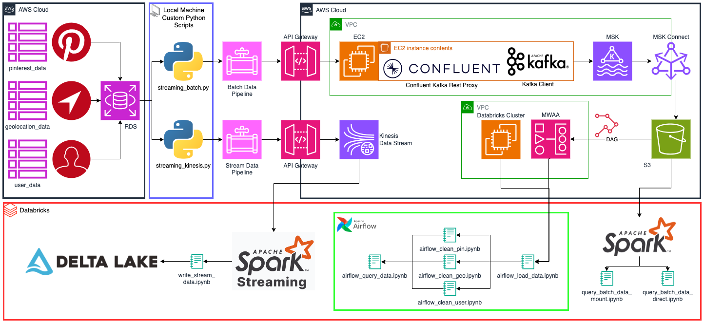
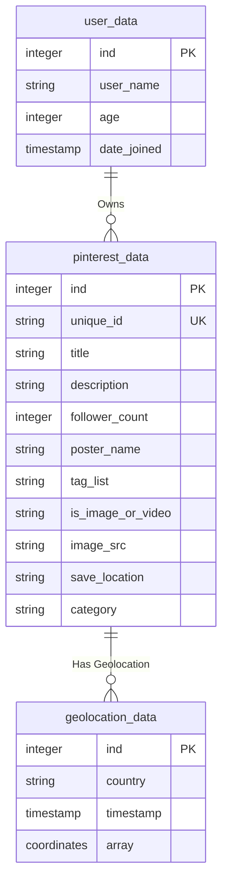

# AWS Data Pipeline Project

This data pipeline project emulates a data management system similar to what a large social media platform, such as Pinterest, might use. It provides a practical look into how data can be efficiently collected, processed, and stored in a cloud environment like AWS.

Two distinct data pipelines were developed, one for a batch ELT process, and another for a ETL stream process.

## Data Management

### Architecture Design

This diagram illustrates the formal structure for managing data flow of the batch and stream processing framework.



### Data Security

Ensuring robust data security is paramount in any data pipeline, and this project prioritises protecting sensitive information at every stage. From data ingestion to processing and storage, the architecture implements stringent security measures to safeguard data integrity and confidentiality.

- Encryption protocols secure data transmission, while access controls and authentication mechanisms restrict access to authorised personnel.
- Implementing encryption protocols, such as HTTPS, across API endpoints helps safeguard data during transit and prevents unauthorised access or interception.
- Additionally, enforcing authentication mechanisms, such as API keys, ensures that only authorised users or systems can access the API endpoints, reducing the risk of data breaches.

AWS offers a range of security features and best practices to safeguard data throughout the pipeline's lifecycle.

- Encryption plays a central role, with AWS Key Management Service (KMS) providing secure key management for encrypting data at rest and in transit.
- Access control is enforced using Identity and Access Management (IAM), ensuring only authorised users and services can interact with the pipeline's components and APIs.
- Network security measures, such as Virtual Private Cloud (VPC) enhances security by providing a private, isolated network environment for the EC2 instances, safeguarding sensitive data and preventing unauthorised access. This combination of EC2 and VPC provisioning offers a robust infrastructure foundation for the data pipeline, enabling reliable and secure data processing workflows.
- Continuous monitoring and logging through AWS CloudWatch and AWS CloudTrail provide visibility into system activity, enabling rapid detection and response to security incidents.

By prioritising data security, this project aims to instil confidence in users and stakeholders regarding protecting their valuable data assets.

### Resource provisioning

Resource provisioning is crucial in ensuring efficient and scalable data processing. This data pipeline implements effective resource provisioning strategies to seamlessly adapt to varying workloads, maximising performance and reliability while minimising costs.

Leveraging cloud infrastructure, such as Amazon Web Services (AWS), enables the dynamic allocation of computing resources tailored to the pipeline's workload demands via auto-scaling, automatically adjusting capacity to maintain steady, predictable performance at the lowest possible cost. Utilising services like AWS EC2 instances within a Virtual Private Cloud (VPC) environment ensures optimal resource utilisation while minimising operational overhead.

Additionally, orchestration tools such as Airflow facilitate scaling pipeline components, enhancing flexibility and resilience.

This project aims to instill confidence in users and stakeholders regarding protecting their valuable data assets by prioritising data security and implementing efficient resource provisioning strategies.

## Project Navigation

The [wiki](https://github.com/ChefData/pinterest-data-pipeline545/wiki) supplies six project walkthrough documents detailing the process of emulating the Pinterest system of processing data using the AWS Cloud.

- [Part 1](https://github.com/ChefData/pinterest-data-pipeline545/wiki/1:-EC2-instance-as-a-Apache-Kafka-machine) will describe how to configure a `EC2 Kafka client`.
- [Part 2](https://github.com/ChefData/pinterest-data-pipeline545/wiki/2:-MSK-cluster-to-S3-bucket) will describe how to connect an `MSK cluster` to an `S3 bucket`.
- [Part 3](https://github.com/ChefData/pinterest-data-pipeline545/wiki/3:-Configuring-API-Gateway) will describe configuring an `API` in `API Gateway`.
- [Part 4](https://github.com/ChefData/pinterest-data-pipeline545/wiki/4:-ETL-in-Databricks) will describe how to read, clean and query data on `Databricks`.
- [Part 5](https://github.com/ChefData/pinterest-data-pipeline545/wiki/5:-Managed-Workflows-for-Apache-Airflow) will describe how to orchestrate `Databricks` Workloads on `MWAA`.
- [Part 6](https://github.com/ChefData/pinterest-data-pipeline545/wiki/6:-Kinesis-Streaming) will describe how to create data streams using `Kinesis Data Streams`.

## Aim of the project

This project aims to provide hands-on experience setting up and managing a data pipeline. It offers insights into how large-scale applications like Pinterest handle vast amounts of data, ensuring it's processed efficiently and stored securely. The aim is to create a robust data pipeline that enables us to:

- **Data Emulation**: Develop a script that retrieves data from an Amazon RDS to effectively emulate the process of posting data as it would occur on a platform like Pinterest.
- **Data Processing with Kafka**: Implement Apache Kafka to process the influx of data efficiently, ensuring smooth data flow and scalability.
- **Data Storage in S3**: Utilise Amazon S3 buckets to securely store processed data and easily access it for future analysis.
- **API Integration for Data Streaming**: Develop an API to facilitate data streaming into the Kafka cluster and for data distribution to an S3 data lake.
- **Data Analysis in Databricks**: To extract batch data from AWS S3 and transform it in Databricks using pySpark, and to conduct comprehensive batch analysis on the stored Pinterest data
- **Workflow Orchestration with MWAA**: Employ Managed Workflows for Apache Airflow (MWAA) to orchestrate complex data workflows using Directed Acyclic Graphs (DAGs), which enhances the automation and monitoring of the data pipeline.
- **Real-time Data Handling with Kinesis**: Integrate AWS Kinesis Data Streams to extend the pipeline's capabilities for real-time data management using a Spark cluster on Databricks.

## Project Structure

### Data files

The project uses an RDS database containing three tables resembling data received by the Pinterest API when a user makes a POST request by uploading data to Pinterest:

- `pinterest_data`: Contains data about posts which users upload to Pinterest
- `geolocation_data`: Contains data about the geolocation of each Pinterest post found in pinterest_data
- `user_data`: Contains data about the user that has uploaded each post found in pinterest_data



### Local Scripts


- `rds_db_connector.py`: Contains the `RDSDBConnector` class for connecting to a database, reading credentials from a YAML file, creating a database URL, initialising an SQLAlchemy engine, and performing database operations.
- `api_communicator.py`: Contains the `APICommunicator` class for communicating with an API and sending data to Kafka topics or Kinesis streams.
- `data_processor.py`: The `DataProcessor` class is responsible for processing data from various sources and sending it to an API.
- `streaming_batch.py`: Contains a script that extracts Pinterest data from MySQL database and uploads it to an S3 bucket through an API Gateway that goes through an MSK cluster on an EC2 instance.
- `streaming_kinesis.py`: Contains a script that streams real-time data to AWS Kinesis

### Spark Scripts


- `databricks_load_data.py`: Contains the `S3DataLoader` class for loading data from AWS S3 into PySpark DataFrames.
- `databricks_clean_data.py`: Contains the `DataCleaning` class for cleaning data in PySpark DataFrames.
- `query_batch_data_direct.ipynb`: A script to directly load data from the S3 bucket, clean that data, and query the cleaned data for information.
- `query_batch_data_mount.ipynb`: A script to mount, clean and query data for information.
- `write_stream_data.ipynb`: A script to read real-time kinesis data, clean it, and save it in the delta table on Databricks.

### Data Orchestration

- `0ab336d6fcf7_dag.py`: A dag file which runs the following notebooks on databricks daily.


- `airflow_load_data.ipynb`: A script to mount the S3 bucket onto databricks.
- `airflow_clean_geo.ipynb`: This script reads JSON files from the mounted S3 bucket, stores the contents as DataFrames and performs cleaning operations.
- `airflow_clean_pin.ipynb`: A script that reads JSON files from the mounted S3 bucket, stores the contents as DataFrames and performs cleaning operations.
- `airflow_clean_user.ipynb`: This script reads JSON files from the mounted S3 bucket, stores the contents as DataFrames and performs cleaning operations.
- `airflow_query_data.ipynb`: A script to query the cleaned data for information.

### File structure of the project

```text
AWS Data Pipeline

Local Machine
.
├── 📁classes
│   ├── __init__.py
│   ├── api_communicator.py
│   ├── aws_db_connector.py
│   └── rds_db_connector.py
├── 📁credentials
│   ├── creds_template.yaml
│   └── template.env
├── 📁databricks
│   ├── 📁airflow
│   │   ├── 0ab336d6fcf7_dag.py
│   │   ├── airflow_clean_geo.ipynb
│   │   ├── airflow_clean_pin.ipynb
│   │   ├── airflow_clean_user.ipynb
│   │   ├── airflow_load_data.ipynb
│   │   └── airflow_query_data.ipynb
│   ├── 📁classes
│   │   ├── databricks_clean_data.py
│   │   └── databricks_load_data.py
│   ├── query_batch_data_direct.ipynb
│   ├── query_batch_data_mount.ipynb
│   └── write_stream_data.ipynb
├── 📁README_Images
├── .env
├── .gitignore
├── USER_ID-key-pair.pem
├── AiCore-Project-PDP-env.yaml
├── creds.yaml
├── LICENSE
├── README.md
├── streaming_batch.py
└── streaming_kinesis.py

EC2 Instance
├── 📁kafka_2.12-2.8.1
│   ├── 📁bin
│   │   └── client.properties
│   └── 📁libs
│       └── aws-msk-iam-auth-1.1.5-all.jar
├── 📁kafka-connect-s3
│   └── confluentinc-kafka-connect-s3-10.0.3.zip
└── 📁confluent-7.2.0
    └── 📁etc
        └── 📁kafka-rest
            └── kafka-rest.properties
```

## Troubleshooting

If you encounter any issues during the installation or setup process, please open an issue in the repository.
