# Walkthrough of Pinterest Data Pipeline Project

## Table of Contents

- [Batch Processing: Configure the EC2 Kafka client](#batch-processing-configure-the-ec2-kafka-client)
  - [Setting up permissions](#setting-up-permissions)
  - [Connect to the EC2 instance](#connect-to-the-ec2-instance)
  - [Set up Kafka on the EC2 instance](#set-up-kafka-on-the-ec2-instance)
  - [Setting up IAM authentication](#setting-up-iam-authentication)
  - [Setting up CLASSPATH environment variable](#setting-up-classpath-environment-variable)
  - [Configure Kafka client to use AWS IAM](#configure-kafka-client-to-use-aws-iam)
  - [Create Kafka topics](#create-kafka-topics)
- [Batch Processing: Connect a MSK cluster to a S3 bucket](#batch-processing-connect-a-msk-cluster-to-a-s3-bucket)
  - [Create a custom plugin with MSK Connect](#create-a-custom-plugin-with-msk-connect)
  - [Create a connector with MSK Connect](#create-a-connector-with-msk-connect)
- [Batch Processing: Configuring an API in API Gateway](#batch-processing-configuring-an-api-in-api-gateway)
  - [Build a Kafka REST proxy integration method for the API](#build-a-kafka-rest-proxy-integration-method-for-the-api)
  - [Set up the Kafka REST proxy on the EC2 client](#set-up-the-kafka-rest-proxy-on-the-ec2-client)
  - [Starting the Kafka REST proxy on the EC2 client](#starting-the-kafka-rest-proxy-on-the-ec2-client)
  - [Send data to the API](#send-data-to-the-api)
  - [Checking Data has been sent with a Kafka consumer](#checking-data-has-been-sent-with-a-kafka-consumer)
  - [Checking Data has been ingested and stored in the S3 bucket](#checking-data-has-been-ingested-and-stored-in-the-s3-bucket)
- [Batch Processing: Apache Spark on Databricks](#batch-processing-apache-spark-on-databricks)
  - [Create AWS Access Key and Secret Access Key for Databricks](#create-aws-access-key-and-secret-access-key-for-databricks)
  - [Upload credential csv file to Databricks](#upload-credential-csv-file-to-databricks)
  - [Mount an AWS S3 bucket to Databricks](#mount-an-aws-s3-bucket-to-databricks)
  - [Reading JSON files from mounted S3 bucket](#reading-json-files-from-mounted-s3-bucket)
  - [Clean data read from JSON files](#clean-data-read-from-json-files)
    - [Clean pin df](#clean-pin-df)
    - [Clean geo df](#clean-geo-df)
    - [Clean user df](#clean-user-df)

## Batch Processing: Configure the EC2 Kafka client

The following is a step by step guide of how to create the batch pipeline.

### Setting up permissions

Ensure you have the private key file (.pem) associated with the key pair used for the instance, as described in the [Credential Setup](#credential-setup)

In terminal on your local machine:

- Use the following command to set the appropriate permissions for the private key file to ensure it is only accessible by the owner:

    ```bash
    chmod 400 /path/to/KEY_PAIR_NAME.pem
    ```

> [!NOTE]
>
> The command 'chmod' is used to change the ownership and permission. In linux their are 3 types of ownership (User, Group, Other) and 3 types of permission (Read, Write, Excute).
>
> In the command 'chmod 400' the 3 digits are associated with:
>
> - 1st position show ownership of USER === Here 4
> - 2st position show ownership of GROUP === Here 0
> - 3st position show ownership of OTHER === Here 0
>
> The numbers represent:
>
> - 0=>No permission
> - 1=>Excute
> - 2=>Write
> - 3=>Execute + Write
> - 4=>Read
> - 5=>Read + Execute
> - 6=>Read +Write
> - 7=>Read + Write +Execute
>
> The command 'chmod 400' therefore represents:
>
> - READ permission for USER
> - NO permission for GROUP
> - NO permission for OTHER

### Connect to the EC2 instance

In terminal on your local machine:

- Use the SSH command to connect to the instance. You can find the exact command to connect to the EC2 instance under 'Example' in the EC2 Instance SSH client tab:

    ```bash
    ssh -i "/path/to/KEY_PAIR_NAME.pem" ec2-user@public_dns_name
    ```

When accessing the EC2 client using SSH for the first time a message may be encountered about the authenticity of the host. This message is prompted because the SSH client does not recognise the remote host and wants to verify its authenticity to ensure secure communication.

Type yes to confirm and continue connecting. By doing so, the key fingerprint will be stored in the SSH client's known_hosts file, and future connections to the same host will not prompt the same message.

If during this process your local machine is logged off the instance just run the ssh command again to reconnect.

### Set up Kafka on the EC2 instance

In order to connect to the IAM authenticated MSK cluster, the appropriate packages need to be installed on the EC2 client machine.

On the client EC2 machine:

- Install Java 1.8.0 with the following command:

    ```bash
    sudo yum install java-1.8.0
    ```

- Install Kafka 2.12-2.8.1 with the following command:

    ```bash
    wget https://archive.apache.org/dist/kafka/2.8.1/kafka_2.12-2.8.1.tgz  
    ```

- Extract the downloaded Kafka archive by running the following command:

    ```bash
    tar -xzf kafka_kafka_2.12-2.8.1.tar
    ```

- Running the following command will output the following image:

    ```bash
    cd /home/ec2-user/kafka_2.12-2.8.1
    ls -al
    ```

    

### Setting up IAM authentication

MSK clusters support IAM authentication. IAM access control allows MSK to enable both authentication and authorisation for clusters. This means, that if a client tries to write something to the cluster, MSK uses IAM to check whether the client is an authenticated identity and also whether it is authorised to produce to the cluster. To connect to a cluster that uses IAM authentication, follow these additional steps.

On the client EC2 machine:

- Inside the libs folder download the IAM MSK authentication package from Github, using the following command:

    ```bash
    cd /home/ec2-user/kafka_2.12-2.8.1/libs
    wget https://github.com/aws/aws-msk-iam-auth/releases/download/v1.1.5/aws-msk-iam-auth-1.1.5-all.jar
    ```

### Setting up CLASSPATH environment variable

In order to ensure that the Amazon MSK IAM libraries are easily accessible to the Kafka client, regardless of the location from which commands are executed, the environment variable CLASSPATH needs to be setup.

On the client EC2 machine:

- To set up the CLASSPATH environment variable, use the following command:

    ```bash
    export CLASSPATH=/home/ec2-user/kafka_2.12-2.8.1/libs/aws-msk-iam-auth-1.1.5-all.jar
    ```

When opening a new session or restarting an EC2 instance, any environment variables that were set in previous sessions will not persist. Therefore, to maintain the CLASSPATH environment variable across sessions, add the export command to the .bashrc file located in the home directory of the ec2-user.

On the client EC2 machine:

- Open .bashrc using the command:

    ```bash
    cd /home/ec2-user/
    nano ~/.bashrc
    ```

- Add the same export command to the .bashrc file:

    ```bash
    export CLASSPATH=/home/ec2-user/kafka_2.12-2.8.1/libs/aws-msk-iam-auth-1.1.5-all.jar
    ```

- Once the export command has been inserted into the .bashrc, make sure to save the changes before exiting.
- After making changes to the .bashrc file, run the source command to apply the changes to the current session:

    ```bash
    source ~/.bashrc
    ```

- To verify if the CLASSPATH environment variable was set properly, use the echo command to display its value:

    ```bash
    echo $CLASSPATH
    ```

- If the CLASSPATH was set correctly, this command will output the path assigned to it, which in this case is /home/ec2-user/kafka_2.12-2.8.1/libs/aws-msk-iam-auth-1.1.5-all.jar

### Configure Kafka client to use AWS IAM

On the client EC2 machine:

- To configure a Kafka client to use AWS IAM for authentication, create a client.properties file, using the following command:

    ```bash
    cd /home/ec2-user/kafka_2.12-2.8.1/bin
    nano client.properties
    ```

- The client.properties file should contain the following (replacing IAM_ARN as described in the [Credential Setup](#credential-setup)):

    ```bash
    # Sets up TLS for encryption and SASL for authN.
    security.protocol = SASL_SSL

    # Identifies the SASL mechanism to use.
    sasl.mechanism = AWS_MSK_IAM

    # Binds SASL client implementation. Uses the specified profile name to look for credentials.
    sasl.jaas.config = software.amazon.msk.auth.iam.IAMLoginModule required awsRoleArn="IAM_ARN";

    # Encapsulates constructing a SigV4 signature based on extracted credentials.
    # The SASL client bound by "sasl.jaas.config" invokes this class.
    sasl.client.callback.handler.class = software.amazon.msk.auth.iam.IAMClientCallbackHandler
    ```

- Once the previous text has been inserted into the client.properties file, make sure to save the changes before exiting.

### Create Kafka topics

An Apache Kafka topic is a named channel for messages. Producers publish messages to topics, and consumers subscribe to them. Topics help organise and categorise data flow, allowing for scalable and flexible data distribution. Each message is associated with a topic, and topics are divided into partitions for parallel processing.

This project uses a RDS database containing three tables resembling data received by the Pinterest API when a POST request is made by a user uploading data to Pinterest. A topic will be created for each table in the RDS database.

To create the three topics, run the following commands (replacing BOOTSTRAP_SERVER_STRING and USER_ID as described in the [Credential Setup](#credential-setup)):

- For the Pinterest data

    ```bash
    cd /home/ec2-user/kafka_2.12-2.8.1/bin
    ./kafka-topics.sh --bootstrap-server <BOOTSTRAP_SERVER_STRING> --command-config client.properties --create --topic <USER_ID>.pin
    ```

- For the geolocation data

    ```bash
    cd /home/ec2-user/kafka_2.12-2.8.1/bin
    ./kafka-topics.sh --bootstrap-server <BOOTSTRAP_SERVER_STRING> --command-config client.properties --create --topic <USER_ID>.geo
    ```

- For the user data

    ```bash
    cd /home/ec2-user/kafka_2.12-2.8.1/bin
    ./kafka-topics.sh --bootstrap-server <BOOTSTRAP_SERVER_STRING> --command-config client.properties --create --topic <USER_ID>.user
    ```

## Batch Processing: Connect a MSK cluster to a S3 bucket

### Create a custom plugin with MSK Connect

The Confluent.io Amazon S3 Connector is a sink connector that exports data from Kafka topics to S3 objects in either JSON, Avro or Bytes format.

In the EC2 client machine:

- Download the Confluent.io Amazon S3 Connector and copy it to the S3 bucket by running the following command (replacing BUCKET_NAME as described in the [Credential Setup](#credential-setup)):

    ```bash
    # assume admin user privileges
    sudo -u ec2-user -i
    # create directory where we will save our connector
    mkdir kafka-connect-s3 && cd kafka-connect-s3
    # download connector from Confluent
    wget https://d1i4a15mxbxib1.cloudfront.net/api/plugins/confluentinc/kafka-connect-s3/versions/10.0.3/confluentinc-kafka-connect-s3-10.0.3.zip
    # copy connector to our S3 bucket
    aws s3 cp ./confluentinc-kafka-connect-s3-10.0.3.zip s3://<BUCKET_NAME>/kafka-connect-s3/
    ```

In the S3 console:

- Open the bucket associated with the USER_ID.
- Open the newly created folder kafka-connect-s3/
- Select the zip file and copy the S3 URI

In the MSK console:

- Select 'Customised plugins' under the 'MSK Connect' section on the left side of the console
- Choose Create custom plugin
- Paste the S3 URI for the zip file
- Create a custom plugin with the following name: <USER_ID>-plugin

### Create a connector with MSK Connect

In the MSK console:

- Select Connectors under the MSK Connect section on the left side of the console
- Choose Create connector
- In the list of plugins, select the newly created plugin, and then click Next.
- For this project the AWS account only had permissions to create a connector with the following name: <USER_ID>-connector
- Then choose the pinterest-msk-cluster from the cluster list.
- To ensure that data going through the three previously created Kafka topics will get saved to the S3 bucket, paste the following configuration in the Connector configuration settings (replacing BUCKET_NAME and USER_ID as described in the [Credential Setup](#credential-setup)):

    ```bash
    connector.class=io.confluent.connect.s3.S3SinkConnector
    # same region as our bucket and cluster
    s3.region=us-east-1
    flush.size=1
    schema.compatibility=NONE
    tasks.max=3
    # include nomeclature of topic name, given here as an example will read all data from topic names starting with msk.topic....
    topics.regex=<USER_ID>.*
    format.class=io.confluent.connect.s3.format.json.JsonFormat
    partitioner.class=io.confluent.connect.storage.partitioner.DefaultPartitioner
    value.converter.schemas.enable=false
    value.converter=org.apache.kafka.connect.json.JsonConverter
    storage.class=io.confluent.connect.s3.storage.S3Storage
    key.converter=org.apache.kafka.connect.storage.StringConverter
    s3.bucket.name=<BUCKET_NAME>
    ```

- Change the 'Connector capacity type' to 'Provisioned'; ensure both the MCU count per worker and Number of workers are set to 1
- Change 'Worker Configuration' to 'Use a customised configuration', then pick 'confluent-worker'
- Under 'Access permissions' select the IAM role previously created: the role has the following format <USER_ID>-ec2-access-role
- Leave the rest of the configurations as default.
- Skip the rest of the pages.

Once your connector is up and running you will be able to visualise it in the Connectors tab in the MSK console.

Now that the plugin-connector pair has been built, data passing through the IAM authenticated cluster will be automatically stored in the designated S3 bucket, in a newly created folder called topics.

## Batch Processing: Configuring an API in API Gateway

### Build a Kafka REST proxy integration method for the API

By building a Kafka REST Proxy integration (which provides a RESTful interface to a Kafka cluster) it will make it easy to produce and consume messages, view the state of a cluster, or perform administrative actions without using native Kafka protocols or clients.

> HTTP proxy integration is a simple, yet powerful way of building APIs that allow web applications to access multiple resources on the integrated HTTP endpoint. In HTTP proxy integration, API Gateway simply passes client-submitted method requests to the backend. In turn the backend HTTP endpoint parses the incoming data request to determine the appropriate return responses.
>
> Creating a proxy resource with the {proxy+} parameter and the ANY method, provides the integration with access to all available resources.
>
> [!GitHub]
> Creating a {proxy+} resource with HTTP proxy integration allows a streamlined setup where the API Gateway submits all request data directly to the backend with no intervention from API Gateway.
> All requests and responses are handled by the backend - in this case the Confluent REST Proxy on the EC2 instance.
>
> [!GitHub]
> By installing a Confluent REST Proxy for Kafka on the EC2 instance, we can post data from the Pinterest emulator to a REST API on the Amazon API Gateway which in turn sends it via the proxy to update the Kafka topics on the MSK cluster without having to create and maintain producer programs locally on the EC2 instance.

In the 'API Gateway' console

- Select REST type API with regional endpoint
- Select 'Create resource' to create a new child resource for our API


- Select the 'Proxy resource' toggle
- For 'Resource Name' enter {proxy+}
- Enable 'CORS (Cross Origin Resource Sharing)'
- Select 'Create Resource'


- To set up an integration click on the 'ANY' resource


- Then click on the 'Edit integration' button


- For 'Integration type' select 'HTTP'
- Select the 'HTTP proxy integration' toggle
- For 'HTTP method' select 'ANY'
- For the Endpoint URL, enter the Kafka Client Amazon EC2 Instance Public IPv4 DNS with the following format (replacing KAFKA_CLIENT_EC2_INSTANCE_PUBLIC_DNS as described in the [Credential Setup](#credential-setup)):

    ```bash
    http://<KAFKA_CLIENT_EC2_INSTANCE_PUBLIC_DNS>:8082/{proxy}
    ```

- 8082 is the default port the Confluent REST Proxy listens to
- Click 'Save'


- To deploy the API use the 'Deploy API' button in the top-right corner of the API page.


- For Stage, choose \*New Stage\*
- For Stage name, enter the desired stage name, for example 'Test'.
  - Copy the stage name as the DEPLOYMENT_STAGE as described in the [Credential Setup](#credential-setup)
- Click 'Deploy'
  - Copy the Invoke URL as the INVOKE_URL as described in the [Credential Setup](#credential-setup). It will have the following structure: <https://APIInvokeURL/Test>

### Set up the Kafka REST proxy on the EC2 client

Now the Kafka REST Proxy integration for the API has been set up, it is time to set up the Kafka REST Proxy on the EC2 client machine. To be able to consume data using MSK from the API just created, additional packages need to be downloaded on the client EC2 machine.

On the client EC2 machine:

- Install Confluent package for Kafka REST proxy, using the following command:

    ```bash
    sudo wget https://packages.confluent.io/archive/7.2/confluent-7.2.0.tar.gz
    tar -xvzf confluent-7.2.0.tar.gz
    ```

- To configure the REST proxy to communicate with the desired MSK cluster, and to perform IAM authentication the kafka-rest.properties file needs to be modified:

    ```bash
    cd /home/ec2-user/confluent-7.2.0/etc/kafka-rest
    nano kafka-rest.properties
    ```


- To allow the REST proxy to connect to the MSK cluster:
  - Modify the bootstrap.servers variable with the BOOTSTRAP_SERVER_STRING as described in the [Credential Setup](#credential-setup)
  - Modify the zookeeper.connect variable with the PLAINTEXT_APACHE_ZOOKEEPER_CONNECTION_STRING as described in the [Credential Setup](#credential-setup)
- To surpass the IAM authentication of the MSK cluster, add the following to the kafka-rest.properties file (replacing IAM_ARN as described in the [Credential Setup](#credential-setup)):

    ```bash
    # Sets up TLS for encryption and SASL for authN.
    client.security.protocol = SASL_SSL

    # Identifies the SASL mechanism to use.
    client.sasl.mechanism = AWS_MSK_IAM

    # Binds SASL client implementation.
    client.sasl.jaas.config = software.amazon.msk.auth.iam.IAMLoginModule required awsRoleArn="<IAM_ARN>";

    # Encapsulates constructing a SigV4 signature based on extracted credentials.
    # The SASL client bound by "sasl.jaas.config" invokes this class.
    client.sasl.client.callback.handler.class = software.amazon.msk.auth.iam.IAMClientCallbackHandler
    ```

- Once the previous text has been inserted into the client.properties file, make sure to save the changes before exiting.

    > Notice the difference from the Kafka client.properties file. To allow communication between the REST proxy and the cluster brokers, all configurations should be prefixed with client.

### Starting the Kafka REST proxy on the EC2 client

On the client EC2 machine:

- Start the REST proxy with the following command:

    ```bash
    cd /home/ec2-user/confluent-7.2.0/bin
    ./kafka-rest-start /home/ec2-user/confluent-7.2.0/etc/kafka-rest/kafka-rest.properties
    ```

- In the EC2 console, the following message should be present:

    

The proxy is now ready to receive requests from the API and the Kafka related modules are now ready to accept data from the Pinterest users.

### Send data to the API

Data can now be sent to the API, which in turn will send the data to the MSK Cluster using the plugin-connector pair previously created. The user_posting_emulation.py has been supplied to send data to the Kafka topics using the API Invoke URL. It will send data from the three tables to their corresponding Kafka topic.

In terminal on your local machine:

- Navigate to the project directory:

    ```bash
    cd pinterest-data-pipeline545
    ```

- Run the following Python Script:

    ```bash
    python user_posting_emulation.py
    ```

### Checking Data has been sent with a Kafka consumer

To check data has been sent to the cluster, run a Kafka consumer (one per topic).

On the client EC2 machine:

- Open a new terminal window and run the following command (replacing BOOTSTRAP_SERVER_STRING and USER_ID as described in the [Credential Setup](#credential-setup)):

  - For the Pinterest data

    ```bash
    cd /home/ec2-user/kafka_2.12-2.8.1/bin
    ./kafka-console-consumer.sh --bootstrap-server <BOOTSTRAP_SERVER_STRING> --consumer.config client.properties --group <CONSUMER_GROUP> --topic <USER_ID>.pin --from-beginning
    ```

  - For the geolocation data

    ```bash
    cd /home/ec2-user/kafka_2.12-2.8.1/bin
    ./kafka-console-consumer.sh --bootstrap-server <BOOTSTRAP_SERVER_STRING> --consumer.config client.properties --group <CONSUMER_GROUP> --topic <USER_ID>.geo --from-beginning
    ```

  - For the user data

    ```bash
    cd /home/ec2-user/kafka_2.12-2.8.1/bin
    ./kafka-console-consumer.sh --bootstrap-server <BOOTSTRAP_SERVER_STRING> --consumer.config client.properties --group <CONSUMER_GROUP> --topic <USER_ID>.user --from-beginning
    ```

If everything has been set up correctly, the Kafka consumers will show messages being consumed.

The following is a explation of the additional configuration:

- --consumer.config; with the path to a consumer properties file containing security settings, is required as the SSL is being used for authentication
- --from-beginning; option is used to start consuming from the beginning of the topic. To see only new messages, omit this option.

### Checking Data has been ingested and stored in the S3 bucket

If the data has successfully been ingested through Kafka, it will be present in the S3 bucket as follows:


Notice the folder organization (e.g topics/<USER_ID>.pin/partition=0/) that your connector creates in the bucket

## Batch Processing: Apache Spark on Databricks

Apache Spark is a powerful open-source distributed computing system that provides fast and general-purpose cluster computing for big data processing.

Databricks, on the other hand, is a cloud-based platform built on top of Apache Spark, making it easier to deploy and manage Spark clusters. Databricks provides a unified analytics platform that can process large amounts of data quickly. Databricks provides an optimised and managed Spark environment.

To clean and query the data from the three Kafka topics, the S3 bucket will be mounted to a Databricks account. To read data from an Amazon S3 bucket into Databricks, the following steps need to be taken:

### File Structure

- The following file [databricks_load_data.py](../databricks/databricks_load_data.py) holds the methods for lodaing the data within the class *S3DataLoader*
- The following file [databricks_clean_data.py](../databricks/databricks_clean_data.py) holds the methods for cleaning the data within the class *DataCleaning*

- The following file [databricks_query_data_mount.py](../databricks/databricks_query_data_mount.py) holds the script for mounting, cleaning and querying the data.
- The following file [databricks_query_data_direct.py](../databricks/databricks_query_data_direct.py) holds an alternative script for accessing the data, along with cleaning and querying the data. this is due to Databricks no longer recommends mounting external data locations to Databricks Filesystem.

### Create AWS Access Key and Secret Access Key for Databricks

> [!Note]
>
> During this project the Databricks account was already granted full access to S3, so a new Access Key and Secret Access Key was not required for Databricks.
> The following are the steps required to create a new Access Key and Secret Access Key if they were required.

In the 'IAM' console:

- Select 'Users' under the 'Access management' section on the left side of the console
- Click on the 'Create user' button.
- On the 'Specify user details' page, enter the desired 'User name' and click 'Next'.
- On the 'Set permissions' page, select the 'Attach policies directly' choice.
- In the search bar type AmazonS3FullAccess and check the box. (This will allow full access to S3, meaning Databricks will be able to connect to any existing buckets on the AWS account.)
- Skip the next sections until you reach the Review page. Here select the 'Create user' button.
- Now that you have created the IAM User, you will need to assign it a programmatic access key:
  - In the 'Security Credentials' tab select 'Create Access Key'
  - On the subsequent page select 'Command Line Interface (CLI)'
  - Navigate to the bottom of the page click 'I understand'
  - On the next page, give the key-pair a description and select 'Create Access Key'
  - Click the 'Download.csv file' button to download the credentials.

### Upload credential csv file to Databricks

> [!Note]
>
> During this project the credentials file was already uploaded to Databricks.
> This file has been named authentication_credentials.csv.
> The following are the steps required to upload a credentials file if required.

In the 'Databricks' UI:

- Click the 'Catalog' icon and then click '+ Add' --> 'Add data' button.
- Click on 'Create or modify table' and then drop the credentials file downloaded from AWS.
- Once the file has been successfully uploaded, click 'Create table' to finalise the process.
- The credentials will be uploaded in the following location: dbfs:/user/hive/warehouse/
- Now that the access keys are available from within the Databricks file store, they can be used in Databricks notebooks.

### Mount an AWS S3 bucket to Databricks

> [!Note]
>
> This project uses mounting to connect to the AWS S3 bucket.
>
> Databricks no longer recommends mounting external data locations to Databricks Filesystem.
> Databricks recommends migrating away from using mounts, and instead managing data governance with Unity Catalog to configure access to S3 and volumes for direct interaction with files.
>
> As Unity Catalog has yet to be enabled on the account, mounting data via an external location will be used.

Databricks enables users to mount cloud object storage to the Databricks File System (DBFS) to simplify data access patterns.

Databricks mounts create a link between a workspace and cloud object storage, which enables interaction with cloud object storage using familiar file paths relative to the Databricks file system. Mounts work by creating a local alias under the /mnt directory that stores the following information:

- Location of the cloud object storage.
- Driver specifications to connect to the storage account or container.
- Security credentials required to access the data.

### Reading JSON files from mounted S3 bucket

To read the data from the uploaded source, spark.read methods were used in notebooks utilising the Python programming language.

When reading in the JSONs from S3, the complete path to the JSON objects was used, as seen in the S3 bucket (e.g topics/<USER_ID>.pin/partition=0/).

### Creating dataframes from JSON files

Within Databricks three DataFrames will be created to hold the data:

- df_pin for the Pinterest post data
- df_geo for the geolocation data
- df_user for the user data.

However these dataframes are non-Delta tables with many small files. Therefore to improve the performance of queries, these dataframes are converted to Delta with the DeltaTable API. The new dataframe tables will accelerate queries.

A Delta table, refers to a storage layer that brings ACID (Atomicity, Consistency, Isolation, Durability) transactions to Apache Spark. Delta tables are designed to improve the reliability, performance, and manageability of data lakes.

Key features of Delta tables include:

- ACID Transactions: Delta tables provide support for ACID transactions, which ensures that operations on the data are atomic, consistent, isolated, and durable. This is particularly important for data consistency and reliability in a distributed and parallel processing environment.
- Schema Evolution: Delta tables support schema evolution, allowing you to modify the structure of the data over time without requiring a full rewrite of the entire dataset. This is useful when dealing with evolving data requirements.
- Time Travel: Delta tables enable time travel, allowing you to query the data as it existed at a specific point in time. This is beneficial for auditing, debugging, or rolling back to a previous state of the data.
- Concurrency Control: Delta tables provide concurrency control mechanisms to handle multiple users or applications trying to modify the same data concurrently. This helps avoid conflicts and ensures data consistency.
- Unified Batch and Streaming: Delta supports both batch and streaming workloads, making it suitable for a wide range of data processing scenarios. You can use Delta tables for both batch data processing using Spark jobs and real-time streaming data using Structured Streaming.
- Metadata Management: Delta tables maintain metadata that tracks the changes made to the data, enabling efficient management and optimization of data operations.

You can then perform various operations on the Delta table, taking advantage of its ACID properties and other features. Delta tables are particularly useful for managing and processing large-scale data in a robust and efficient manner.

### Clean data read from JSON files

Cleaning data that was read from JSON files typically involves handling missing values, filtering out irrelevant information, and transforming the data into a suitable format.

The following sections detail how the data from the three Kafka topics from the S3 bucket were cleaned within Databricks.

#### Clean pin df

To clean the df_pin DataFrame the following cell will perform the following transformations:

- Replace empty entries and entries with no relevant data in each column with Nones
- Perform the necessary transformations on the follower_count to ensure every entry is a number. Make sure the data type of this column is an int.
- Ensure that each column containing numeric data has a numeric data type
- Clean the data in the save_location column to include only the save location path
- Rename the index column to ind.
- Reorder the DataFrame columns to have the following column order: (ind, unique_id, title, description, follower_count, poster_name, tag_list, is_image_or_video, image_src, save_location, category)

#### Clean geo df

To clean the df_geo DataFrame the follwoing cell will perform the following transformations:

- Create a new column coordinates that contains an array based on the latitude and longitude columns
- Drop the latitude and longitude columns from the DataFrame
- Convert the timestamp column from a string to a timestamp data type
- Reorder the DataFrame columns to have the following column order: (ind, country, coordinates, timestamp)

#### Clean user df

To clean the df_user DataFrame the following cell will perform the following transformations:

- Create a new column user_name that concatenates the information found in the first_name and last_name columns
- Drop the first_name and last_name columns from the DataFrame
- Convert the date_joined column from a string to a timestamp data type
- Reorder the DataFrame columns to have the following column order: (ind, user_name, age, date_joined)

### Querying the Batch Data

Before querieing the data the three dataframes (df_pin, df_geo, and df_user) are joined together on the common column heading 'ind' into a single dataframe called df_all.

To make sure that df_all is a valid DataFrame it will be created and registered as a temporary table before executing any SQL queries. To do this df_all is registered as a temporary view using df_all.createOrReplaceTempView("df_all").

#### Questions Proposed for Querying the Batch Data

Question 1: Find the most popular category in each country

- Find the most popular Pinterest category people post to based on their country.
- The query should return a DataFrame that contains the following columns: (country, category, category_count)

Question 2: Find which was the most popular category each year

- Find how many posts each category had between 2018 and 2022.
- The query will return a DataFrame that contains the following columns: (post_year, category, category_count)

Question 3: Find the user with most followers in each country

- Step 1: For each country find the user with the most followers.
  - Your query should return a DataFrame that contains the following columns: (country, poster_name, follower_count)
- Step 2: Based on the above query, find the country with the user with most followers.
  - Your query should return a DataFrame that contains the following columns: (country, follower_count)
  - This DataFrame should have only one entry.

Question 4: Find the most popular category for different age groups

- What is the most popular category people post to based on the following age groups: (18-24, 25-35, 36-50, +50)
- The query should return a DataFrame that contains the following columns: (age_group, category, category_count)

Question 5: Find the median follower count for different age groups

- What is the median follower count for users in the following age groups: (18-24, 25-35, 36-50, +50)
- The query should return a DataFrame that contains the following columns: (age_group, median_follower_count)

Question 6: Find how many users have joined each year?

- Find how many users have joined between 2015 and 2020.
- The query should return a DataFrame that contains the following columns: (post_year, number_users_joined)

Question 7: Find the median follower count of users based on their joining year

- Find the median follower count of users have joined between 2015 and 2020.
- Your query should return a DataFrame that contains the following columns: (post_year, median_follower_count)

Question 8: Find the median follower count of users based on their joining year and age group

- Find the median follower count of users that have joined between 2015 and 2020, based on which age group they are part of.
- The query should return a DataFrame that contains the following columns: (age_group, post_year, median_follower_count)

## Batch Processing: Managed Workflows for Apache Airflow

Airflow is a generic workflow scheduler with dependency management. Besides its ability to schedule periodic jobs, Airflow lets you express explicit dependencies between different stages in your data pipeline. Each ETL pipeline is represented as a directed acyclic graph (DAG) of tasks. Dependencies are encoded into the DAG by its edges — for any given edge, the downstream task is only scheduled if the upstream task completed successfully. The tasks in Airflow are instances of "operator" class and are implemented as small Python scripts. Since they are simply Python scripts, operators in Airflow can perform many tasks: they can poll for some precondition to be true (also called a sensor) before succeeding, perform ETL directly, or trigger external systems like Databricks.

Databricks implemented an Airflow operator called DatabricksSubmitRunOperator, enabling a smoother integration between Airflow and Databricks. Through this operator, we can hit the Databricks Runs Submit API endpoint, which can externally trigger a single run of a jar, python script, or notebook. After making the initial request to submit the run, the operator will continue to poll for the result of the run. When it completes successfully, the operator will return allowing for downstream tasks to run.

Amazon Managed Workflows for Apache Airflow (MWAA) is a fully managed service provided by Amazon Web Services (AWS) that simplifies the deployment and operation of Apache Airflow. MWAA allows users to build, schedule, and monitor workflows in a scalable and cost-effective manner without the need to manage the underlying infrastructure. All of the components contained in the outer box (in the image below) appear as a single Amazon MWAA environment.
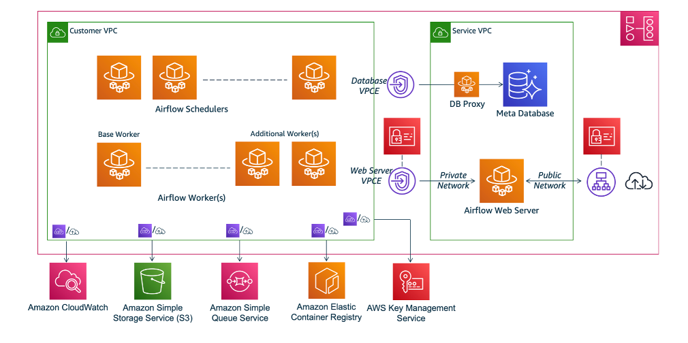

The following section illustrates how you can set up Airflow and use it to trigger Databricks jobs on AWS MWAA.

### Create and upload a DAG to a MWAA environment

> [!Note]
>
> During this project the AWS account had already been provided with access to a MWAA environment 'Databricks-Airflow-env' and to its S3 bucket 'mwaa-dags-bucket'.
> Thus, the following were not reqiuired:
>
> - to create an API token in Databricks to connect to the AWS account
> - to set up the MWAA-Databricks connection
> - to create the requirements.txt file. This informs MWAA which python libraries are required to create a Databricks connection. This requirements.txt file will contain: apache-airflow[databricks].

MWAA orchestrates workflows using DAGs. During this project an Airflow DAG was created that triggered a Databricks Notebook to be run on a specific schedule. This DAG was uploaded to the dags folder in the mwaa-dags-bucket.

The AWS account was granted permissions to upload and update the DAG <0ab336d6fcf7_dag> from the following file [0ab336d6fcf7_dag.py](../0ab336d6fcf7_dag.py) to the S3 bucket mwaa-dags-bucket/dags/. This DAG will run a Databricks Notebook on a daily schedule.

The file [0ab336d6fcf7_dag.py](../databricks/0ab336d6fcf7_dag.py) is essentially a script DAG which constructs three DatabricksSubmitRunOperator tasks and then sets the dependency at the end.

In the 'S3' console:

- Navigate to the dags/ folder.

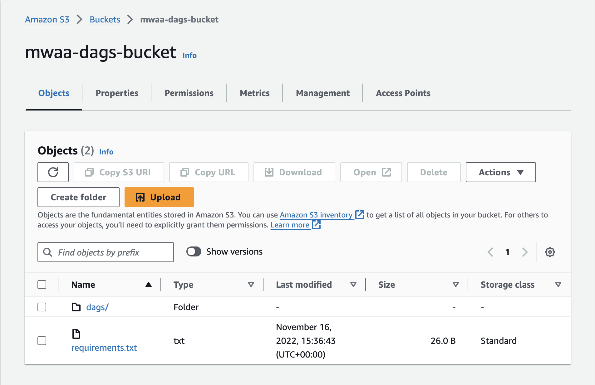

- Click 'Upload' and drag across the prepared Airflow DAG python file.

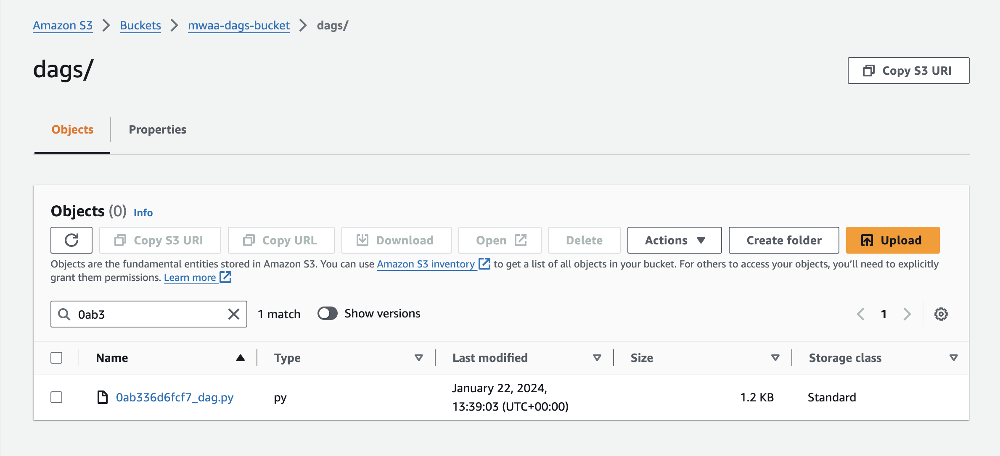

### Trigger a DAG that runs a Databricks Notebook

In the 'MWAA' console

- Click 'Open Airflow UI'
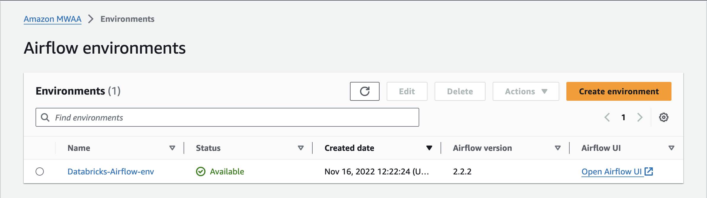

- Once uploaded to the DAGs folder, the new DAG was avaliable in the Airflow UI on the MWAA environment, under paused DAGs.
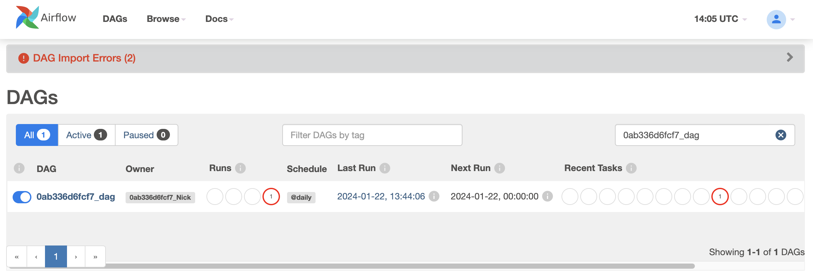

- In order to manually trigger the DAG, it will first have to be unpaused.

- Click on the DAG name
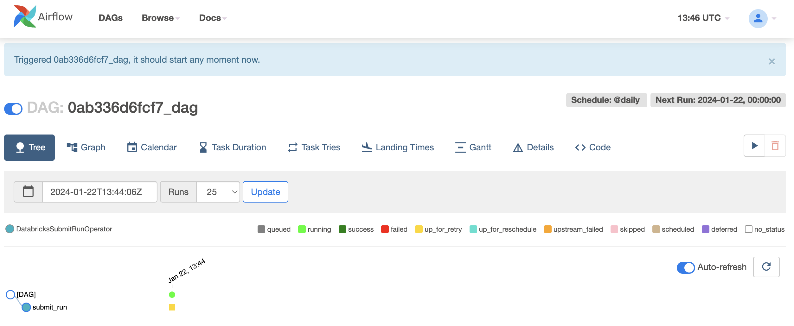

- Coloured blocks show the status of the DatabricksSubmitRunOperator.
  - A successful run will be shown with green blocks.
  - Hover over the blocks to gain more insight into protential errors.

The batch data has now been uploaded, cleaned and then sent to AWS MWAA for further processing to orchestrate the data workflow.

## Stream Processing: AWS Kinesis

Send streaming data to Kinesis and read this data in Databricks

### Create data streams using Kinesis Data Streams

Kinesis Data Streams is a highly customisable AWS streaming solution. Highly customisable means that all parts involved with stream processing, such as data ingestion, monitoring, elasticity, and consumption are done programmatically when creating the stream. An important consideration is that Kinesis Data Streams does not have the ability to do auto scaling.

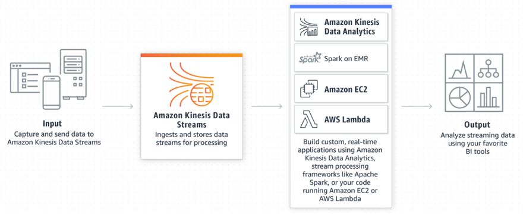

A Kinesis Data Stream is a set of Shards. A shard is a uniquely identified sequence of data records in a stream. A stream is composed of one or more shards, each of which provides a fixed unit of capacity. The data capacity of your stream is a function of the number of shards that you specify for the stream. You can increase or decrease the number of shards allocated to your stream to keep up with your data demands.

A shard contains:

- a sequence of Data Records, which in turn are composed of:
  - a Sequence Number: Each data record has a sequence number that is unique per partition-key within its shard. Kinesis Data Streams assigns the sequence number after you write data to the stream. The longer the time period between write requests, the larger the sequence numbers becomes.
  - a Partition Key: A partition key is used to group data by shard within a stream.
  - a Data Blob: A Data Blob is an immutable sequence of bytes.

For this project three data streams were created using Kinesis Data Streams, one for each Pinterest table.

- streaming-<USER_ID>-pin
- streaming-<USER_ID>-geo
- streaming-<USER_ID>-user

In the 'Kinesis' console:

- Select `Data Streams` from the left hand panel.
- Click the `Create data stream` button
- For this project the `Data stream name` will be `streaming-<USER_ID>-<TOPIC_SUFFIX>`
- For this use case the `On-demand capacity mode` will be used.
- Click the `Create data stream` button

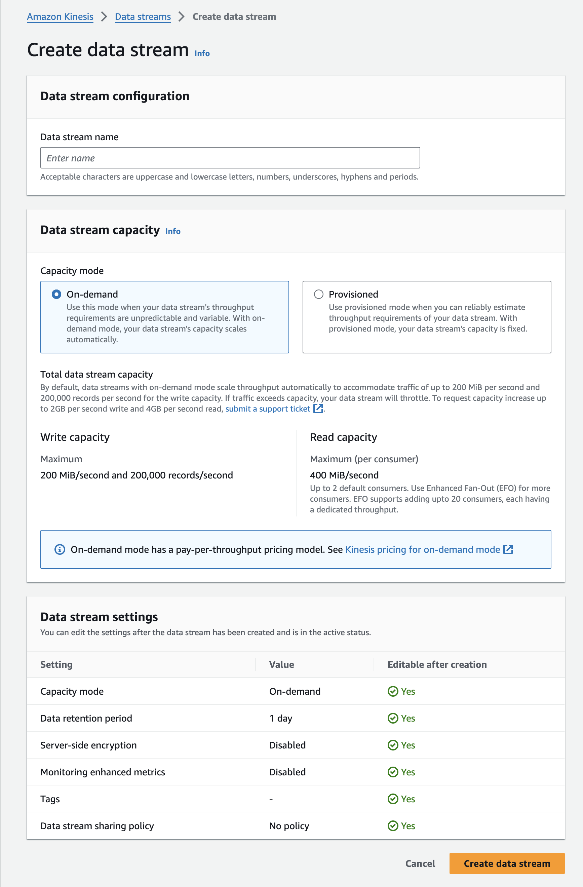

### Configure an API with Kinesis proxy integration

A REST API with an Amazon Kinesis proxy integration is required for this project. This intergration was built into the previously created REST API with Kafka REST proxy integration to allow it to invoke Kinesis actions.

The API is able to invoke the following actions:

- List streams in Kinesis
- Create, describe and delete streams in Kinesis
- Add records to streams in Kinesis

> [!Note]
>
> During this project the AWS account had been granted the necessary permissions to invoke Kinesis actions, so it was not neccessary to create an IAM role for the API to access Kinesis.

---

📝 - Walkthrough Start

In the 'IAM' console:

- Select *Roles* from the left hand panel.
- Select the access role with the following structure: <USER_ID-kinesis-access-role>.
- Copy the ARN of this role
- This ARN will be used when setting up the Execution role for the integration point of all the methods created.

In the 'API Gateway' console:

- Select the desired API
- Select *Resources* from the left hand panel

- Click the *Create resource* button to start provisioning a new resource

- Under Resource Name, type streams
- Leave the rest as default
- Click the Create resource button
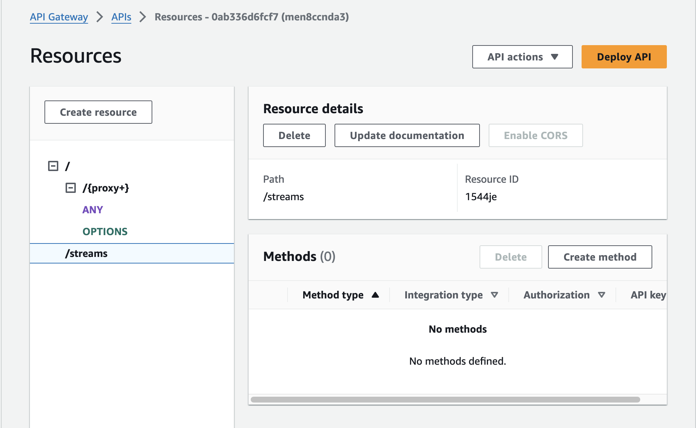

- Select the created streams resource
- Select the *Create method* button
- Select GET as the method type
  - For Integration type select AWS Service
  - For AWS Region choose us-east-1
  - For AWS Service select Kinesis,
  - For HTTP method select POST (to invoke Kinesis's ListStreams action)
  - For Action Type select User action name
  - For Action name enter ListStreams
  - For Execution role copy the ARN of the Kinesis Access Role (created in the previous section)
  - Click *Create method* to finalise provisioning this method
  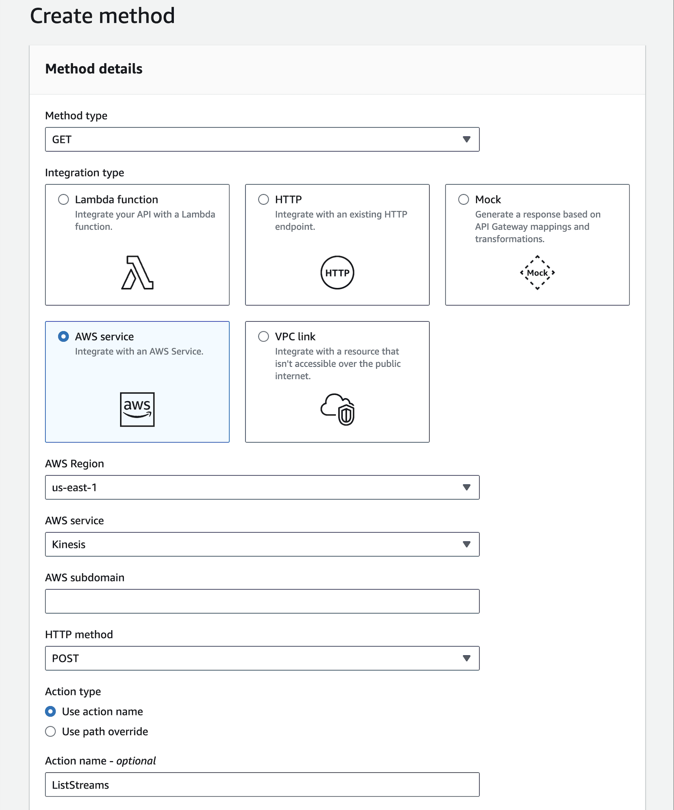

- Select the *Integration request* tab
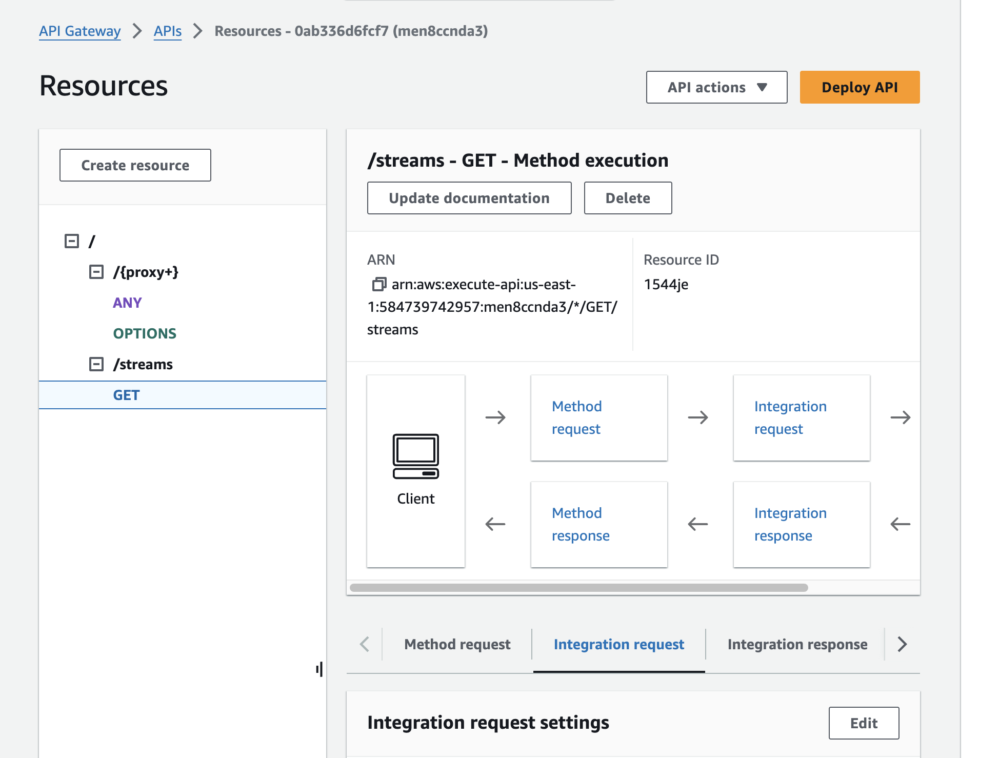
- Click on the Edit button
- Expand the *URL request headers parameters* panel, click *Add request header parameter*
  - Under Name enter Content-Type
  - Under Mapped form enter 'application/x-amz-json-1.1'
- Expand the *Mapping Templates* panel, click *Add mapping template*
  - Under Content type enter application/json
  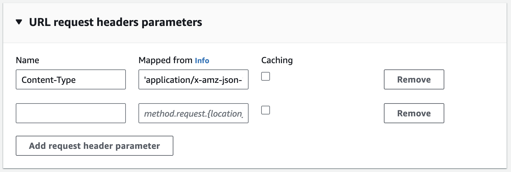
  - Under Template body enter {} in the template editor
  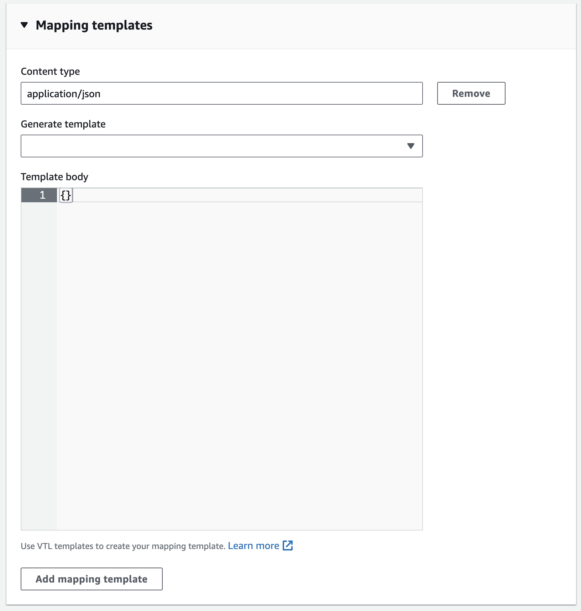
- Click *Save*

- Under the streams resource create a new child resource with the Resource name {stream-name}


- Set up the GET method for {stream-name} resource
  - Select the /{stream-name} resource
  - Click the Create method button
    - For Method type select GET
    - For Integration type select AWS Service
    - For AWS Region choose us-east-1
    - For AWS Service select Kinesis
    - For HTTP method select POST
    - For Action Type select User action name
    - For Action name enter DescribeStream
    - For Execution role enter the ARN
    - Click Create method
  - Select the Integration Request panel under the GET resource
    - Select Edit
    - Expand the URL request headers parameters panel
      - Click on the Add request header parameter button
      - Under Name enter Content-Type
      - Under Mapped form enter 'application/x-amz-json-1.1'
    - Expand the Mapping Ttemplates panel
      - Click on the Add mapping template button
      - Under Cotent-Type enter application/json
      - In the Template body include the following:

        ```bash
        {
            "StreamName": "$input.params('stream-name')"
        }
        ```

    - Click the Save button

> [!Note]
>
> This template is designed to construct an input payload for sending data to an AWS Kinesis stream. It expects the client to provide the stream-name as a parameter in the API request, and it uses this parameter to populate the StreamName field in the output payload.
>
>- The $input variable represents the entire input payload received by the API Gateway
>- The params('stream-name') function is used to retrieve the value of the stream-name parameter from the API request. This parameter should have been defined in the API's method request configuration, either as a query parameter, path parameter, or header parameter.
>- The retrieved value of the stream-name parameter is then used to populate the StreamName field in the output payload

- Set up the POST method for {stream-name} resource
  - Select the /{stream-name} resource
  - Click the Create method button
    - For Method type select POST
    - For Integration type select AWS Service
    - For AWS Region choose us-east-1
    - For AWS Service select Kinesis
    - For HTTP method select POST
    - For Action Type select User action name
    - For Action name enter CreateStream
    - For Execution role enter the ARN
    - Click Create method
  - Select the Integration Request panel under the POST resource
    - Select Edit
    - Expand the URL request headers parameters panel
      - Click on the Add request header parameter button
      - Under Name enter Content-Type
      - Under Mapped form enter 'application/x-amz-json-1.1'
    - Expand the Mapping Ttemplates panel
      - Click on the Add mapping template button
      - Under Cotent-Type enter application/json
      - In the Template body include the following:

        ```bash
        {
            "ShardCount": #if($input.path('$.ShardCount') == '') 5 #else $input.path('$.ShardCount') #end,
            "StreamName": "$input.params('stream-name')"
        }
        ```

    - Click the Save button

> [!Note]
>
>- "ShardCount":: This is the key for the field that will hold the value of the shard count in the output payload
>- #if($input.path('$.ShardCount') == ''): This is a conditional statement that checks whether the "ShardCount" field is empty in the input payload
>- 5: This is the default value to be used for "ShardCount" in case the input payload doesn't have a value for it. In this example, if the "ShardCount" field is empty, it will be set to 5.
>- #else $input.path('$.ShardCount'): If the "ShardCount" field is not empty in the input payload, this part of the conditional statement will be executed. It retrieves the value of "ShardCount" from the input payload using the $input.path() function.
>- "StreamName": "$input.params('stream-name')": This is similar to what we discussed in the previous example. It sets the "StreamName" field in the output payload by retrieving the value of the "stream-name" parameter from the API request.
>
>To summarize, this mapping template does the following:
>
>- If the input payload contains a non-empty "ShardCount" field, it sets the "ShardCount" field in the output payload to the same value
>- If the input payload does not contain a "ShardCount" field or if it is empty, it sets the "ShardCount" field in the output payload to a default value of 5
>- It sets the "StreamName" field in the output payload based on the value of the "stream-name" parameter provided in the API request

- Set up the DELETE method for {stream-name} resource
  - Select the /{stream-name} resource
  - Click the Create method button
    - For Method type select DELETE
    - For Integration type select AWS Service
    - For AWS Region choose us-east-1
    - For AWS Service select Kinesis
    - For HTTP method select POST
    - For Action Type select User action name
    - For Action name enter DeleteStream
    - For Execution role enter the ARN
    - Click Create method
  - Select the Integration Request panel under the DELETE resource
    - Select Edit
    - Expand the URL request headers parameters panel
      - Click on the Add request header parameter button
      - Under Name enter Content-Type
      - Under Mapped form enter 'application/x-amz-json-1.1'
    - Expand the Mapping Ttemplates panel
      - Click on the Add mapping template button
      - Under Cotent-Type enter application/json
      - In the Template body include the following:

        ```bash
        {
            "StreamName": "$input.params('stream-name')"
        }
        ```

    - Click the Save button

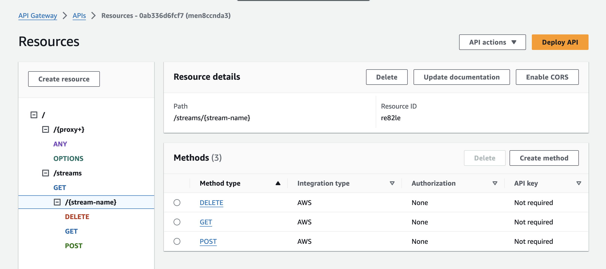

- Under the `/{stream-name}` resource select `Create resource` to create a new child resource
  - Under `Resource Name` enter `record`
  - Click `Create resource` 
- Set up the PUT method for `/record` resource
  - Select the `/record` resource
  - Click the `Create method` button
    - For `Method type` select `PUT`
    - For `Integration type` select `AWS Service`
    - For `AWS Region` choose `us-east-1`
    - For `AWS Service` select `Kinesis`
    - For `HTTP method` select `POST`
    - For `Action Type` select `User action name`
    - For `Action name` enter `PutRecord`
    - For `Execution role` enter the `ARN`
    - Click `Create method`
  - Select the `Integration request` panel under the `PUT` resource
    - Select `Edit`
    - Expand the `URL request headers parameters` panel
      - Click on the `Add request header parameter` button
      - Under `Name` enter `Content-Type`
      - Under `Mapped form` enter `'application/x-amz-json-1.1'`
    - Expand the `Mapping Ttemplates` panel
      - Click on the `Add mapping template` button
      - Under `Cotent-Type` enter `application/json`
      - In the `Template body` include the following:

        ```bash
        {
            "StreamName": "$input.params('stream-name')",
            "Data": "$util.base64Encode($input.json('$.Data'))",
            "PartitionKey": "$input.path('$.PartitionKey')"
        }
        ```

    - Click the `Save` button

> [!Note]
>
>This mapping template is used to transform an API request payload into the format required for writing a single record to an AWS Kinesis stream. Let's go through it step by step:
>
>- "StreamName": "$input.params('stream-name')": This sets the "StreamName" field in the output payload to the value of the "stream-name" parameter provided in the API request. This part is similar to previous examples.
>- "Data": "$util.base64Encode($input.json('$.Data'))": This line sets the "Data" field in the output payload. It uses the $input.json() function to retrieve the value of the "Data" field from the input payload. The value is then encoded in Base64 format using the $util.base64Encode() function. Kinesis requires the data to be in Base64 format when writing records.
>- "PartitionKey": "$input.path('$.PartitionKey')": This line sets the "PartitionKey" field in the output payload. It uses the $input.path() function to retrieve the value of the "PartitionKey" field from the input payload.
To summarise, this mapping template does the following:
>- It sets the "StreamName" field in the output payload based on the value of the "stream-name" parameter provided in the API request
>- It retrieves the value of the "Data" field from the input payload and encodes it in Base64 format, which is required for writing to a Kinesis stream
>- It retrieves the value of the "PartitionKey" field from the input payload

- Under the `/{stream-name}` resource select `Create resource` to create another new child resource
  - Under `Resource Name` enter `records`
  - Click `Create resource`
- Set up the PUT method for `/record` resource
  - Select the `/record` resource
  - Click the `Create method` button
    - For `Method type` select `PUT`
    - For `Integration type` select `AWS Service`
    - For `AWS Region` choose `us-east-1`
    - For `AWS Service` select `Kinesis`
    - For `HTTP method` select `POST`
    - For `Action Type` select `User action name`
    - For `Action name` enter `PutRecords`
    - For `Execution role` enter the `ARN`
    - Click `Create method`
  - Select the `Integration request` panel under the `PUT` resource
    - Select `Edit`
    - Expand the `URL request headers parameters` panel
      - Click on the `Add request header parameter` button
      - Under `Name` enter `Content-Type`
      - Under `Mapped form` enter `'application/x-amz-json-1.1'`
    - Expand the `Mapping Ttemplates` panel
      - Click on the `Add mapping template` button
      - Under `Cotent-Type` enter `application/json`
      - In the `Template body` include the following:

        ```bash
        {
            "StreamName": "$input.params('stream-name')",
            "Records": [
            #foreach($elem in $input.path('$.records'))
                {
                    "Data": "$util.base64Encode($elem.data)",
                    "PartitionKey": "$elem.partition-key"
                }#if($foreach.hasNext),#end
                #end
            ]
        }
        ```

    - Click the `Save` button

> [!Note]
>
> This mapping template is used to transform an API request payload into the format required for writing records to an AWS Kinesis stream. Let's break it down step by step:
>
>- "StreamName": "$input.params('stream-name')": This sets the "StreamName" field in the output payload to the value of the "stream-name" parameter provided in the API request. This is similar to what we have seen in previous examples.
>- "Records": [...]: This is an array key in the output payload that will hold an array of records to be written to the Kinesis stream
>- #foreach($elem in $input.path('$.records')): This is a loop that iterates over each element (record) in the "records" array from the input payload. The $input.path() function retrieves the value of "records" array from the input payload.
>- "Data": "$util.base64Encode($elem.data)": For each record in the "records" array, this line sets the "Data" field in the output payload. It uses the $elem.data syntax to access the "data" field of the current record. It then applies the $util.base64Encode() function to encode the data in Base64 format, which is the expected format for the data when writing to a Kinesis stream.
>- "PartitionKey": "$elem.partition-key": This line sets the "PartitionKey"field in the output payload for each record. It uses the $elem.partition-key syntax to access the "partition-key" field of the current record.
>- #if($foreach.hasNext),#end: This conditional statement adds a comma (,) after each record except the last one. This is required to ensure that the output JSON is formatted correctly as an array.
>- #end: This marks the end of the loop
To summarise, this mapping template does the following:
>- It sets the "StreamName" field in the output payload based on the value of the "stream-name" parameter provided in the API request
>- It iterates over the "records" array in the input payload and constructs an array of records in the output payload, where each record includes the encoded "Data" and "PartitionKey" fields required for writing to a Kinesis stream

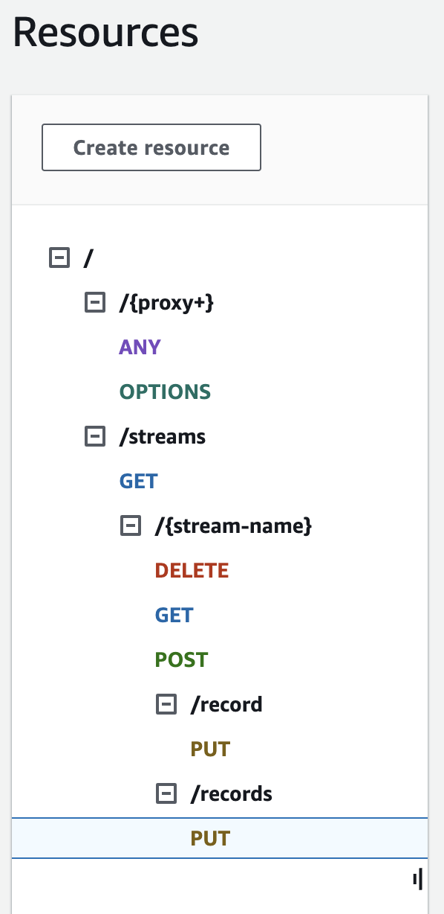

Now that API has been updated, the Python requests library can be used to test the new API methods and obtain a response.

- Click `Deploy API` button to deploy the newest version of the API
 and use the correct API Invoke URL.

📝 - Walkthrough End

---


### Send data to the Kinesis streams

### Read data from Kinesis streams in Databricks

### Transform Kinesis streams in Databricks

### Write the streaming data to Delta Tables
