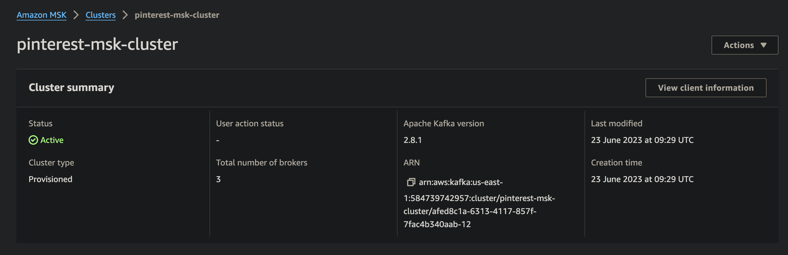

# Walkthrough of Pinterest Data Pipeline Project: Part 2

Pinterest crunches billions of data points daily to decide how to provide more value to its users.

This walkthrough will describe using the AWS Cloud to emulate Pinterest's data processing system. This walkthrough will explain the following:

- [Part 1](Walkthrough_part_1_EC2_Kafka) will describe how to configure a `EC2 Kafka client`
- [Part 2](Walkthrough_part_2_MSK_S3) will describe how to connect an `MSK cluster` to an `S3 bucket`
- [Part 3](Walkthrough_part_3_API) will describe how to configure an `API` in `API Gateway`
- [Part 4](Walkthrough_part_4_ETL_Databricks) will describe how to read, clean and query data on `Databricks`
- [Part 5](Walkthrough_part_5_Airflow) will describe how to orchestrate `Databricks` Workloads on `MWAA`
- [Part 6](Walkthrough_part_6_Streaming) will describe how to send streaming data to `Kinesis` and read this data in `Databricks`

## Table of Contents

- [Technologies used](#technologies-used)
  - [Amazon MSK](#amazon-msk)
  - [Amazon S3](#amazon-s3)
- [Connect an MSK cluster to an S3 bucket](#connect-a-msk-cluster-to-a-s3-bucket)
  - [Create Kafka topics](#create-kafka-topics)
  - [Create a custom plugin with MSK Connect](#create-a-custom-plugin-with-msk-connect)
  - [Create a connector with MSK Connect](#create-a-connector-with-msk-connect)
- [Conclusion](#conclusion)

## Technologies used

[Part 1](Walkthrough_part_1_EC2_Kafka) will give an overview of how this project used [Amazon RDS](Walkthrough_part_1_EC2_Kafka#amazon-rds), [Amazon EC2](Walkthrough_part_1_EC2_Kafka#amazon-ec2), [Apache Kafka](Walkthrough_part_1_EC2_Kafka#apache-kafka), and [AWS IAM](Walkthrough_part_1_EC2_Kafka#aws-iam)

[Part 2](Walkthrough_part_2_MSK_S3) will give an overview of how this project used [Amazon MSK](Walkthrough_part_2_MSK_S3#amazon-msk) and [Amazon S3](Walkthrough_part_2_MSK_S3#amazon-s3)

[Part 3](Walkthrough_part_3_API) will give an overview of how this project used [Amazon API Gateway](Walkthrough_part_3_API#amazon-api-gateway) and [Confluent REST Proxy for Kafka](Walkthrough_part_3_API#confluent-rest-proxy-for-kafka)

[Part 4](Walkthrough_part_4_ETL_Databricks) will give an overview of how this project used [Apache Spark](Walkthrough_part_4_ETL_Databricks#apache-spark) and [Databricks](Walkthrough_part_4_ETL_Databricks#databricks)

[Part 5](Walkthrough_part_5_Airflow) will give an overview of how this project used [Apache Airflow](Walkthrough_part_4_ETL_Databricks#apache-airflow) and [Amazon MWAA](Walkthrough_part_4_ETL_Databricks#amazon-mwaa)

[Part 6](Walkthrough_part_6_Streaming) will give an overview of how this project used [Apache Spark Structured Streaming](Walkthrough_part_6_Streaming#apache-spark-structured-streaming), [Apache Delta Lake](Walkthrough_part_6_Streaming#apache-delta-lake) and [AWS Kinesis](Walkthrough_part_6_Streaming#aws-kinesis)

### Amazon MSK

Amazon Managed Streaming for Apache Kafka (Amazon MSK) is a fully managed, highly available, and scalable streaming platform service provided by Amazon Web Services (AWS). It simplifies the deployment, configuration, and management of Apache Kafka clusters. Amazon MSK is designed to manage the complexities of deploying and operating Apache Kafka clusters. It provides a fully managed Kafka service, allowing users to focus on building and managing their streaming applications rather than handling the infrastructure.

Amazon MSK Connect is a feature of Amazon MSK. With MSK Connect, you can run fully managed Apache Kafka Connect workloads on AWS. This feature makes it easy to deploy, monitor, and automatically scale connectors that move data between Apache Kafka clusters and external systems such as databases, file systems, and search indices.

MSK seamlessly integrates with other AWS services; for example, you can use AWS Identity and Access Management (IAM) for access control. MSK clusters support IAM authentication. IAM access control allows MSK to enable both authentication and authorisation for clusters. If a client tries to write something to the cluster, MSK uses IAM to check whether the client has an authenticated identity and is authorised to produce something for the cluster.

MSK manages Apache ZooKeeper, a critical component in Kafka clusters, reducing the operational burden on users. ZooKeeper is used for coordination and metadata management within Kafka. MSK provides security features to help protect Kafka clusters and data. It supports encryption in transit using TLS/SSL and integration with AWS Identity and Access Management (IAM) for access control.

This project uses Amazon MSK to connect to the Kafka application running on the Amazon EC2 instance. Amazon MSK seamlessly integrates with other AWS services, allowing this project to connect the Kafka cluster to Amazon S3.

### Amazon S3

Amazon Simple Storage Service (Amazon S3) is an object storage service that allows users to store and retrieve objects, which can be files or data of any type. Objects in Amazon S3 are stored in containers called buckets. A bucket is a top-level container used to organise and manage objects.

S3 offers features like server-side encryption (SSE) to protect data at rest and supports HTTPS for secure data transfer. Amazon S3 provides fine-grained access control mechanisms, allowing users to define access policies and permissions for buckets and objects. Access can be restricted using AWS Identity and Access Management (IAM) policies.

This project uses MSK Connect to connect the MSK cluster to a S3 bucket, such that any data going through the cluster will be automatically saved and stored in a dedicated S3 bucket.

## Connect a MSK cluster to a S3 bucket

The following walkthrough will describe connecting an Amazon `MSK cluster` to an Amazon `S3 bucket`.

### Create Kafka topics

Within the `MSK` Console:

- Select `Clusters` from the left-hand panel
- Select the desired cluster

- Click the `View client information` button
- Take note of the `Bootstrap servers` string under `Private endpoint (single-VPC)`
  - The bootstrap brokers' string will contain the number of brokers provisioned when creating the cluster
  - For this walkthrough, it will be referred to as `BOOTSTRAP_SERVER_STRING`
- Take note of the `Apache ZooKeeper connection` string under `Plaintext`
  - The Zookeeper connection string contains the host:port pairs, each corresponding to a Zookeeper server
  - The cluster might have two sets of connection strings: Plaintext and TLS. Apache Kafka communicates in PLAINTEXT by default, meaning all data is sent in the clear. To encrypt communication, you can use Transport Layer Security (TLS).
  - For this walkthrough, it will be referred to as `ZOOKEEPER_CONNECTION_STRING`

In the `EC2` client machine:

To create the three topics, run the following commands (replacing `BOOTSTRAP_SERVER_STRING` as described above and replacing `USER_ID` as supplied by AiCore):

- For the Pinterest data

    ```bash
    cd /home/ec2-user/kafka_2.12-2.8.1/bin
    ./kafka-topics.sh --bootstrap-server BOOTSTRAP_SERVER_STRING --command-config client.properties --create --topic USER_ID.pin
    ```

- For the geolocation data

    ```bash
    cd /home/ec2-user/kafka_2.12-2.8.1/bin
    ./kafka-topics.sh --bootstrap-server BOOTSTRAP_SERVER_STRING --command-config client.properties --create --topic USER_ID.geo
    ```

- For the user data

    ```bash
    cd /home/ec2-user/kafka_2.12-2.8.1/bin
    ./kafka-topics.sh --bootstrap-server BOOTSTRAP_SERVER_STRING --command-config client.properties --create --topic USER_ID.user
    ```

### Create a custom plugin with MSK Connect

In the `S3` console:

- Find the bucket associated with the `USER_ID`.
  - During this project, the bucket name had the following format (replacing `USER_ID` as supplied by AiCore): `user-USER_ID-bucket`
- Take note of the bucket name
  - For this walkthrough, it will be referred to as `BUCKET_NAME`

The `Confluent.io Amazon S3 Connector` is a sink connector that exports data from Kafka topics to S3 objects in either `JSON`, `Avro` or `Bytes` format.

In the `EC2` client machine:

- Run the following command to download the `Confluent.io Amazon S3 Connector` and copy it to the `S3 bucket` (replacing `BUCKET_NAME` as described above):

  ```bash
  # assume admin user privileges
  sudo -u ec2-user -i
  # create a directory where we will save our connector
  mkdir kafka-connect-s3 && cd kafka-connect-s3
  # Download connector from Confluent
  wget https://d1i4a15mxbxib1.cloudfront.net/api/plugins/confluentinc/kafka-connect-s3/versions/10.0.3/confluentinc-kafka-connect-s3-10.0.3.zip
  # Copy the connector to our S3 bucket
  aws s3 cp ./confluentinc-kafka-connect-s3-10.0.3.zip s3://BUCKET_NAME/kafka-connect-s3/
  ```

In the `S3` console:

- Open the bucket associated with the `USER_ID`.
- Open the newly created folder `kafka-connect-s3/`
- Select the zip file and copy the `S3 URI`

In the `MSK` console:

- Select `Customised plugins` under the `MSK Connect` section on the left side of the console
- Choose `Create custom plugin`
- Paste the `S3 URI` for the zip file
- Create a custom plugin with the following name: `USER_ID-plugin`

### Create a connector with MSK Connect

> [!NOTE]
>
> For this project, the AWS account only had permission to create a connector with the following name: `USER_ID-connector`

In the `MSK` console:

- Select `Connectors` under the `MSK Connect` section on the left side of the console
- Choose `Create connector`
- In the list of `plugins`, select the newly created plugin, and then click `Next`.
- Then choose the `pinterest-msk-cluster` from the `cluster` list.
- To ensure that data going through the three previously created Kafka topics will get saved to the `S3 bucket`, paste the following configuration in the `Connector configuration settings` (replacing `BUCKET_NAME` as described in [Create a custom plugin with MSK Connect](Walkthrough_Batch_Processing_part_.md#create-a-custom-plugin-with-msk-connect) and replacing `USER_ID` as supplied by AiCore):

    ```bash
    connector.class=io.confluent.connect.s3.S3SinkConnector
    # same region as our bucket and cluster
    s3.region=us-east-1
    flush.size=1
    schema.compatibility=NONE
    tasks.max=3
    # Include terminology of the topic name, given here as an example will read all data from topic names starting with msk.topic...
    topics.regex=USER_ID.*
    format.class=io.confluent.connect.s3.format.json.JsonFormat
    partitioner.class=io.confluent.connect.storage.partitioner.DefaultPartitioner
    value.converter.schemas.enable=false
    value.converter=org.apache.kafka.connect.json.JsonConverter
    storage.class=io.confluent.connect.s3.storage.S3Storage
    key.converter=org.apache.kafka.connect.storage.StringConverter
    s3.bucket.name=BUCKET_NAME
    ```

- Change the `Connector capacity type` to `Provisioned`; ensure both the `MCU count per worker` and `Number of workers` are set to `1`
- Change `Worker Configuration` to `Use a customised configuration`, then pick `confluent-worker`
- Under `Access permissions` select the `IAM role` previously created: the role has the following format `USER_ID-ec2-access-role`
- Leave the rest of the configurations as default.
- Skip the rest of the pages.

Once the connector is up and running, it can be seen in the `Connectors` tab in the `MSK` console.

Now that the `plugin-connector pair` has been built, data passing through the `IAM authenticated cluster` will be automatically stored in the designated `S3 bucket` in a newly created folder called `topics`.

## Conclusion

Amazon MSK, a fully managed and scalable streaming platform, simplifies the deployment and management of Apache Kafka clusters. The walkthrough demonstrates how MSK Connect facilitates the creation of connectors to seamlessly move data between Kafka clusters and external systems such as S3. Integrating AWS services, including IAM for access control, ensures a secure and efficient data processing pipeline.

Amazon S3, as an object storage service, plays a pivotal role in this project by providing a dedicated space for storing data. The walkthrough details the creation of Kafka topics, custom plugins with MSK Connect, and connectors to export data from Kafka topics to S3 objects. The Confluent.io Amazon S3 Connector enhances the flexibility of exporting data in various formats such as JSON, Avro, or Bytes.

By following this walkthrough, users can replicate and adapt the Pinterest data pipeline project to meet their specific requirements, fostering a deeper insight into the world of batch data processing on AWS.
