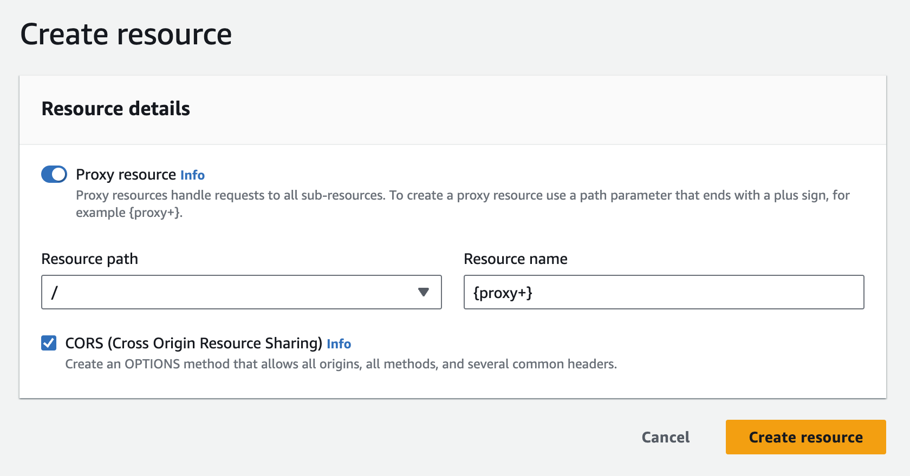
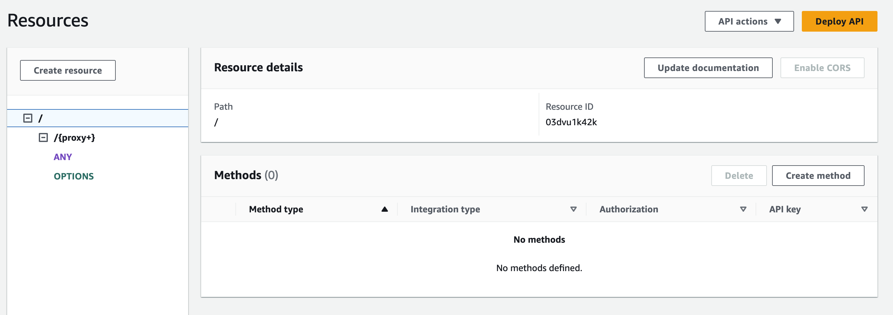
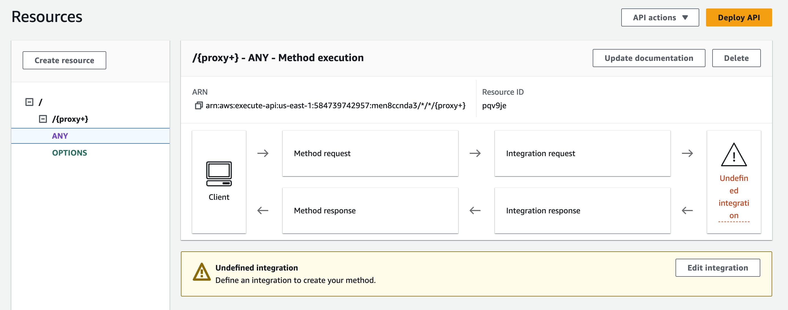
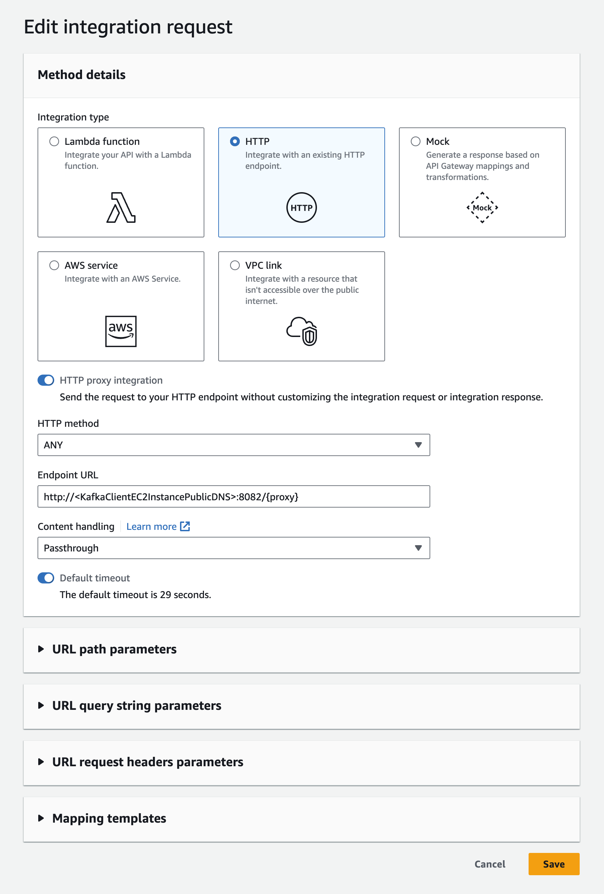
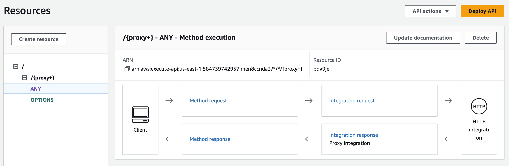
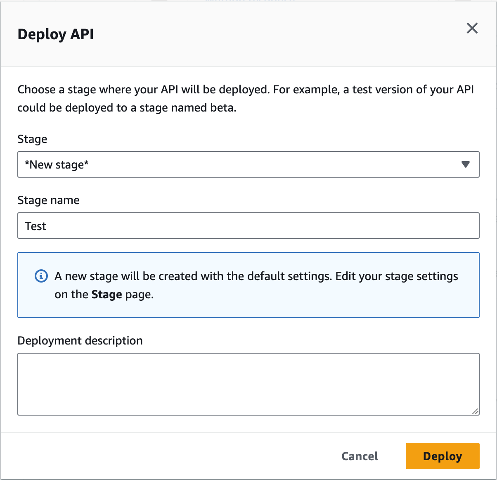
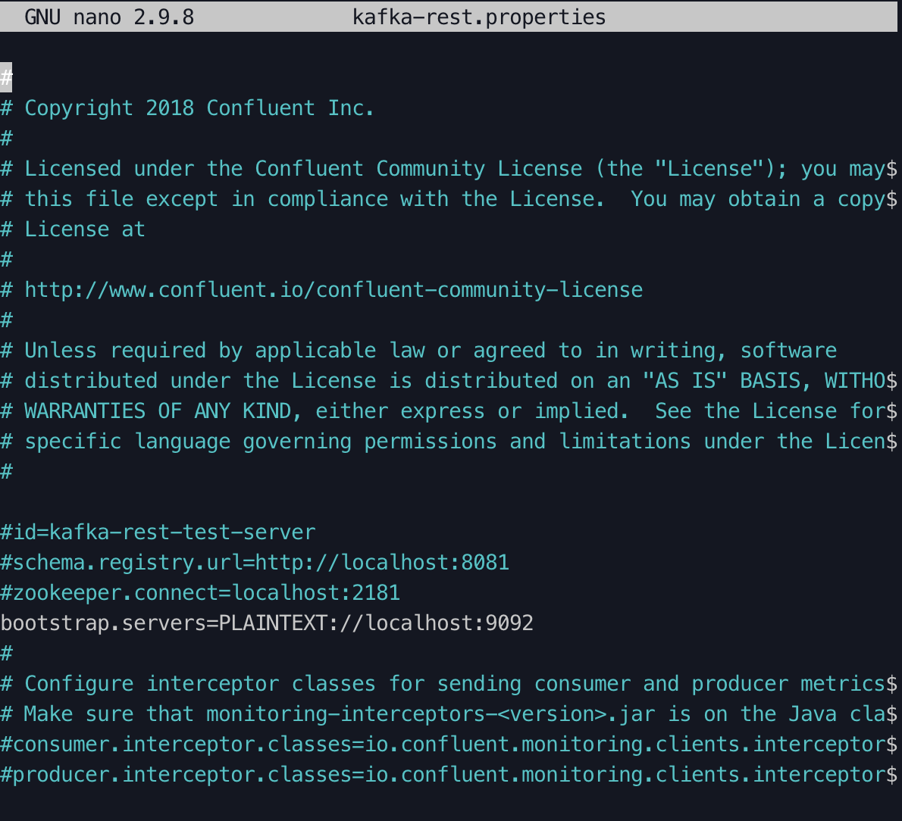
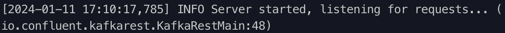
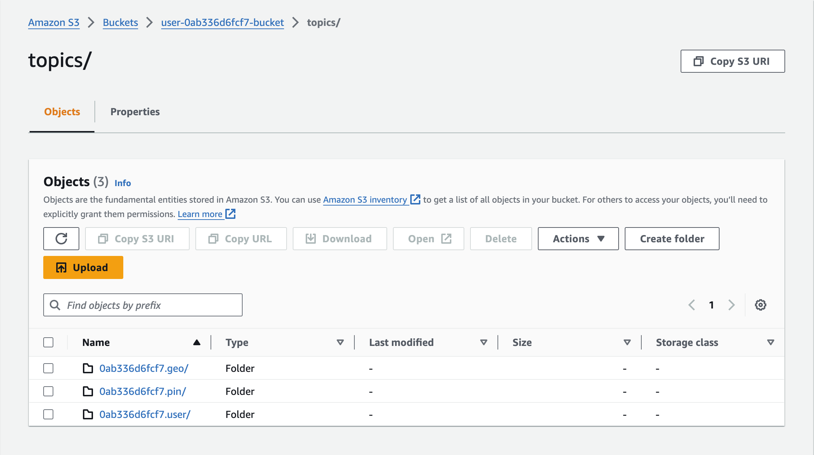
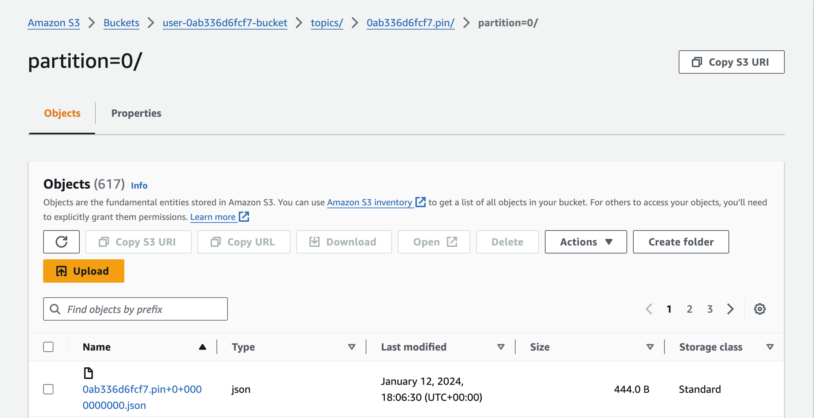

# Walkthrough of Pinterest Data Pipeline Project: Part 3

Pinterest crunches billions of data points daily to decide how to provide more value to its users.

This walkthrough will describe using the AWS Cloud to emulate Pinterest's data processing system. This walkthrough will explain the following:

- [Part 1](Walkthrough_part_1_EC2_Kafka) will describe how to configure a `EC2 Kafka client`
- [Part 2](Walkthrough_part_2_MSK_S3) will describe how to connect an `MSK cluster` to an `S3 bucket`
- [Part 3](Walkthrough_part_3_API) will describe how to configure an `API` in `API Gateway`
- [Part 4](Walkthrough_part_4_ETL_Databricks) will describe how to read, clean and query data on `Databricks`
- [Part 5](Walkthrough_part_5_Airflow) will describe how to orchestrate `Databricks` Workloads on `MWAA`
- [Part 6](Walkthrough_part_6_Streaming) will describe how to send streaming data to `Kinesis` and read this data in `Databricks`

## Table of Contents

- [Technologies used](#technologies-used)
  - [Amazon API Gateway](#amazon-api-gateway)
  - [Confluent REST Proxy for Kafka](#confluent-rest-proxy-for-kafka)
- [Configuring an API in API Gateway](#configuring-an-api-in-api-gateway)
  - [Build a Kafka REST proxy integration method for the API](#build-a-kafka-rest-proxy-integration-method-for-the-api)
  - [Set up the Kafka REST proxy on the EC2 client](#set-up-the-kafka-rest-proxy-on-the-ec2-client)
  - [Starting the Kafka REST proxy on the EC2 client](#starting-the-kafka-rest-proxy-on-the-ec2-client)
  - [Send data to the API](#send-data-to-the-api)
  - [Checking Data has been sent with a Kafka consumer](#checking-data-has-been-sent-with-a-kafka-consumer)
  - [Checking Data has been ingested and stored in the S3 bucket](#checking-data-has-been-ingested-and-stored-in-the-s3-bucket)
- [Conclusion](#conclusion)

## Technologies used

[Part 1](Walkthrough_part_1_EC2_Kafka) will give an overview of how this project used [Amazon RDS](Walkthrough_part_1_EC2_Kafka#amazon-rds), [Amazon EC2](Walkthrough_part_1_EC2_Kafka#amazon-ec2), [Apache Kafka](Walkthrough_part_1_EC2_Kafka#apache-kafka), and [AWS IAM](Walkthrough_part_1_EC2_Kafka#aws-iam)

[Part 2](Walkthrough_part_2_MSK_S3) will give an overview of how this project used [Amazon MSK](Walkthrough_part_2_MSK_S3#amazon-msk) and [Amazon S3](Walkthrough_part_2_MSK_S3#amazon-s3)

[Part 3](Walkthrough_part_3_API) will give an overview of how this project used [Amazon API Gateway](Walkthrough_part_3_API#amazon-api-gateway) and [Confluent REST Proxy for Kafka](Walkthrough_part_3_API#confluent-rest-proxy-for-kafka)

[Part 4](Walkthrough_part_4_ETL_Databricks) will give an overview of how this project used [Apache Spark](Walkthrough_part_4_ETL_Databricks#apache-spark) and [Databricks](Walkthrough_part_4_ETL_Databricks#databricks)

[Part 5](Walkthrough_part_5_Airflow) will give an overview of how this project used [Apache Airflow](Walkthrough_part_4_ETL_Databricks#apache-airflow) and [Amazon MWAA](Walkthrough_part_4_ETL_Databricks#amazon-mwaa)

[Part 6](Walkthrough_part_6_Streaming) will give an overview of how this project used [Apache Spark Structured Streaming](Walkthrough_part_6_Streaming#apache-spark-structured-streaming), [Apache Delta Lake](Walkthrough_part_6_Streaming#apache-delta-lake) and [AWS Kinesis](Walkthrough_part_6_Streaming#aws-kinesis)

### Amazon API Gateway

Amazon API Gateway is a fully managed service that Amazon Web Services (AWS) provides. It makes it easy for developers to create, publish, maintain, monitor, and secure Application Programming Interfaces (APIs) at any scale. It is a front door for applications to access data, business logic, or functionality from backend services, including AWS services or on-premises servers.

API Gateway can integrate with various backend services, including Amazon EC2 instances and other HTTP/HTTPS endpoints; this enables users to connect their APIs to different backend systems. API Gateway supports proxy integration, allowing it to act as a proxy for HTTP requests to other services without needing custom code; this simplifies exposing existing services via APIs. API Gateway enables users to transform incoming requests and outgoing responses; this includes modifying headers, payloads, and other aspects of the HTTP request and response to meet the requirements of the backend services or consumers.

This project will use Amazon API Gateway to create a RESTful API to replicate Pinterest's experimental data pipeline. This API will send data to the MSK cluster, which in turn will be stored in an S3 bucket, using the connector built in [Create a connector with MSK Connect](Walkthrough_part_2_MSK_S3#create-a-connector-with-msk-connect).

### Confluent REST Proxy for Kafka

Confluent REST Proxy is a component provided by Confluent, which distributes Apache Kafka. The Confluent REST Proxy is designed to deliver a RESTful HTTP interface for interacting with Apache Kafka; this enables easy integration with applications, services, and clients that communicate over HTTP. The REST Proxy exposes endpoints for producing and consuming messages. Through these endpoints, clients can send messages to Kafka topics (produce) or retrieve messages from topics (consume). Confluent REST Proxy supports JSON as a serialisation format for messages; this allows users to send messages in JSON format and have them automatically serialised and deserialised by the proxy.

This project will install the Confluent package for Kafka REST proxy on the EC2 client. Building a Kafka REST Proxy integration will make it easy to produce and consume messages, view the state of a cluster, or perform administrative actions without using native Kafka protocols or clients on the EC2 instance.

## Configuring an API in API Gateway

The following walkthrough will describe the process of building an API to replicate Pinterest's experimental data pipeline.

### Build a Kafka REST proxy integration method for the API

Within the `EC2` console:

- Select `Instances`
- Select the desired EC2 client machine
- Take note of the `Public IPv4 DNS`
  - For this walkthrough, it will be referred to as `EC2_PUBLIC_DNS`

> [!Note]
>
> The administrator has already provided a REST-type API with a regional endpoint for this project. The API was named after the `USER_ID` supplied by AiCore.

Within the `API Gateway` console

- Select the desired API
- Select `Create resource` to create a new child resource for the API

  

- Select the `Proxy resource` toggle
- For `Resource Name` enter `{proxy+}`
- Enable `CORS (Cross Origin Resource Sharing)`
- Select `Create Resource`
  
- To set up an integration, click on the `ANY` resource
  - Creating a proxy resource with the `{proxy+}` parameter and the `ANY` method provides the integration with access to all available resources.
  
- Then click on the `Edit integration` button
  
  - For `Integration type` select `HTTP`
  - Select the `HTTP proxy integration` toggle
  - For `HTTP method` select `ANY`
  - For the `Endpoint URL`, enter the Kafka Client Amazon EC2 Instance Public IPv4 DNS (replacing `EC2_PUBLIC_DNS` as described above):
    - `8082` is the default port the `Confluent REST Proxy` listens to

  ```bash
  http://EC2_PUBLIC_DNS:8082/{proxy}
  ```

- Click `Save`

  

- Click the `Deploy API` button in the top-right corner of the API page.

  

- For `Stage` choose `*New Stage*`
- For `Stage name`, enter the desired stage name, for example `Test`
  - For this walkthrough, the `Stage name` will be referred to as `DEPLOYMENT_STAGE`
- Click `Deploy`
-Take note of the `Invoke URL`
  - For this walkthrough, the `Invoke URL` will be referred to as `INVOKE_URL`

### Set up the Kafka REST proxy on the EC2 client

Now the `Kafka REST Proxy integration` for the `API` has been set up, it is time to set up the `Kafka REST Proxy` on the `EC2` client machine.

Additional packages must be downloaded on the client EC2 machine to consume data using `MSK` from the `API` just created.

On the client `EC2` machine:

- Install the `Confluent` package for `Kafka REST proxy`, using the following command:

    ```bash
    sudo wget https://packages.confluent.io/archive/7.2/confluent-7.2.0.tar.gz
    tar -xvzf confluent-7.2.0.tar.gz
    ```

- To configure the `REST proxy` to communicate with the desired `MSK cluster`, and to perform `IAM authentication`, the `kafka-rest.properties` file needs to be modified:

    ```bash
    cd /home/ec2-user/confluent-7.2.0/etc/kafka-rest
    nano kafka-rest.properties
    ```



- To allow the `REST proxy` to connect to the `MSK cluster`:
  - Modify the `bootstrap.servers` variable to include the `BOOTSTRAP_SERVER_STRING` as described in [Create Kafka topics](Walkthrough_part_1_EC2_Kafka#create-kafka-topics)
  - Modify the `zookeeper.connect` variable to include the `ZOOKEEPER_CONNECTION_STRING` as described in [Create Kafka topics](Walkthrough_part_1_EC2_Kafka#create-kafka-topics)

- To surpass the IAM authentication of the MSK cluster, add the following to the kafka-rest.properties file (replacing `IAM_ARN` as described in [Configure Kafka client to use AWS IAM](Walkthrough_part_1_EC2_Kafka#configure-kafka-client-to-use-aws-iam)):

```bash
# Sets up TLS for encryption and SASL for authN.
client.security.protocol = SASL_SSL

# Identifies the SASL mechanism to use.
client.sasl.mechanism = AWS_MSK_IAM

# Binds SASL client implementation.
client.sasl.jaas.config = software.amazon.msk.auth.iam.IAMLoginModule required awsRoleArn="IAM_ARN";

# Encapsulates constructing a SigV4 signature based on extracted credentials.
# The SASL client bound by "sasl.jaas.config" invokes this class.
client.sasl.client.callback.handler.class = software.amazon.msk.auth.iam.IAMClientCallbackHandler
```

- Once the previous text has been inserted into the client.properties file, make sure to save the changes before exiting.

    > Notice the difference from the Kafka `client.properties` file.
    >
    > To allow communication between the REST proxy and the cluster brokers, all configurations should be prefixed with `client`.

### Starting the Kafka REST proxy on the EC2 client

On the client EC2 machine:

- Start the REST proxy with the following command:

    ```bash
    cd /home/ec2-user/confluent-7.2.0/bin
    ./kafka-rest-start /home/ec2-user/confluent-7.2.0/etc/kafka-rest/kafka-rest.properties
    ```

- In the EC2 console, the following message should be present:

    

The proxy is now ready to receive requests from the API, and the Kafka-related modules are now ready to accept data from Pinterest users.

### Send data to the API

Data can now be sent to the API, which in turn will send the data to the MSK Cluster using the plugin-connector pair previously created.

The Python script [rds_db_connector](classes/rds_db_connector.py) defines a class called `RDSDBConnector` that facilitates connecting to a RDS database using the SQLAlchemy library. The purpose of this class is to encapsulate the process of reading database credentials from a YAML file, validating them, and initialising a SQLAlchemy database engine. This class provides a structured and reusable way to connect to an RDS database using SQLAlchemy, promoting the separation of concerns by encapsulating database initialisation logic within the class.

The Python script [api_communicator.py](classes/api_communicator.py) defines a class called `APICommunicator` that is designed for communicating with an API and sending data to Kafka topics.

The Python script [aws_db_connector.py](classes/aws_db_connector.py) defines a class called `AWSDBConnector`, which is responsible for connecting to a database and sending data to an API. This script simulates a continuous process of fetching random data from a database and sending it to an API, allowing the user to choose between streaming or batch mode.

The Python script [user_posting_emulation_batch.py](user_posting_emulation_batch.py) was built to emulate sending requests to the API, which adds one record at a time to the created topics. This script uses the methods from the three previously described classes. In batch mode, this script will continuously send new data from the three Pinterest tables to the corresponding Kafka topic.

In the terminal on your local machine:

- Navigate to the project directory:

```bash
cd pinterest-data-pipeline545
```

- Run the following Python Script:

```bash
python user_posting_emulation_batch.py
```

### Checking Data has been sent with a Kafka consumer

To check data has been sent to the cluster, run a Kafka consumer (one per topic).

On the client EC2 machine:

- Open a new terminal window and run the following command (replacing `CONSUMER_GROUP` with `students`, replacing `USER_ID` as supplied by AiCore and replacing `BOOTSTRAP_SERVER_STRING` as described in [Create Kafka topics](Walkthrough_part_1_EC2_Kafka#create-kafka-topics))

  - For the Pinterest data

    ```bash
    cd /home/ec2-user/kafka_2.12-2.8.1/bin
    ./kafka-console-consumer.sh --bootstrap-server BOOTSTRAP_SERVER_STRING --consumer.config client.properties --group CONSUMER_GROUP --topic USER_ID.pin --from-beginning
    ```

  - For the geolocation data

    ```bash
    cd /home/ec2-user/kafka_2.12-2.8.1/bin
    ./kafka-console-consumer.sh --bootstrap-server BOOTSTRAP_SERVER_STRING --consumer.config client.properties --group CONSUMER_GROUP --topic USER_ID.geo --from-beginning
    ```

  - For the user data

    ```bash
    cd /home/ec2-user/kafka_2.12-2.8.1/bin
    ./kafka-console-consumer.sh --bootstrap-server BOOTSTRAP_SERVER_STRING --consumer.config client.properties --group CONSUMER_GROUP --topic USER_ID.user --from-beginning
    ```

If everything has been set up correctly, the Kafka consumers will show messages being consumed.

> The following is an explanation of the additional configuration:
>
> - `--consumer.config`: with the path to a consumer properties file containing security settings, is required as the SSL is being used for authentication
> - `--from-beginning`: option is used to start consuming from the beginning of the topic. To see only new messages, omit this option.

### Checking Data has been ingested and stored in the S3 bucket

If the data has successfully been ingested through Kafka, it will be present in the S3 bucket as follows:





Notice the folder organisation (e.g. `topics/USER_ID.pin/partition=0/`) that the connector creates in the bucket.

## Conclusion

The focus of Part 3 was on configuring an API in Amazon API Gateway. The walkthrough explained how to build a Kafka REST proxy integration method for the API, set up the Kafka REST proxy on the EC2 client, and start the Kafka REST proxy to receive requests from the API. It also covered sending data to the API and checking its ingestion into the MSK cluster using Kafka consumers.

By following these steps, users can replicate Pinterest's experimental data pipeline, allowing for efficient batch processing of vast amounts of data on the AWS Cloud. This project serves as a valuable resource for those looking to understand and implement similar data processing systems.
