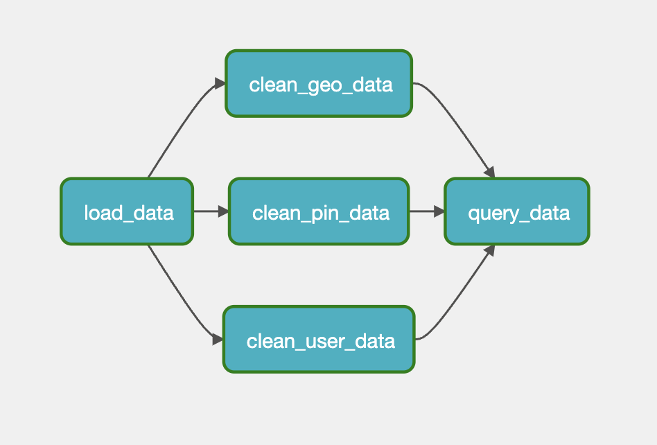
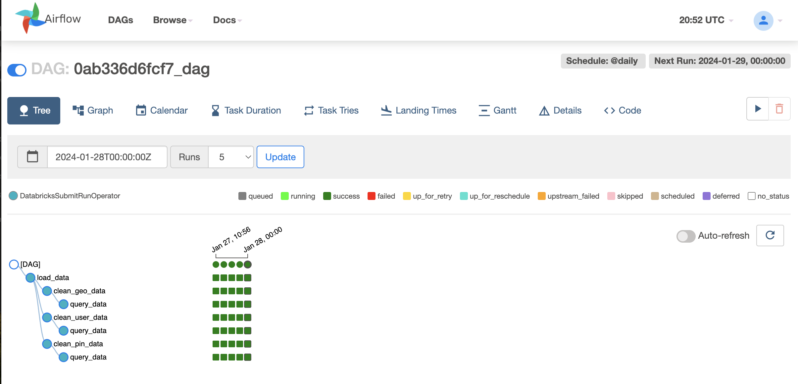
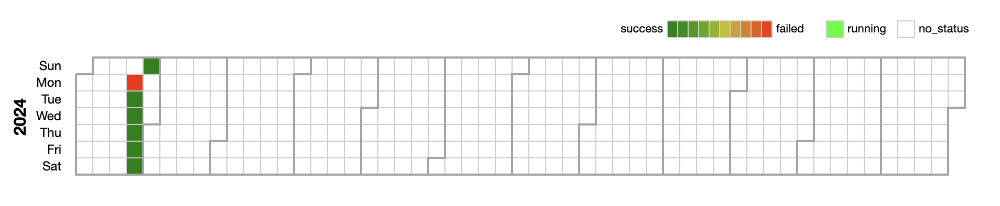
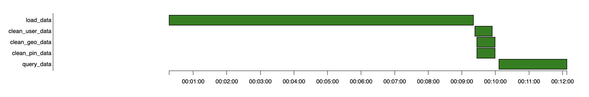

# Walkthrough of Pinterest Data Pipeline Project: Part 5

Pinterest crunches billions of data points every day to decide how to provide more value to their users.

This walkthrough will describe the process taken to emulate Pinterests system of processing data using the AWS Cloud. This walkthrough will explain the following:

- [Part 1](Walkthrough_part_1_EC2_Kafka) will describe how to configure a `EC2 Kafka client`
- [Part 2](Walkthrough_part_2_MSK_S3) will describe how to connect a `MSK cluster` to a `S3 bucket`
- [Part 3](Walkthrough_part_3_API) will describe how to configure an `API` in `API Gateway`
- [Part 4](Walkthrough_part_4_ETL_Databricks) will describe how to read, clean and query data on `Databricks`
- [Part 5](Walkthrough_part_5_Airflow) will describe how to orchestrate `Databricks` Workloads on `MWAA`
- [Part 6](Walkthrough_part_6_Streaming) will describe how to send streaming data to `Kinesis` and read this data in `Databricks`

## Table of Contents

- [Technologies used](#technologies-used)
  - [Apache Airflow](#apache-airflow)
  - [Amazon MWAA](#amazon-mwaa)
- [Managed Workflows for Apache Airflow](#managed-workflows-for-apache-airflow)
  - [Setup Databricks jobs](#setup-databricks-jobs)
  - [Create a DAG](#create-a-dag)
  - [Upload the DAG to a MWAA environment](#upload-the-dag-to-a-mwaa-environment)
  - [Trigger a DAG that runs a Databricks Notebook](#trigger-a-dag-that-runs-a-databricks-notebook)
- [Conclusion](#conclusion)

## Technologies used

[Part 1](Walkthrough_part_1_EC2_Kafka) will give an overview of how this project used [Amazon RDS](Walkthrough_part_1_EC2_Kafka#amazon-rds), [Amazon EC2](Walkthrough_part_1_EC2_Kafka#amazon-ec2), [Apache Kafka](Walkthrough_part_1_EC2_Kafka#apache-kafka), and [AWS IAM](Walkthrough_part_1_EC2_Kafka#aws-iam)

[Part 2](Walkthrough_part_2_MSK_S3) will give an overview of how this project used [Amazon MSK](Walkthrough_part_2_MSK_S3#amazon-msk) and [Amazon S3](Walkthrough_part_2_MSK_S3#amazon-s3)

[Part 3](Walkthrough_part_3_API) will give an overview of how this project used [Amazon API Gateway](Walkthrough_part_3_API#amazon-api-gateway) and [Confluent REST Proxy for Kafka](Walkthrough_part_3_API#confluent-rest-proxy-for-kafka)

[Part 4](Walkthrough_part_4_ETL_Databricks) will give an overview of how this project used [Apache Spark](Walkthrough_part_4_ETL_Databricks#apache-spark) and [Databricks](Walkthrough_part_4_ETL_Databricks#databricks)

[Part 5](Walkthrough_part_5_Airflow) will give an overview of how this project used [Apache Airflow](Walkthrough_part_4_ETL_Databricks#apache-airflow) and [Amazon MWAA](Walkthrough_part_4_ETL_Databricks#amazon-mwaa)

[Part 6](Walkthrough_part_6_Streaming) will give an overview of how this project used [Apache Spark Structured Streaming](Walkthrough_part_6_Streaming#apache-spark-structured-streaming), [Apache Delta Lake](Walkthrough_part_6_Streaming#apache-delta-lake) and [AWS Kinesis](Walkthrough_part_6_Streaming#aws-kinesis)

### Apache Airflow

Apache Airflow is an open-source platform designed for orchestrating complex workflows and data processing pipelines. Airflow provides a way to programmatically author, schedule, and monitor workflows. Workflows in Airflow are represented as Directed Acyclic Graphs (DAGs), where nodes represent tasks and edges define the order of task execution. This allows for a flexible and visual representation of complex workflows.

Airflow includes a scheduler that automates the execution of workflows based on predefined schedules. Users can set up periodic, interval-based, or triggered executions for their workflows. Airflow provides a web-based user interface that offers a graphical representation of DAGs, making it easy for users to visualize, monitor, and troubleshoot their workflows.

The DatabricksSubmitRunOperator is an operator in Apache Airflow designed to submit and run jobs on Databricks. This operator allows you to integrate Databricks job execution into Airflow workflows. The primary purpose of this operator is to submit and run jobs on a Databricks workspace. Databricks jobs can include tasks related to data processing, machine learning, or any other computation supported by the Databricks platform.

During this project an Airflow DAG was created that triggered a Databricks Notebook to be run on a specific schedule. This DAG was uploaded to the dags folder in the mwaa-dags-bucket.

### Amazon MWAA

Amazon Managed Workflows for Apache Airflow (MWAA) is a fully managed service provided by Amazon Web Services (AWS) that simplifies the deployment and operation of Apache Airflow. MWAA allows users to build, schedule, and monitor workflows in a scalable and cost-effective manner without the need to manage the underlying infrastructure. All of the components contained in the outer box (in the image below) appear as a single Amazon MWAA environment.

MWAA seamlessly integrates with other AWS services, allowing users to easily incorporate functionalities such as data storage, compute resources, and security features into their workflows. MWAA is compatible with popular Apache Airflow features, plugins, and workflows, making it easier for existing users to migrate to the managed service.

## Managed Workflows for Apache Airflow

The following section illustrates how you can set up Airflow and use it to trigger Databricks jobs on AWS MWAA.

> [!Note]
>
> During this project the AWS account had already been provided with access to a MWAA environment 'Databricks-Airflow-env' and to its S3 bucket 'mwaa-dags-bucket'.
> Thus, the following were not reqiuired:
>
> - To create an API token in Databricks to connect to the AWS account
> - To set up the MWAA-Databricks connection
> - To create the `requirements.txt` file
>   - This informs `MWAA` which python libraries are required to create a Databricks connection.
>   - This `requirements.txt` file will contain: `apache-airflow[databricks]`

### Setup Databricks jobs

Airflow allows users to define dependencies between tasks, ensuring that tasks are executed in the correct order. Tasks can be set to run sequentially, in parallel, or based on specific conditions. The tasks in Airflow are instances of "operator" class and are implemented as small Python scripts. Since they are simply Python scripts, operators in Airflow can perform many tasks: they can poll for some precondition to be true (also called a sensor) before succeeding, perform ETL directly, or trigger external systems like Databricks.

For this project five notebooks were created in Databricks to experiment with Airflows dependencies between tasks.

- The notebook [airflow_load_data.ipynb](databricks/airflow/airflow_load_data.ipynb) was created to directly load the data from the S3 bucket
- The notebook [airflow_clean_pin.ipynb](databricks/airflow/airflow_clean_pin.ipynb) was created to clean the df_pin data
- The notebook [airflow_clean_geo.ipynb](databricks/airflow/airflow_clean_geo.ipynb) was created to clean the df_geo data
- The notebook [airflow_clean_user.ipynb](databricks/airflow/airflow_clean_user.ipynb) was created to clean the df_user data
- The notebook [airflow_query_data.ipynb](databricks/airflow/airflow_query_data.ipynb) was created to queary the cleaned data to gain valuable insights

When the workflow is run through the MWAA environment the data will be loaded first, then all three cleaning jobs will be activated, and once the data has been cleaned then the data will be analsised.

### Create a DAG

The AWS account was granted permissions to upload and update the DAG `0ab336d6fcf7_dag` from the following file [0ab336d6fcf7_dag.py](../0ab336d6fcf7_dag.py) to the S3 bucket `mwaa-dags-bucket/dags/`. This DAG will run a Databricks Notebook on a daily schedule.

The file [0ab336d6fcf7_dag.py](../databricks/0ab336d6fcf7_dag.py) is essentially a script DAG which constructs three `DatabricksSubmitRunOperator` tasks and then sets the dependency at the end.

When using the DatabricksSubmitRunOperator, configuration parameters are provided that specify details about the Databricks job. This typically includes the Databricks workspace URL, an access token or personal access token (PAT) for authentication, the type of job to run (e.g., Spark job, Python script), and other job-specific settings.

The DatabricksSubmitRunOperator interacts with the Databricks Jobs API to submit and manage jobs. This API allows you to programmatically create, run, and monitor jobs on the Databricks platform.

### Upload the DAG to a MWAA environment

In the `S3` console:

- Navigate to the `dags/` folder.

- Click 'Upload' and drag across the prepared Airflow DAG python file.

### Trigger a DAG that runs a Databricks Notebook

In the `MWAA` console

- Click `Open Airflow UI`

- Once uploaded to the `DAGs` folder, the new DAG will be avaliable in the Airflow UI on the MWAA environment, under `paused DAGs`.

- In order to manually trigger the DAG, it will first have to be unpaused.

- Click on the `DAG` name

- Coloured blocks show the status of the `DatabricksSubmitRunOperator`.
  - A successful run will be shown with green blocks.
  - Hover over the blocks to gain more insight into protential errors.

The batch data has now been uploaded, cleaned and then sent to AWS MWAA for further processing to orchestrate the data workflow.

Further details about the workflow can be seen in the tabs within the Airflow UI, such as a calendar and a gantt chart.

## Conclusion

The emphasis in Part 5 was on the integration of Apache Airflow and Amazon MWAA. Apache Airflow, an open-source platform designed for orchestrating workflows, provided a flexible and visual representation of complex data processing pipelines. The DatabricksSubmitRunOperator, a key component in Airflow, enabled the seamless submission and execution of Databricks jobs. Amazon MWAA, a fully managed service, simplified the deployment and operation of Apache Airflow, offering scalability and cost-effectiveness without the burden of managing underlying infrastructure.

The walkthrough also covered the setup of Airflow to trigger Databricks jobs on AWS MWAA, illustrating the process of creating a DAG, uploading it to the MWAA environment, and triggering the DAG to run a Databricks Notebook.

Overall, this Pinterest Data Pipeline Project provides a comprehensive guide for implementing a robust and scalable data processing solution in the AWS Cloud, with a particular focus on orchestrating workflows using Apache Airflow and Amazon MWAA.

In conclusion, this walkthrough has detailed the comprehensive process of emulating Pinterest's data processing system through batch processing using the AWS Cloud. The project involves configuring an EC2 Kafka client, connecting an MSK cluster to an S3 bucket, setting up an API in API Gateway, reading, cleaning, and querying data on Databricks, and setting up workflows in Airflow to trigger Databricks jobs.

Batch processing, as elucidated in the walkthrough, is a crucial data processing technique that involves collecting, processing, and storing data in scheduled intervals. Pinterest strategically employs batch processing in scenarios where immediate responses are not critical, enabling efficient resource utilization, scalability, and systematic data management.
