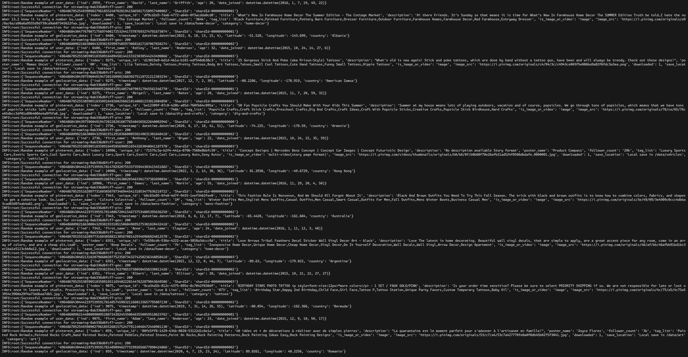
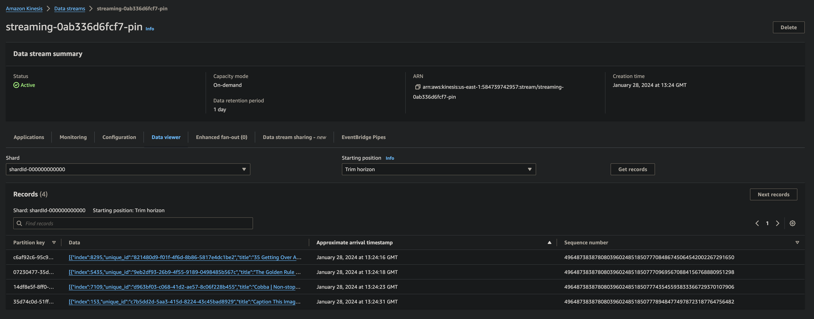
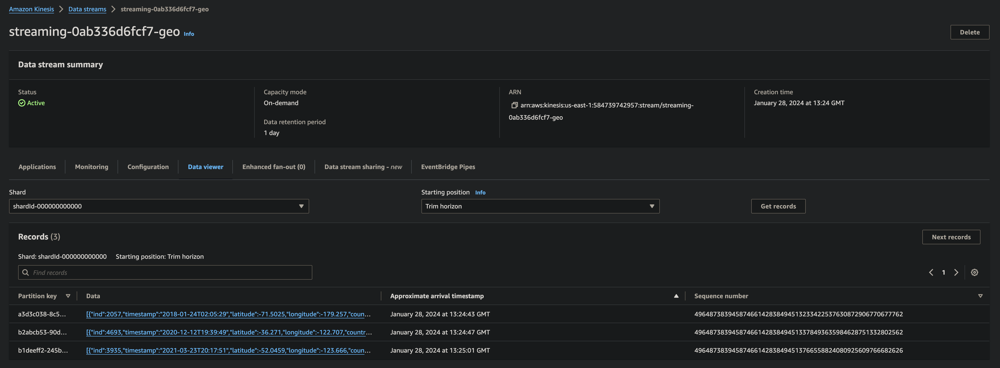
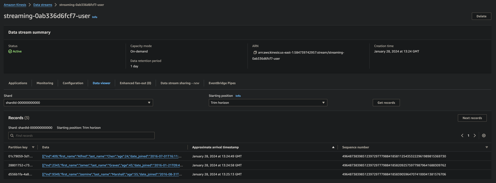
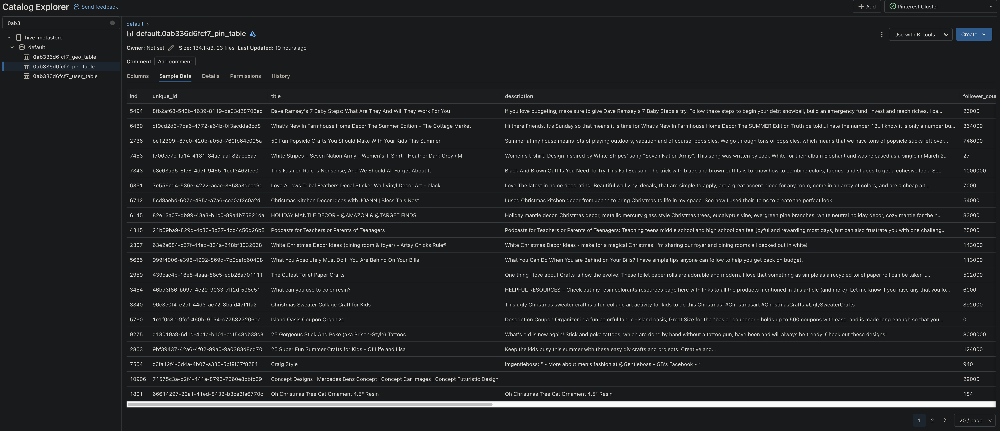
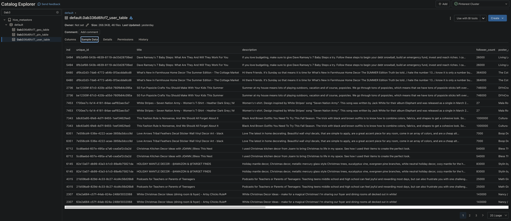

# Walkthrough of Pinterest Data Pipeline Project: Part 6

Pinterest crunches billions of data points every day to decide how to provide more value to their users.

This walkthrough will describe the process taken to emulate Pinterests system of processing data using the AWS Cloud. This walkthrough will explain the following:

- [Part 1](Walkthrough_part_1_EC2_Kafka) will describe how to configure a `EC2 Kafka client`
- [Part 2](Walkthrough_part_2_MSK_S3) will describe how to connect a `MSK cluster` to a `S3 bucket`
- [Part 3](Walkthrough_part_3_API) will describe how to configure an `API` in `API Gateway`
- [Part 4](Walkthrough_part_4_ETL_Databricks) will describe how to read, clean and query data on `Databricks`
- [Part 5](Walkthrough_part_5_Airflow) will describe how to orchestrate `Databricks` Workloads on `MWAA`
- [Part 6](Walkthrough_part_6_Streaming) will describe how to send streaming data to `Kinesis` and read this data in `Databricks`

## Table of Contents

- [Real-time streaming](#real-time-streaming)
- [Technologies used](#technologies-used)
  - [Apache Spark Structured Streaming](#apache-spark-structured-streaming)
  - [Apache Delta Lake](#apache-delta-lake)
  - [AWS Kinesis](#aws-kinesis)
- [Streaming data to Kinesis](#streaming-data-to-kinesis)
  - [Create data streams using Kinesis Data Streams](#create-data-streams-using-kinesis-data-streams)
  - [Configure an API with Kinesis proxy integration](#configure-an-api-with-kinesis-proxy-integration)
    - [Set permissions to invoke Kinesis actions](#set-permissions-to-invoke-kinesis-actions)
    - [Create streams resource](#create-streams-resource)
    - [Create GET method for streams resource](#create-get-method-for-streams-resource)
    - [Configure GET method for streams resource](#configure-get-method-for-streams-resource)
    - [Create {stream-name} child resource](#create-stream-name-child-resource)
    - [Create GET method for {stream-name} child resource](#create-get-method-for-stream-name-child-resource)
    - [Configure GET method for {stream-name} child resource](#configure-get-method-for-stream-name-child-resource)
    - [Create POST method for {stream-name} child resource](#create-post-method-for-stream-name-child-resource)
    - [Configure POST method for {stream-name} child resource](#configure-post-method-for-stream-name-child-resource)
    - [Create DELETE method for {stream-name} child resource](#create-delete-method-for-stream-name-child-resource)
    - [Configure DELETE method for {stream-name} child resource](#configure-delete-method-for-stream-name-child-resource)
    - [Create record child resource](#create-record-child-resource)
    - [Create PUT method for record child resource](#create-put-method-for-record-child-resource)
    - [Configure PUT method for record child resource](#configure-put-method-for-record-child-resource)
    - [Create records child resource](#create-records-child-resource)
    - [Create PUT method for records child resource](#create-put-method-for-records-child-resource)
    - [Configure PUT method for records child resource](#configure-put-method-for-records-child-resource)
    - [Deploy API](#deploy-api)
  - [Send data to the Kinesis streams](#send-data-to-the-kinesis-streams)
    - [Visualise data coming into Kinesis Data Streams](#visualise-data-coming-into-kinesis-data-streams)
- [Read and transform data from Kinesis streams in Databricks](#read-and-transform-data-from-kinesis-streams-in-databricks)
  -[Write the streaming data to Delta Tables](#write-the-streaming-data-to-delta-tables)
- [Conclusion](#conclusion)

## Real-time streaming

Real-time streaming data refers to the continuous flow of information that is generated, processed, and transmitted in near-instantaneous time. Unlike traditional batch processing, where data is collected and processed in fixed intervals, real-time streaming data involves the immediate processing and analysis of data as it is produced.

This type of data is often generated by various sources such as sensors, social media feeds, financial transactions, and IoT devices. The data is transmitted in small, time-sensitive chunks or "streams," allowing for quick analysis and decision-making.

Real-time streaming data is crucial in applications where timely insights and actions are essential, such as in financial trading, monitoring industrial processes, or analyzing social media trends. Technologies like Apache Kafka, Apache Flink, and Apache Spark Streaming are commonly used to handle and process real-time streaming data in different use cases.

Pinterest utilises real-time streaming data to enhance user experience, provide personalised content, and improve the efficiency of its platform.

## Technologies used

[Part 1](Walkthrough_part_1_EC2_Kafka) will give an overview of how this project used [Amazon RDS](Walkthrough_part_1_EC2_Kafka#amazon-rds), [Amazon EC2](Walkthrough_part_1_EC2_Kafka#amazon-ec2), [Apache Kafka](Walkthrough_part_1_EC2_Kafka#apache-kafka), and [AWS IAM](Walkthrough_part_1_EC2_Kafka#aws-iam)

[Part 2](Walkthrough_part_2_MSK_S3) will give an overview of how this project used [Amazon MSK](Walkthrough_part_2_MSK_S3#amazon-msk) and [Amazon S3](Walkthrough_part_2_MSK_S3#amazon-s3)

[Part 3](Walkthrough_part_3_API) will give an overview of how this project used [Amazon API Gateway](Walkthrough_part_3_API#amazon-api-gateway) and [Confluent REST Proxy for Kafka](Walkthrough_part_3_API#confluent-rest-proxy-for-kafka)

[Part 4](Walkthrough_part_4_ETL_Databricks) will give an overview of how this project used [Apache Spark](Walkthrough_part_4_ETL_Databricks#apache-spark) and [Databricks](Walkthrough_part_4_ETL_Databricks#databricks)

[Part 5](Walkthrough_part_5_Airflow) will give an overview of how this project used [Apache Airflow](Walkthrough_part_4_ETL_Databricks#apache-airflow) and [Amazon MWAA](Walkthrough_part_4_ETL_Databricks#amazon-mwaa)

[Part 6](Walkthrough_part_6_Streaming) will give an overview of how this project used [Apache Spark Structured Streaming](Walkthrough_part_6_Streaming#apache-spark-structured-streaming), [Apache Delta Lake](Walkthrough_part_6_Streaming#apache-delta-lake) and [AWS Kinesis](Walkthrough_part_6_Streaming#aws-kinesis)

## Apache Spark Structured Streaming

Apache Spark Structured Streaming is a near-real time processing engine that offers end-to-end fault tolerance with exactly-once processing guarantees using familiar Spark APIs. Structured Streaming lets you express computation on streaming data in the same way you express a batch computation on static data. The Structured Streaming engine performs the computation incrementally and continuously updates the result as streaming data arrives.

It allows developers and data engineers to process and analyse real-time data using the same high-level, SQL-like programming constructs as batch processing in Apache Spark. Structured Streaming leverages the structured APIs provided by Apache Spark, including DataFrames and Datasets. This allows users to express their stream processing logic in a declarative and SQL-like manner, making it accessible to both SQL users and those familiar with traditional batch processing.

One of the key advantages of Structured Streaming is its unified programming model for batch and streaming processing. Developers can use the same code to express transformations, aggregations, and analytics whether working with batch data or real-time streams.
Databricks supports structured streaming, enabling real-time data processing and analytics. This project builds a continuous application that processes and analyses data as it arrives.

### Apache Delta Lake

Delta Lake is an open-source storage layer that brings ACID transactions to Apache Spark and big data workloads. Databricks provides seamless integration with Delta Lake, enabling reliable and scalable data lake solutions. Delta Lake can be used with Structured Streaming for reliable and scalable stream processing.

### AWS Kinesis

Amazon Kinesis is a platform that enables real-time processing of streaming data at scale. It provides various services, such as Amazon Kinesis Streams, Amazon Kinesis Firehose, and Amazon Kinesis Analytics, which allow users to ingest, process, and analyse large volumes of data in real-time.

- Amazon Kinesis Streams allows you to collect and process real-time data streams.
- Firehose simplifies the process of loading streaming data into AWS services.
- Analytics facilitates the real-time analysis of streaming data using SQL queries.


Amazon Kinesis Streams enables real-time processing of streaming data at scale. It allows you to ingest and process large volumes of data continuously and in near real-time. Kinesis Streams allows you to create data streams, which are sequences of data records. These records can be anything from logs and application-generated events to sensor data and social media feeds. A stream is divided into shards, which are the basic unit of storage and throughput in Kinesis Streams. Each shard provides a fixed amount of capacity for both read and write operations. The number of shards determines the stream's capacity. Kinesis Streams can be easily integrated with other AWS services, such as Amazon S3, to build end-to-end streaming data processing solutions.

## Streaming data to Kinesis

The following walkthrough will describe the process to setup AWS Kinesis Data Streams in order to send streaming data and then read that data in Databricks for processing.

### Create data streams using Kinesis Data Streams

For this project three data streams were created using Kinesis Data Streams, one for each Pinterest table.

Within the `AWS Kinesis` console:

- Select `Data Streams` from the left hand panel.
- Click the `Create data stream` button
- For this project the `Data stream name` will be `streaming-<USER_ID>-<TOPIC_SUFFIX>`
- For this use case the `On-demand capacity mode` will be used.
- Click the `Create data stream` button

Repeat these steps to create all three streams:

- `streaming-<USER_ID>-pin`
- `streaming-<USER_ID>-geo`
- `streaming-<USER_ID>-user`


### Configure an API with Kinesis proxy integration

A REST API with an Amazon Kinesis proxy integration is required for this project. This intergration was built into the previously created REST API with Kafka REST proxy integration to allow it to invoke Kinesis actions.

The API is able to invoke the following actions:

- List streams in Kinesis
- Create, describe and delete streams in Kinesis
- Add records to streams in Kinesis

#### Set permissions to invoke Kinesis actions

> [!Note]
>
> During this project the AWS account had been granted the necessary permissions to invoke Kinesis actions, so it was not neccessary to create an IAM role for the API to access Kinesis.

Within the `IAM` console:

- Select `Roles` from the left hand panel.
- Select the access role with the following structure: `<USER_ID>-kinesis-access-role`.
- Copy the `ARN` of the Kinesis Access Role
- This `ARN` will be used when setting up the Execution role for the integration point of all the methods created.

#### Create streams resource

Within the `API Gateway` console:

- Select the desired API
- Select `Resources` from the left hand panel

- Click the `Create resource` button to start provisioning a new resource

- Under `Resource Name`, type `streams`
- Leave the rest as default
- Click the `Create resource` button


#### Create GET method for streams resource

Within the `Resources` page of the desired API in the `API Gateway` console:

- Select the `streams` resource
- Select the `Create method` button
- Select `GET` as the method type
  - For `Integration type` select `AWS Service`
  - For `AWS Region` choose `us-east-1`
  - For `AWS Service` select `Kinesis`
  - For `HTTP method` select `POST` (to invoke Kinesis's ListStreams action)
  - For `Action Type` select `User action name`
  - For `Action name` enter `ListStreams`
  - For `Execution role` copy the `ARN` of the Kinesis Access Role as described in the [Create data streams using Kinesis Data Streams](#create-data-streams-using-kinesis-data-streams)
  - Click `Create method` to finalise provisioning this method
  

#### Configure GET method for streams resource

Within the `Resources` page of the desired API in the `API Gateway` console:

- Select the `GET` resource
- Select the `Integration request` tab

- Click on the `Edit` button
- Expand the `URL request headers parameters` panel, click `Add request header parameter`
  - Under `Name` enter `Content-Type`
  - Under `Mapped form` enter `'application/x-amz-json-1.1'`
- Expand the `Mapping Templates` panel, click `Add mapping template`
  - Under `Content type` enter `application/json`
  
  - Under `Template body` enter `{}` in the template editor
  
- Click `Save`

#### Create {stream-name} child resource

Within the `Resources` page of the desired API in the `API Gateway` console:

- Under the `streams` resource create a new child resource
  - Click the `Create resource` button to start provisioning a new resource
  - Under `Resource Name`, type `{stream-name}`
  - Leave the rest as default
  - Click the `Create resource` button
  

#### Create GET method for {stream-name} child resource

Within the `Resources` page of the desired API in the `API Gateway` console:

- Select the `/{stream-name}` resource
- Click the `Create method` button
  - For `Method type` select `GET`
  - For `Integration type` select `AWS Service`
  - For `AWS Region` choose `us-east-1`
  - For `AWS Service` select `Kinesis`
  - For `HTTP method` select `POST`
  - For `Action Type` select `User action name`
  - For `Action name` enter `DescribeStream`
  - For `Execution role` enter the `ARN` of the Kinesis Access Role as described in the [Create data streams using Kinesis Data Streams](#create-data-streams-using-kinesis-data-streams)
  - Click `Create method`

#### Configure GET method for {stream-name} child resource

Within the `Resources` page of the desired API in the `API Gateway` console:

- Select the `Integration Request` panel under the `GET` resource
  - Select `Edit`
  - Expand the `URL request headers parameters` panel
    - Click on the `Add request header parameter` button
    - Under `Name` enter `Content-Type`
    - Under `Mapped form` enter `'application/x-amz-json-1.1'`
  - Expand the `Mapping Templates` panel
    - Click on the `Add mapping template` button
    - Under `Content-Type` enter `application/json`
    - In the `Template body` include the following:

      ```bash
      {
          "StreamName": "$input.params('stream-name')"
      }
      ```

  - Click the `Save` button

> [!Note]
>
> In AWS API Gateway, mapping templates are used to transform the incoming request or outgoing response before it is sent to or after it is received from the backend service.
>
> - `"StreamName":` This is the key for the property in the resulting JSON object. It indicates that the value to be mapped will be assigned to the StreamName property in the output.
> - `"$input.params('stream-name')":` This is the value to be assigned to the StreamName property. It's using the $input.params() syntax to retrieve the value of the parameter named 'stream-name' from the incoming request. In AWS API Gateway, request parameters can be accessed using this syntax.
>
> In simpler terms, this mapping template is saying, "Take the value of the parameter named 'stream-name' from the incoming request and assign it to the 'StreamName' property in the output JSON object." This mapped output can then be used in the AWS Kinesis integration, where the StreamName property would be populated with the value of the 'stream-name' parameter from the incoming request.

#### Create POST method for {stream-name} child resource

Within the `Resources` page of the desired API in the `API Gateway` console:

- Select the `/{stream-name}` resource
- Click the `Create method` button
  - For `Method type` select `POST`
  - For `Integration type` select `AWS Service`
  - For `AWS Region` choose `us-east-1`
  - For `AWS Service` select `Kinesis`
  - For `HTTP method` select `POST`
  - For `Action Type` select `User action name`
  - For `Action name` enter `CreateStream`
  - For `Execution role` enter the `ARN` of the Kinesis Access Role as described in the [Create data streams using Kinesis Data Streams](#create-data-streams-using-kinesis-data-streams)
  - Click `Create method`

#### Configure POST method for {stream-name} child resource

Within the `Resources` page of the desired API in the `API Gateway` console:

- Select the `Integration Request` panel under the `POST` resource
  - Select `Edit`
  - Expand the `URL request headers parameters` panel
    - Click on the `Add request header parameter` button
    - Under `Name` enter `Content-Type`
    - Under `Mapped form` enter `'application/x-amz-json-1.1'`
  - Expand the `Mapping Templates` panel
    - Click on the `Add mapping template` button
    - Under `Content-Type` enter `application/json`
    - In the `Template body` include the following:

      ```bash
      {
          "ShardCount": #if($input.path('$.ShardCount') == '') 5 #else $input.path('$.ShardCount') #end,
          "StreamName": "$input.params('stream-name')"
      }
      ```

  - Click the `Save` button

> [!Note]
>
> This mapping template, creates a JSON object with two properties: `"ShardCount"` and `"StreamName"`.
>
> - `"ShardCount":` This property is dynamically set based on a conditional check. The #if directive is used to check if the value of $.ShardCount (ShardCount property in the incoming request JSON) is empty (''). If it is empty, the template assigns a default value of 5 to "ShardCount". If it's not empty, it takes the value of $.ShardCount.
> - `"StreamName":` This property is assigned the value of the parameter named 'stream-name' from the incoming request using $input.params('stream-name').
>
> In summary, this mapping template is saying, "If the incoming request has a ShardCount property, use that value for 'ShardCount'. Otherwise, set 'ShardCount' to 5. Also, assign the value of the 'stream-name' parameter from the incoming request to the 'StreamName' property."

#### Create DELETE method for {stream-name} child resource

Within the `Resources` page of the desired API in the `API Gateway` console:

- Select the `/{stream-name}` resource
- Click the `Create method` button
  - For `Method type` select `DELETE`
  - For `Integration type` select `AWS Service`
  - For `AWS Region` choose `us-east-1`
  - For `AWS Service` select `Kinesis`
  - For `HTTP method` select `POST`
  - For `Action Type` select `User action name`
  - For `Action name` enter `DeleteStream`
  - For `Execution role` enter the `ARN` of the Kinesis Access Role as described in the [Create data streams using Kinesis Data Streams](#create-data-streams-using-kinesis-data-streams)
  - Click `Create method`

#### Configure DELETE method for {stream-name} child resource

Within the `Resources` page of the desired API in the `API Gateway` console:

- Select the `Integration Request` panel under the `DELETE` resource
  - Select `Edit`
  - Expand the `URL request headers parameters` panel
    - Click on the `Add request header parameter` button
    - Under `Name` enter `Content-Type`
    - Under `Mapped form` enter `'application/x-amz-json-1.1'`
  - Expand the `Mapping Templates` panel
    - Click on the `Add mapping template` button
    - Under `Content-Type` enter `application/json`
    - In the `Template body` include the following:

      ```bash
      {
          "StreamName": "$input.params('stream-name')"
      }
      ```

  - Click the `Save` button

> [!Note]
>
> This mapping template, creates a JSON object with a single property: `"StreamName"`.
>
> - `"StreamName":` This property is assigned the value of the parameter named 'stream-name' from the incoming request using $input.params('stream-name').
>
> In simpler terms, this mapping template is saying, "Take the value of the 'stream-name' parameter from the incoming request and assign it to the 'StreamName' property in the output JSON object."


#### Create record child resource

Within the `Resources` page of the desired API in the `API Gateway` console:

- Under the `/{stream-name}` resource create a new child resource
  - Click the `Create resource` button to start provisioning a new resource
  - Under `Resource Name`, type `record`
  - Leave the rest as default
  - Click the `Create resource` button

#### Create PUT method for record child resource

Within the `Resources` page of the desired API in the `API Gateway` console:

- Select the `/record` resource
- Click the `Create method` button
  - For `Method type` select `PUT`
  - For `Integration type` select `AWS Service`
  - For `AWS Region` choose `us-east-1`
  - For `AWS Service` select `Kinesis`
  - For `HTTP method` select `POST`
  - For `Action Type` select `User action name`
  - For `Action name` enter `PutRecord`
  - For `Execution role` enter the `ARN` of the Kinesis Access Role as described in the [Create data streams using Kinesis Data Streams](#create-data-streams-using-kinesis-data-streams)
  - Click `Create method`

#### Configure PUT method for record child resource

Within the `Resources` page of the desired API in the `API Gateway` console:

- Select the `Integration request` panel under the `PUT` resource
  - Select `Edit`
  - Expand the `URL request headers parameters` panel
    - Click on the `Add request header parameter` button
    - Under `Name` enter `Content-Type`
    - Under `Mapped form` enter `'application/x-amz-json-1.1'`
  - Expand the `Mapping Ttemplates` panel
    - Click on the `Add mapping template` button
    - Under `Cotent-Type` enter `application/json`
    - In the `Template body` include the following:

      ```bash
      {
          "StreamName": "$input.params('stream-name')",
          "Data": "$util.base64Encode($input.json('$.Data'))",
          "PartitionKey": "$input.path('$.PartitionKey')"
      }
      ```

  - Click the `Save` button

> [!Note]
>
> This mapping template is used to transform an API request payload into the format required for writing a single record to an AWS Kinesis stream.
> This mapping template creates a JSON object with three properties: `"StreamName"`, `"Data"`, and `"PartitionKey"`.
>
> - `"StreamName":` This property is assigned the value of the parameter named `'stream-name'` from the incoming request using `$input.params('stream-name')`.
> - `"Data":` This property encodes the JSON data from the incoming request's `$.Data` property using base64 encoding. The `$util.base64Encode()` function is applied to the JSON data. This is commonly done when sending binary data through APIs or when you want to ensure that the data is transmitted in a way that won't be altered by certain characters.
> - `"PartitionKey"`: This property is assigned the value of the 'PartitionKey' property from the incoming request's JSON using $input.path('$.PartitionKey').
>
> In summary, this mapping template is preparing data to be sent to a Kinesis stream. It takes the 'stream-name' parameter as is, base64 encodes the JSON data from 'Data', and uses the 'PartitionKey' property as is.

#### Create records child resource

Within the `Resources` page of the desired API in the `API Gateway` console:

- Under the `/{stream-name}` resource create a new child resource
  - Click the `Create resource` button to start provisioning a new resource
  - Under `Resource Name`, type `records`
  - Leave the rest as default
  - Click the `Create resource` button

#### Create PUT method for records child resource

Within the `Resources` page of the desired API in the `API Gateway` console:

- Select the `/record` resource
- Click the `Create method` button
  - For `Method type` select `PUT`
  - For `Integration type` select `AWS Service`
  - For `AWS Region` choose `us-east-1`
  - For `AWS Service` select `Kinesis`
  - For `HTTP method` select `POST`
  - For `Action Type` select `User action name`
  - For `Action name` enter `PutRecords`
  - For `Execution role` enter the `ARN` of the Kinesis Access Role as described in the [Create data streams using Kinesis Data Streams](#create-data-streams-using-kinesis-data-streams)
  - Click `Create method`

#### Configure PUT method for records child resource

Within the `Resources` page of the desired API in the `API Gateway` console:

- Select the `Integration request` panel under the `PUT` resource
  - Select `Edit`
  - Expand the `URL request headers parameters` panel
    - Click on the `Add request header parameter` button
    - Under `Name` enter `Content-Type`
    - Under `Mapped form` enter `'application/x-amz-json-1.1'`
  - Expand the `Mapping Ttemplates` panel
    - Click on the `Add mapping template` button
    - Under `Cotent-Type` enter `application/json`
    - In the `Template body` include the following:

      ```bash
      {
          "StreamName": "$input.params('stream-name')",
          "Records": [
          #foreach($elem in $input.path('$.records'))
              {
                  "Data": "$util.base64Encode($elem.data)",
                  "PartitionKey": "$elem.partition-key"
              }#if($foreach.hasNext),#end
              #end
          ]
      }
      ```

  - Click the `Save` button

> [!Note]
>
> This mapping template is used to transform an API request payload into the format required for writing records to an AWS Kinesis stream.
> This mapping template constructs a JSON object with two properties: `"StreamName"` and `"Records"`. The `"Records"` property is an array containing elements from the incoming request's `$.records` array.
>
> - `"StreamName"`: This property is assigned the value of the parameter named `'stream-name'` from the incoming request using `$input.params('stream-name')`.
> - `"Records"`: This property is an array constructed using the `#foreach` directive. It iterates over each element in the `$.records` array from the incoming request.
>   - Each element in the array is an object with two properties:
>     - `"Data"`: This property base64 encodes the `data` property of each element in the `$.records` array using `$util.base64Encode($elem.data)`.
>     - `"PartitionKey"`: This property is assigned the value of the `partition-key` property from each element in the `$.records` array using `"$elem.partition-key"`.
> - The `#if($foreach.hasNext),#end` is used to include a comma after each record in the array except for the last one, ensuring proper JSON syntax.
>
> In summary, this mapping template is designed for handling multiple records, and preparing them for an AWS Kinesis integration. It takes the `'stream-name'` parameter as is and constructs an array of records, each with base64-encoded data and a partition key.


#### Deploy API

Click `Deploy API` button to deploy the newest version of the API.

Now that API has been updated, the Python requests library can be used to test the new API methods and obtain a response.

### Send data to the Kinesis streams

The Python script [rds_db_connector](classes/rds_db_connector.py) defines a class called `RDSDBConnector`, that facilitates connecting to a RDS database using the SQLAlchemy library. The purpose of this class is to encapsulate the process of reading database credentials from a YAML file, validating them, and initialising a SQLAlchemy database engine. This class provides a structured and reusable way to connect to a RDS database using SQLAlchemy, promoting separation of concerns by encapsulating database initialisation logic within the class.

The Python script [api_communicator.py](classes/api_communicator.py) defines a class called `APICommunicator`, that is designed for communicating with an API and sending data to Kinesis stream.

The Python script [aws_db_connector.py](classes/aws_db_connector.py) defines a class called `AWSDBConnector`, which is responsible for connecting to a database and sending data to an API. This script simulates a continuous process of fetching random data from a database and sending it to an API, allowing the user to choose between streaming or batch mode.

The Python script [user_posting_emulation_stream.py](user_posting_emulation_stream.py) was built to emulate sending requests to the API, which adds one record at a time to the created streams. This script uses the methods from the three previously described classes. In streaming mode this script will continuously send new data from the three Pinterest tables to the corresponding Kinesis stream until interrupted.

In terminal on your local machine:

- Navigate to the project directory:

    ```bash
    cd pinterest-data-pipeline545
    ```

- Run the following Python Script:

    ```bash
    python user_posting_emulation_stream.py
    ```



#### Visualise data coming into Kinesis Data Streams

Once data has been sent to a Kinesis Data Stream, this data can be visualised in the `Kinesis` console.

Within the `AWS Kinesis` console:

- Select `Data Streams` from the left hand panel.
- Select the desired stream
- Select the `Data viewer` panel
- Choose the `Shard` (data will normally be stored in the first shard `shardId-000000000000`)
- In the `Starting position` section select `Trim horizon` (This will read all the records available in the stream if only posted to the stream once. If the stream has already been used, then it will read data from the last checkpoint.)
- Select `Get records` to visualise the data that has been send to the stream.





## Read and transform data from Kinesis streams in Databricks

The Python script [databricks_load_data.py](./databricks/classes/databricks_load_data.py) was created in Databricks. It supplies the following methods:

- Reads in the credentials authentication_credentials.csv file and retrieve the Access Key and Secret Access Key
- Reads the streaming data from AWS Kinesis and returns a dictionary of PySpark DataFrames
- Defines the schema for 'pin' data.
- Defines the schema for 'geo' data.
- Defines the schema for 'user' data.
- Processes the streaming data and creates global temporary views of Delta tables
- Writes the streaming DataFrames to Delta tables

The Python script [databricks_clean_data.py](./databricks/classes/databricks_clean_data.py) was created in Databricks. It supplies the following methods:

- Cleans the pin data in the PySpark DataFrame
- Cleans the geo data in the PySpark DataFrame
- Cleans the user data in the PySpark DataFrame

The notebook [write_stream_data.ipynb](./databricks/write_stream_data.ipynb) was created in Databricks to read the data from the three streams. It then proceeds to clean the data and then write the data in Delta Tables. This notebook uses the methods from the two previous scripts.

### Write the streaming data to Delta Tables

In Databricks, a delta table refers to a type of storage layer that brings ACID (Atomicity, Consistency, Isolation, Durability) transactions to Apache Spark and big data workloads. Delta tables are essentially parquet files with a set of transaction logs that capture all the changes made to the data. Here are some key features and concepts related to delta tables in Databricks:

- ACID Transactions: Delta tables provide ACID transactions on big data. This means that operations on the table, such as inserts, updates, and deletes, are atomic and consistent.
- Schema Evolution: Delta tables support schema evolution, allowing you to modify the table's schema over time without requiring a full rewrite of the data.
- Time Travel: Delta tables support time travel, allowing you to query the table as it appeared at a specific point in time. This is made possible by the transaction logs that keep track of changes.
- Optimistic Concurrency Control: Delta uses optimistic concurrency control to manage concurrent writes. Multiple users or jobs can write to a delta table concurrently, and conflicts are resolved automatically.
- Metadata Management: Delta tables maintain metadata to keep track of the table's schema, transaction log, and other important information. This metadata is used to enable features like time travel.
- Streaming Support: Delta tables seamlessly integrate with structured streaming in Apache Spark, enabling real-time data processing.

Once converted to a delta table, inserts, updates, and deletes can be performed while maintaining transactional consistency. The delta table's features provide a robust solution for managing and evolving big data tables in a distributed and scalable environment.

The delta tables are uploaded within Databricks to Catalogs/hive_metastore/default.





## Conclusion

This walkthrough details the process to create a real-time streaming data pipeline using AWS Kinesis. It runs through the process of creating Kinesis data streams, and how to create an API to send data to those streams. By utilising databricks, the streams were read, transformed and loaded into Delta tables where further processing can be conducted ready for analysis.
